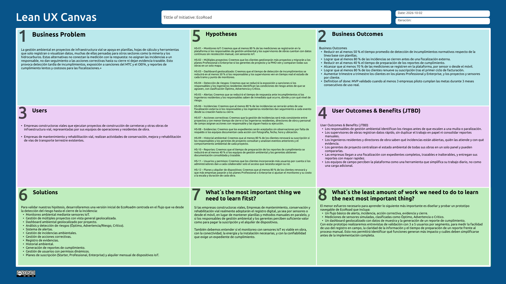

# Capítulo 1

## Introducción

La introducción desempeña un papel fundamental en la estructuración y comprensión del proyecto, ya que establece el marco conceptual y contextual sobre el cual se desarrollará el trabajo. En esta sección inicial, se presenta una visión general que permite al lector comprender los objetivos principales que se desean alcanzar, así como los antecedentes que han llevado a la formulación del proyecto. También se delimita el alcance del mismo, es decir, hasta dónde se pretende llegar con el desarrollo de la propuesta. Asimismo, la introducción cumple la función de contextualizar la relevancia del proyecto en un entorno específico, destacando las razones que justifican su realización, los desafíos que se pretenden abordar y los beneficios esperados a partir de su implementación. En suma, esta parte inicial no solo informa, sino que también orienta y motiva al lector a profundizar en el contenido que se presentará a lo largo del documento.

## 1.1 Startup Profile

Una startup es una pequeña empresa de reciente creación, con alto potencial innovador y tecnológico, donde su modelo es escalable y su crecimiento puede ser exponencial.

En esta sección se describen los aspectos clave que definen a la startup, incluyendo su origen, las motivaciones que impulsaron su creación, el problema específico que busca solucionar y el enfoque innovador que emplea para posicionarse frente a sus competidores.

Asimismo, se analizan los objetivos a mediano y largo plazo, junto con las estrategias diseñadas para su crecimiento y consolidación dentro del sector. Entender estos elementos resulta vital para evaluar el potencial de la startup y el impacto que puede generar en su entorno.

### 1.1.1 Descripción de la Startup

En una sociedad donde los proyectos viales demandan una gestión más eficiente, EcoRoad, diseñada por nuestra startup llamada Caimán, nace como una plataforma web SaaS diseñada para transformar la gestión ambiental en el sector de infraestructura vial. A diferencia de las soluciones tradicionales que solo visualizan datos, nuestra propuesta integra dispositivos IoT en tiempo real para capturar indicadores críticos (aire, ruido, agua, vibraciones) y los convierte automáticamente en un flujo de trabajo trazable, desde la detección del riesgo y la emisión de alertas, hasta la asignación de acciones correctivas y el registro de evidencias en campo.

Orientada a empresas constructoras y de conservación vial, la plataforma permite centralizar múltiples proyectos en un solo lugar. Su modelo de negocio se basa en planes de suscripción mensuales o anuales (Starter, Professional y Enterprise) adaptados a la escala de cada cliente, complementado con un esquema flexible de alquiler independiente de sensores IoT. Así, nos diferenciamos por ofrecer no es solo una herramienta de monitoreo, sino un ecosistema integral que impulsa una ingeniería civil preventiva, transparente y sostenible.

#### Misión

Desarrollar soluciones tecnológicas robustas, eficientes y centradas en la gestión ambiental, que permitan a las empresas constructoras y de conservación vial gestionar sus operaciones de manera transparente y en tiempo real. En EcoRoad nos enfocamos en la innovación constante, la integración de tecnologías IoT y la transformación de datos en acciones correctivas trazables, con el fin de mitigar riesgos ambientales y contribuir a una gestión más sostenible de los proyectos de infraestructura vial.

#### Visión

Convertirnos en la plataforma SaaS líder en gestión y monitoreo ambiental para el sector de infraestructura vial en Latinoamérica, integrando tecnologías emergentes como el Internet de las Cosas y la analítica automatizada de datos. Aspiramos a transformar la gestión ambiental de los proyectos viales en un proceso dinámico, predictivo y preventivo, contribuyendo al desarrollo de una infraestructura vial más sostenible.

### 1.1.2. Perfiles de los Miembros del Equipo

<table border="1" width="100%">
  <tr>
    <td width="140" valign="top" align="center">
      
    </td>
    <td valign="top">
      <strong>Eduardo Martín Guillén Chávez - (U202)</strong> - Ingeniería de Software  
      
    </td>
  </tr>

  <tr>
    <td width="140" valign="top" align="center">
      
    </td>
    <td valign="top">
      <strong>Andy Alfredo Hipolito Salcedo Muñoz - (U20241E417)</strong> - Ingeniería de Software  
      Soy un estudiante de Ingenieria de Software, tengo 21 años y tengo conocimientos en C++, programación orientada a objetos, desarrollo de frontend, base de datos y diseño de arquitectura. Mi aporte al equipo será la implementación de la lógica de negocio de EcoRoad, el análisis de los datos generados por el monitoreo ambiental, el apoyo en la configuración del despliegue de la solución en la nube y la colaboración en la documentación para cumplir con cada entrega.
    </td>
  </tr>

  <tr>
    <td width="140" valign="top" align="center">
      
    </td>
    <td valign="top">
      <strong>Cristina Marcela Yarleque RuizCristina Marcela Yarleque Ruiz - (U20241f859)</strong> - Ingeniería de Software  
      Tengo 20 años, cuento con habilidades en diseño de aplicaciones web y sólida lógica de programación utilizando C++.  Busco aplicar mis conocimientos técnicos en proyectos desafiantes mientras sigo expandiendo mis habilidades."
    </td>
  </tr>

  <tr>
    <td width="140" valign="top" align="center">
      
    </td>
    <td valign="top">
      <strong>Miguel Ángel Román López - (U202212897)</strong> - Ingeniería de Software  
      Tengo 21 años y estudio la carrera de Ingeniería de Software en la Universidad Peruana de Ciencias Aplicadas, poseo conocimientos en C++, programación orientada a objetos, diseño web y gestión de proyectos. Mi aporte será investigación, ideas e imaginación para realizar un buen proyecto y cumplir con las entregas.
    </td>
  </tr>

  <tr>
    <td width="140" valign="top" align="center">
      
    </td>
    <td valign="top">
      <strong>Alisee Muriel Torres Juárez - (U202624323)</strong> - Ingeniería de Software  
      Tengo 21 años y estudio la carrera de Ingeniería de Software en la Universidad Peruana de Ciencias Aplicadas y vengo de la Universidad Tecnológica de Puebla. Mi aporte será aplicar mis conocimientos en proyectos Angular, herramientas como springboot, entre otras.
    </td>
  </tr>
</table>

## 1.2 Solution Profile

EcoRoad es una plataforma web SaaS que da soporte a los procesos de monitoreo, gestión y trazabilidad ambiental en proyectos de infraestructura vial. Mediante sensores IoT registra indicadores ambientales, detecta automáticamente condiciones de riesgo, genera alertas e incidencias, y permite dar seguimiento a las acciones correctivas y a sus evidencias hasta el cierre. Además, visualiza sobre un mapa geolocalizado el estado ambiental de uno o varios proyectos.

Esta sección incluye los antecedentes y la problemática que motivan la solución, y el resultado de aplicar el proceso de Lean UX sobre el dominio del problema.

### 1.2.1 Antecedentes y Problemática

La actividad constructora es uno de los motores más dinámicos de la economía peruana, con la obra pública —donde la infraestructura vial tiene un peso importante— como uno de los principales impulsores del crecimiento sectorial (CAPECO, 2025). La ejecución de estos proyectos está sujeta a un marco normativo ambiental cada vez más exigente, fiscalizado para el subsector transportes por la Dirección de Gestión Ambiental del MTC, mientras que la gestión ambiental y los planes de mitigación requeridos recaen en las propias empresas ejecutoras y de conservación vial bajo la fiscalización del MTC y OEFA., que agrupa a 1,293 consultoras habilitadas a nivel nacional (SENACE, 2024). A pesar de este marco, la digitalización del monitoreo ambiental en obra sigue siendo incipiente, mientras el OEFA avanza hacia una fiscalización más estricta apoyada en monitoreo continuo (OEFA, 2025).

#### What / ¿QUÉ?

EcoRoad busca resolver la fragmentación y el registro manual de datos ambientales durante la ejecución de proyectos viales, integrando tableros geolocalizados en tiempo real, un motor automatizado de alertas e incidencias y un dashboard de control multi-proyecto en un único sistema.

#### When / ¿CUÁNDO?

Esta necesidad es crítica en el contexto actual, en el que la fiscalización ambiental avanza hacia una mayor exigencia tecnológica y en el que la reactivación de la inversión vial incrementa el número de obras activas que requieren monitoreo simultáneo.

#### Where / ¿DÓNDE?

Ocurre principalmente en los proyectos de infraestructura vial ejecutados en el Perú, tanto en zonas urbanas como en tramos interprovinciales, así como en las oficinas centrales de las empresas constructoras y consultoras que supervisan dichos proyectos de forma remota.

#### Who / ¿QUIÉN?

Afecta principalmente a las empresas constructoras y a las empresas de mantenimiento y rehabilitación vial que ejecutan y conservan las obras viales, las cuales deben evidenciar el cumplimiento ambiental y gestionar los riesgos operativos ante entidades fiscalizadoras (MTC, OEFA).

#### Why / ¿POR QUÉ?

Porque las infracciones ambientales no detectadas a tiempo generan sanciones económicas, restricciones para participar en licitaciones públicas y daño reputacional. Centralizar el monitoreo y automatizar la detección de incumplimientos reduce el riesgo regulatorio y optimiza el tiempo dedicado a auditorías.

#### How / ¿CÓMO?

Mediante EcoRoad, una plataforma web centralizada en la nube donde el personal de campo registra los indicadores ambientales, el motor automatizado los compara contra los límites normativos y, ante una superación, genera una alerta y crea un ticket de incidencia visible en los tableros y el dashboard geolocalizados.

#### How Much / ¿CUÁNTO?

El modelo de ingresos es de tipo SaaS, mediante planes de suscripción escalables: *Base, **Profesional* y *Enterprise*, diferenciados por número de proyectos, usuarios y funcionalidades de análisis incluidas.

### 1.2.2 Lean UX Process

#### 1.2.2.1. Lean UX Problem Statements

El estado actual de *la gestión ambiental en proyectos de infraestructura vial* se ha enfocado principalmente en *el registro manual y disperso de indicadores ambientales, sin herramientas de análisis automatizado ni visualización centralizada, lo que provoca **detección tardía de incumplimientos normativos, mayor exposición a sanciones y auditorías lentas y costosas.* Esta situación afecta a *empresas constructoras y de mantenimiento vial*, quienes dependen de métodos desactualizados para monitorear y documentar el cumplimiento ambiental de sus proyectos.

Lo que los productos o servicios existentes no logran resolver es la *centralización digital, en tiempo real, del monitoreo ambiental y la gestión de incidencias en proyectos viales. Nuestro producto, **EcoRoad**, abordará esta brecha mediante una plataforma web SaaS que centraliza el registro de indicadores ambientales, detecta automáticamente las superaciones normativas y ofrece tableros geolocalizados para visualizar múltiples proyectos en simultáneo.

Nuestro enfoque inicial estará dirigido a *empresas constructoras y de mantenimiento vial que ejecutan y conservan proyectos viales en el Perú*. Sabremos que tenemos éxito cuando observemos una reducción medible en el tiempo de detección de incumplimientos, mayor cantidad de incidencias resueltas antes de una fiscalización externa, y una reducción en el tiempo dedicado a preparar auditorías.

#### 1.2.2.2. Lean UX Assumptions

##### A. Business Assumptions

1. *Creemos que nuestros clientes necesitan:* un sistema de monitoreo ambiental centralizado y en tiempo real para sus proyectos viales.
2. *Estas necesidades se resuelven con:* una plataforma SaaS que registra indicadores ambientales, detecta automáticamente incumplimientos normativos y visualiza el estado de los proyectos en un mapa.
3. *Nuestros primeros clientes serán:* empresas constructoras y de conservación vial que operan en Lima y otras regiones del Perú.
4. *Valor #1 esperado:* reducir el riesgo de sanciones por incumplimiento normativo mediante la detección temprana de incidencias.
5. *Beneficios adicionales:* optimización del tiempo de auditoría, trazabilidad de los datos ambientales y mejora de la reputación institucional.
6. *Adquisición:* alianzas con gremios del sector construcción (CAPECO), referidos sectoriales y marketing digital dirigido a gerentes de operaciones y proyectos.
7. *Ingresos:* suscripción mensual o anual bajo planes escalables (Base, Profesional, Enterprise).
8. *Competencia principal:* hojas de cálculo, sistemas de gestión documental genéricos y soluciones de monitoreo ambiental orientadas a otros sectores (minería, hidrocarburos).
9. *Ventaja competitiva:* especialización en el dominio de proyectos viales, con motor de alertas automatizado y visualización geolocalizada nativa.
10. *Mayor riesgo de producto:* que los equipos de campo no adopten el registro digital y continúen usando métodos manuales en paralelo.
11. *Mitigación:* diseñar una interfaz simple y rápida de usar en campo, integrada con los flujos de trabajo ya existentes de los equipos de monitoreo.

###### B. User Assumptions

*- ¿Quién es el usuario?* Responsables de gestión ambiental, ingenieros residentes de obra y supervisores de campo.

*- ¿Dónde encaja el producto?* En el proceso diario de monitoreo y control ambiental de un proyecto vial en ejecución o conservación.

*- Problema a resolver:* la falta de visibilidad en tiempo real del cumplimiento normativo ambiental.

*- Uso típico:* registro de mediciones de campo, revisión de alertas, consulta de tableros y generación de reportes para auditorías.

*- Características importantes:* alertas automáticas, geolocalización, generación de reportes y acceso multiusuario por proyecto.

*- Look & feel:* interfaz simple tipo dashboard, con codificación por color según nivel de riesgo (semáforo), pensada para uso rápido en campo desde dispositivos móviles.

##### C. User Outcome & Benefit Assumptions

- Los responsables de gestión ambiental identifican incidencias antes de que escalen a una infracción formal.
- Los supervisores de obra reducen el tiempo dedicado a consolidar reportes manuales.
- Las empresas constructoras y de mantenimiento entregan informes de auditoría con mayor rapidez y respaldo de datos trazables.
- Los equipos de campo perciben la plataforma como una herramienta que simplifica su trabajo diario, no como una carga adicional.

##### D. Business Outcome Assumptions

- Incremento en el número de empresas suscritas a los planes Profesional y Enterprise.
- Reducción medible en el tiempo promedio de detección de incumplimientos normativos entre los clientes activos.
- Aumento en la tasa de renovación de suscripciones tras el primer ciclo de facturación.
- Mayor volumen de proyectos gestionados por cliente a lo largo del tiempo.

##### E. Feature Assumptions

1. *Tableros Geolocalizados en Tiempo Real:* mapean los proyectos y muestran el estado de los indicadores ambientales (aire, ruido, agua) por punto de monitoreo.
2. *Generador de Reportes de Auditoría Automático:* consolida el histórico de indicadores e incidencias en documentación exportable para fiscalizaciones.
3. *Sistema de Alertas Tempranas:* compara los datos ingresados frente a los límites normativos y crea automáticamente un ticket de incidencia ante una superación.
4. *Dashboard de Control Geolocalizado Multi-Proyecto:* consolida el estado ambiental de múltiples proyectos viales en un mismo mapa.

#### 1.2.2.3. Lean UX Hypothesis Statements

##### Visualización y Control Centralizado

Creemos que lograremos una detección más temprana de superaciones normativas y una mejor priorización de los recursos de supervisión, si los responsables de gestión ambiental y supervisores de obra obtienen visibilidad inmediata y geolocalizada del estado de los indicadores ambientales de sus proyectos, con tableros geolocalizados en tiempo real.

##### Automatización de Reporteo

Creemos que lograremos una reducción en el tiempo y costo de preparación de auditorías, si los equipos de gestión ambiental y consultoras ambientales obtienen documentación consolidada y trazable del histórico de indicadores e incidencias de un proyecto, con un generador de reportes de auditoría automático.

##### Estandarización de Procesos

Creemos que lograremos una reducción en el tiempo de respuesta ante incumplimientos normativos y una gestión de incidencias más consistente entre proyectos, si los responsables de gestión ambiental reciben notificaciones inmediatas y un registro automático de incidencias ante una superación de los límites normativos, con un sistema de alertas tempranas.

##### Optimización de Recursos

Creemos que lograremos una gestión más eficiente de carteras de múltiples proyectos viales, si las empresas constructoras y consultoras ambientales que gestionan varios proyectos acceden a una visualización consolidada del estado ambiental de todos sus proyectos en un solo mapa, con un dashboard de control geolocalizado multi-proyecto.

#### 1.2.2.4. Lean UX Canvas

## 1.3 Segmentos Objetivos

EcoRoad está dirigida a dos segmentos B2B específicos relacionados con la ejecución, mejora y conservación de la infraestructura vial:

### Segmento 1: Empresas constructoras viales

Características demográficas:

* Edad: Entre 27 y 50 años. 
* Género: Indistinto (con mayor representación masculina en puestos de campo). 
* Ocupación: Gerentes de proyecto, Ingenieros Residentes, Jefes de Supervisión y Responsables/Especialistas en Gestión Ambiental. 
* Nivel educativo: Profesionales titulados y colegiados en Ingeniería Civil, Ingeniería Ambiental o Ingeniería de la Construcción, idealmente con especializaciones en gestión de proyectos o regulación ambiental. 
* Ubicación geográfica: Sedes centrales principalmente en Lima Metropolitana, con operaciones de campo descentralizadas en toda la red vial nacional del Perú.

Información estadística de sustento:

De acuerdo con la Cámara Peruana de la Construcción (CAPECO), la inversión en infraestructura pública representa uno de los motores más dinámicos del país, donde los proyectos viales (carreteras, puentes, vías urbanas) concentran más del 40% del presupuesto de inversión pública asignado a transportes.

A nivel normativo en el Perú, el Ministerio de Transportes y Comunicaciones (MTC) y el OEFA exigen el cumplimiento estricto de los Estudios de Impacto Ambiental (EIA). Las penalidades por infracciones ambientales en obras viales pueden superar las 100 UIT, lo que genera una necesidad crítica de supervisión en tiempo real para mitigar sobrecostos por paralizaciones o multas.

### Segmento 2: Empresas de mantenimiento y rehabilitación vial

Características demográficas:
* Edad: Entre 24 y 48 años. 
* Género: Indistinto. 
* Ocupación: Supervisores de mantenimiento vial, Coordinadores de Seguridad y Medio Ambiente y personal técnico de campo. 
* Nivel educativo: Bachilleres o licenciados en Ingeniería Ambiental, Ingeniería Civil, Ingeniería Geográfica o técnicos especializados en conservación vial. 
* Ubicación geográfica: Zonas de influencia de los principales corredores viales y concesiones nacionales (Costa, Sierra y Selva del Perú).

Información estadística de sustento:

El Índice de Digitalización de McKinsey & Company posiciona al sector de la construcción e infraestructura en el penúltimo lugar de adopción tecnológica entre 22 industrias evaluadas a nivel global, arrastrando una alta dependencia de bitácoras en papel y reportes manuales en Excel.

Según el Organismo Supervisor de la Inversión en Infraestructura de Transporte de Uso Público (Ositran), el Perú cuenta con miles de kilómetros de carreteras concesionadas que requieren mantenimiento rutinario y periódico obligatorio. La falta de reportes inmediatos de incidencias en estas áreas remotas incrementa los tiempos de respuesta ante desastres ambientales (como derrumbes o contaminación de cuencas) en hasta un 300%.

El uso de herramientas móviles y tecnologías en la nube para la gestión de activos y monitoreo ambiental en campo ha demostrado reducir el tiempo de recolección de datos en un 45% y mejorar el cumplimiento de compromisos socioambientales ante fiscalizaciones del Estado.
