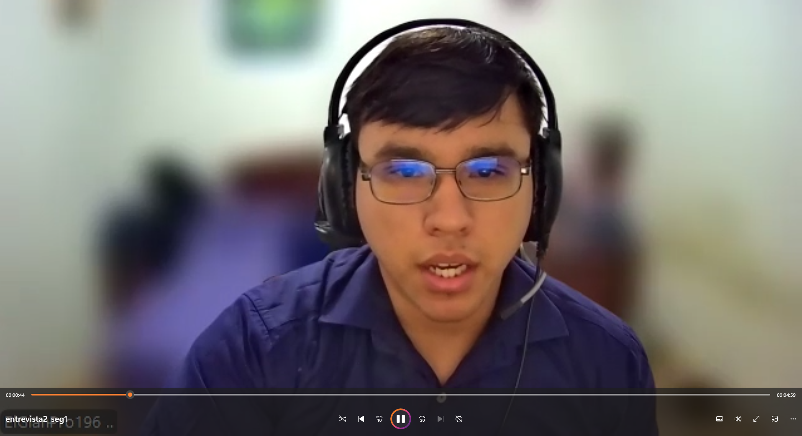
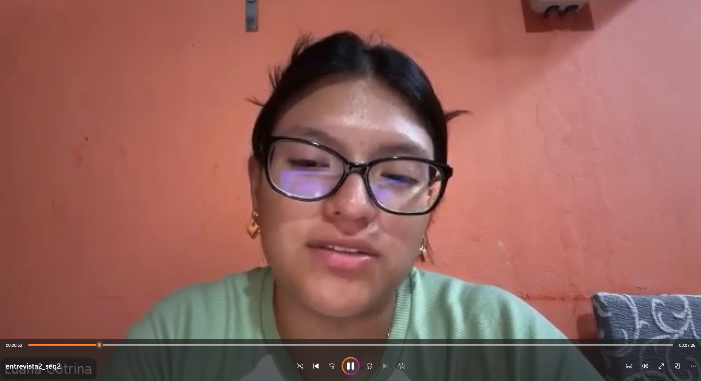
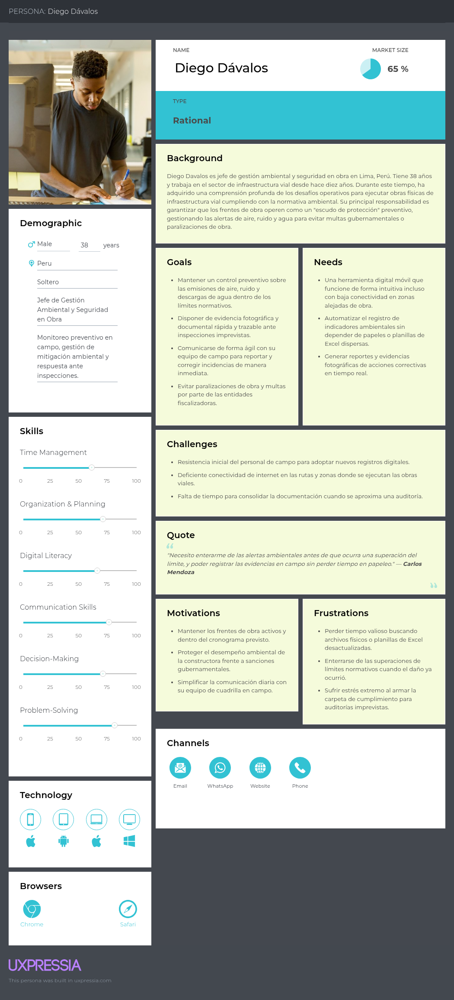
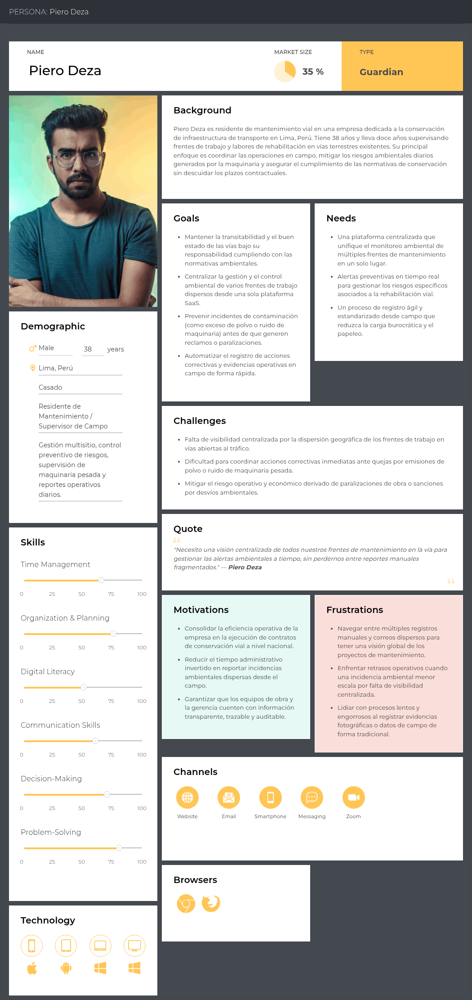
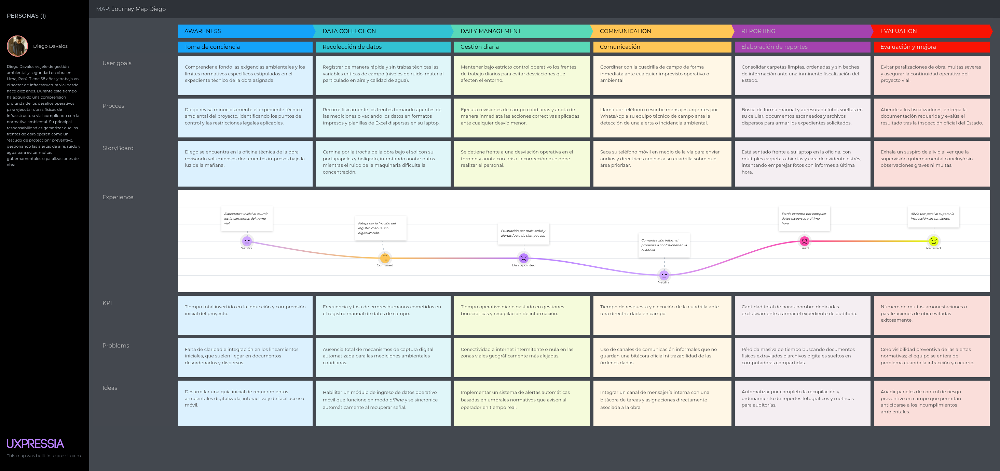
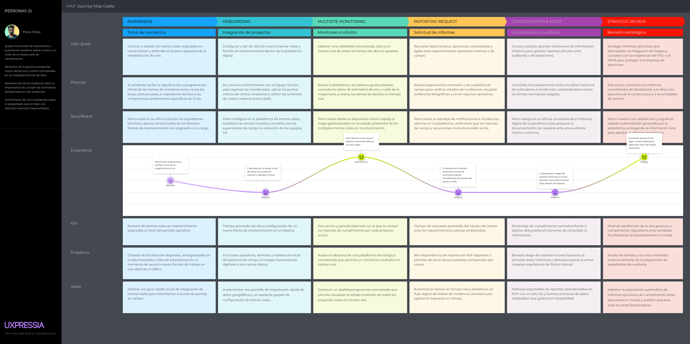
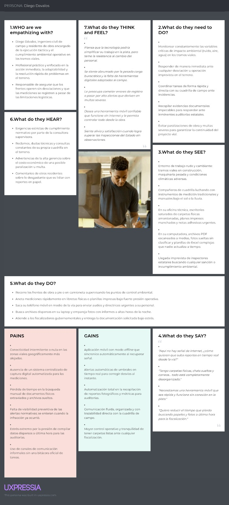
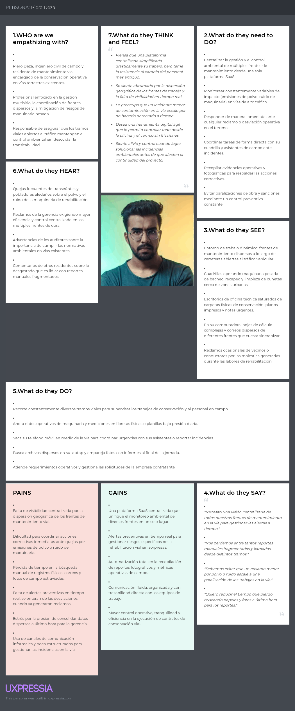
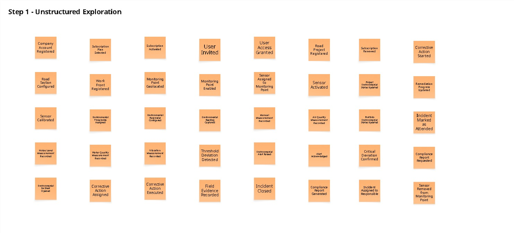
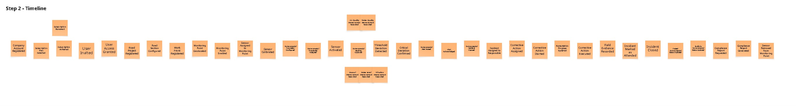

# Requirements Elicitation & Analysis

## 2.1 Competidores

### 2.1.1 Analisis Competitivo

<table style="border: 1px solid ; border-collapse: collapse; width: 100%;">
  <thead>
    <tr>
       <th colspan="6" style="border: 1px solid ; text-align: left; padding: 8px;"><strong>Competitive Analysis Landscape</strong></th>
    </tr>
    <tr>
      <td style="font-weight: bold; width: 18%;">¿Por qué llevar a cabo este análisis?</td>
      <td colspan="5" style="text-align: justify;">
        <strong>Escriba en el recuadro la pregunta que busca responder o el objetivo de este análisis.</strong>  
        El objetivo de este análisis es evaluar las soluciones tecnológicas existentes en el mercado de monitoreo ambiental y gestión de obras —tanto a nivel de hardware especializado como de plataformas SaaS y suites de construcción— para identificar brechas operativas en el sector de infraestructura vial. A través de este contraste, Caiman busca validar su posicionamiento estratégico basado en un modelo híbrido HaaS/SaaS neutral, automatización preventiva de incidencias y aseguramiento de datos inalterables frente a la competencia directa e indirecta.
      </td>
    </tr>
    <tr align="center">
      <th colspan="2" style="vertical-align: middle;">(En la cabecera colocar por cada competidor nombre y logo)</th>
      <th style="vertical-align: middle;"><strong>Su startup</strong>  <strong>EcoRoad (Caiman)</strong>  </th>
      <th style="vertical-align: middle;"><strong>Competidor 1</strong>  <strong>SiteHive</strong>  </th>
      <th style="vertical-align: middle;"><strong>Competidor 2</strong>  <strong>Sonitus Systems</strong>  </th>
      <th style="vertical-align: middle;"><strong>Competidor 3</strong>  <strong>Autodesk CC</strong>  </th>
    </tr>
  </thead>
  <tbody>
    <!-- SECCIÓN PERFIL -->
    <tr>
      <td rowspan="2" align="center" style="font-weight: bold; vertical-align: middle;">Perfil</td>
      <td style="font-weight: bold;">Overview</td>
      <td>Plataforma HaaS/SaaS integrada con red propia de sensores IoT en comodato para monitoreo ambiental (aire, ruido, agua) y gestión preventiva en obras viales.</td>
      <td>Plataforma SaaS australiana especializada en monitoreo ambiental continuo (ruido, polvo, vibración) para construcción y minería.</td>
      <td>Proveedor global especializado en instrumentación y monitorización IoT de nivel de ruido y calidad del aire para monitoreo ambiental.</td>
      <td>Suite integral de software basada en la nube para la gestión de proyectos de construcción, flujos de trabajo BIM y control documental.</td>
    </tr>
    <tr>
      <td style="font-weight: bold;">Ventaja competitiva ¿Qué valor ofrece a los clientes?</td>
      <td>Modelo HaaS sin inversión inicial de hardware, automatización de acciones correctivas y motor de mitigación preventiva para constructoras y empresas de mantenimiento vial.</td>
      <td>Automatización del procesamiento de datos ambientales de campo con algoritmos de reconocimiento de eventos de ruido mediante IA.</td>
      <td>Equipos de medición de alta robustez, precisión instrumental y cumplimiento estricto de estándares internacionales de calibración sonora.</td>
      <td>Integración nativa y madura con modelos BIM (Revit/Civil 3D), gestión de calidad global y amplia adopción corporativa en el sector.</td>
    </tr>
    <!-- SECCIÓN MARKETING -->
    <tr>
      <td rowspan="2" align="center" style="font-weight: bold; vertical-align: middle;">Perfil de Marketing</td>
      <td style="font-weight: bold;">Mercado objetivo</td>
      <td>Empresas constructoras viales y empresas de mantenimiento y rehabilitación vial que operan múltiples proyectos en Perú y LatAm.</td>
      <td>Contratistas generales de edificación e infraestructura pesada en Australia, Nueva Zelanda, Reino Unido y Norteamérica.</td>
      <td>Consultores acústicos, autoridades municipales, firmas ambientales y proyectos industriales a nivel internacional.</td>
      <td>Empresas constructoras de gran envergadura, consorcios de ingeniería, firmas de diseño y entidades públicas a nivel global.</td>
    </tr>
    <tr>
      <td style="font-weight: bold;">Estrategias de marketing</td>
      <td>Alianzas con gremios sectoriales (CAPECO), prospección directa B2B a gerentes de operaciones de constructoras y concesionarias viales.</td>
      <td>Inbound marketing, casos de éxito en megaproyectos urbanos, marketing de contenidos sobre sostenibilidad y webinars técnicos.</td>
      <td>Venta consultiva técnica B2B, presencia en ferias de instrumentación acústica/ambiental y red de distribuidores de hardware.</td>
      <td>Campañas masivas B2B, certificaciones profesionales oficiales, red de partners globales y promociones integradas en el ecosistema Autodesk.</td>
    </tr>
    <!-- SECCIÓN PRODUCTO -->
    <tr>
      <td rowspan="3" align="center" style="font-weight: bold; vertical-align: middle;">Perfil de Producto</td>
      <td style="font-weight: bold;">Productos & Servicios</td>
      <td>Red de sensores IoT (ruido, material particulado, calidad de agua, vibraciones), tablero geolocalizado multitramo, sistema de incidencias y reportes legales en PDF.</td>
      <td>Dispositivos de monitoreo SiteHive (Hexanode), software cloud con mapas en tiempo real, alertas por correo/SMS y reportes de cumplimiento.</td>
      <td>Equipos de medición física (sonómetros Sonitus EM2010, monitores de polvo) integrados a su plataforma web Sonitus Cloud de análisis histórico.</td>
      <td>Módulos de Autodesk Build, BIM Collaborate, Docs y Takeoff; herramientas de incidencias generales (RFI), planos y control de avance.</td>
    </tr>
    <tr>
      <td style="font-weight: bold;">Precios & Costos</td>
      <td>Suscripción dual HaaS mensual o anual (planes Starter, Professional, Enterprise) que incluye software, soporte y alquiler flexible de sensores IoT.</td>
      <td>Suscripción SaaS por dispositivo activo al mes/año; el hardware requiere alquiler por separado o compra directa del kit.</td>
      <td>Venta directa de hardware (costo de capital elevado por equipo) más suscripción periódica por acceso a la plataforma Sonitus Cloud.</td>
      <td>Licenciamiento por usuario/mes o esquema corporativo por volumen de facturación del proyecto (tarifas premium elevadas).</td>
    </tr>
    <tr>
      <td style="font-weight: bold;">Canales de distribución (Web y/o Móvil)</td>
      <td>Plataforma Web responsiva accesible vía navegador de escritorio y móvil, con despliegue de hardware directo en frentes de obra vial.</td>
      <td>Aplicación Web para navegador y versión optimizada para navegadores móviles.</td>
      <td>Plataforma Web (Sonitus Cloud) y distribución física de sensores a través de canales logísticos y representantes locales.</td>
      <td>Aplicación Web de escritorio, aplicaciones móviles dedicadas (iOS y Android) y extensiones de escritorio integradas.</td>
    </tr>
    <!-- SECCIÓN SWOT -->
    <tr>
      <td rowspan="5" align="center" style="font-weight: bold; vertical-align: middle;">Análisis SWOT</td>
      <td colspan="5"><em>Realice esto para su startup y sus competidores. Sus fortalezas deberían apoyar sus oportunidades y contribuir a lo que ustedes definen como su posible ventaja competitiva.</em></td>
    </tr>
    <tr>
      <td style="font-weight: bold;">Fortalezas</td>
      <td>Modelo de ingresos HaaS flexible (cero CapEx forzoso en sensores), flujo completo desde detección IoT hasta cierre de acciones correctivas y gestión multi-proyecto.</td>
      <td>Plataforma de software intuitiva, algoritmos avanzados de clasificación de fuentes de ruido y marca validada en mercados desarrollados.</td>
      <td>Alta precisión de hardware, sensores certificados bajo normas IEC/ISO y larga vida útil de los equipos en campo.</td>
      <td>Posición dominante del mercado global, ecosistema de software interconectado y solidez técnica/financiera corporativa.</td>
    </tr>
    <tr>
      <td style="font-weight: bold;">Debilidades</td>
      <td>Startup en etapa inicial, catálogo de parámetros físicos limitado al alcance de la primera versión y red operativa de despliegue en consolidación.</td>
      <td>Dependencia de conectividad de red celular estable, costos elevados para proyectos medianos en economías emergentes y soporte regional limitado.</td>
      <td>La plataforma de software funciona principalmente como visor pasivo de telemetría, careciendo de gestión preventiva operativa de obra.</td>
      <td>No cuenta con verticalización nativa para estándares ambientales locales (ECA Perú) ni provisión propia de hardware IoT ambiental.</td>
    </tr>
    <tr>
      <td style="font-weight: bold;">Oportunidades</td>
      <td>Normativas ambientales peruanas más rigurosas (fiscalización continua MTC/OEFA) y necesidad de mitigar riesgos de multas en constructoras y concesionarias.</td>
      <td>Expansión hacia regulaciones de descarbonización e iniciativas ESG en obras de infraestructura civil internacional.</td>
      <td>Crecimiento de proyectos de ciudades inteligentes y ordenanzas municipales de control estricto de contaminación sonora.</td>
      <td>Adquisición o integración de plugins IoT de terceros para centralizar mediciones ambientales dentro de Autodesk Construction Cloud.</td>
    </tr>
    <tr>
      <td style="font-weight: bold;">Amenazas</td>
      <td>Reticencia cultural al cambio tecnológico en obras de provincias y demoras administrativas en la adopción por parte de operadoras tradicionales.</td>
      <td>Entrada de proveedores de hardware de bajo costo con capacidades de software genéricas.</td>
      <td>Competidores locales que ofrecen calibración y alquiler de instrumental tradicional a tarifas reducidas por jornada.</td>
      <td>Desarrollo de módulos nativos de gestión ambiental y sostenibilidad dentro de la suite de Autodesk a corto plazo.</td>
    </tr>
  </tbody>
</table>

### 2.1.2. Estrategias y tácticas frente a competidores

Para posicionar a EcoRoad frente a la competencia internacional (como SiteHive y Sonitus Systems) y a las soluciones generalistas de gestión de proyectos (como Autodesk Construction Cloud), Caiman implementa las siguientes estrategias y tácticas competitivas:

* **Estrategia de Costos y Accesibilidad (Modelo HaaS):** A diferencia de competidores que exigen la compra directa y costosa de hardware de medición (Inversión de Capital o CapEx elevado), Caiman ofrece un esquema flexible de alquiler de sensores IoT en comodato adaptado a las necesidades específicas de cada obra vial. Esto elimina la barrera financiera de entrada para empresas constructoras medianas y de conservación vial.
* **Enfoque Vertical y Operativo (Más allá del Visor Pasivo):** Mientras que los proveedores tradicionales de hardware ambiental (Sonitus Systems) actúan meramente como visores pasivos de telemetría y las herramientas BIM (Autodesk) se enfocan en diseño y control documental general, EcoRoad integra el monitoreo IoT directamente con un flujo completo de respuesta operativa: *detección de riesgo → alerta automática → creación de ticket de incidencia → asignación de acción correctiva → registro de evidencia y cierre*.
* **Gestión Multi-Proyecto para Concesionarias y Constructoras:** Se despliega una arquitectura pensada para que las empresas ejecutoras y de mantenimiento vial gestionen múltiples frentes de obra simultáneamente desde una única cuenta centralizada y un mapa geolocalizado unificado, optimizando el control que ejercen los residentes de obra y jefes de operaciones.
* **Estrategia Comercial B2B Dirigida:** La prospección se enfoca directamente en gerentes de operaciones, gerentes de proyectos y residentes de obra de constructoras y empresas de conservación vial, apoyándose en alianzas estratégicas con gremios sectoriales (como CAPECO) y demostrando una reducción directa en el riesgo de paralizaciones y sanciones regulatorias ante el MTC y el OEFA.

## 2.2. Entrevistas

### 2.2.1. Diseño de Entrevistas

Las entrevistas semiestructuradas tienen como objetivo validar las hipótesis del problema, comprender los flujos de trabajo actuales y evaluar la disposición de adopción tecnológica frente a la propuesta de EcoRoad. Las preguntas se estructuran en una fase inicial de presentación y bloques diferenciados para cada uno de los dos segmentos objetivo.

#### Preguntas de Presentación (Transversales)
* ¿Cuál es tu nombre y edad?
* ¿Cuál es tu cargo actual y hace cuánto tiempo te desempeñas en él?
* ¿Cuáles son tus principales responsabilidades del día a día en relación con la gestión o supervisión ambiental del proyecto vial?

---

#### Segmento 1: Empresas Constructoras Viales

**Preguntas Principales:**
* ¿Cómo es tu proceso actual para registrar los indicadores ambientales (aire, ruido, agua, vibraciones) en obra? ¿Qué herramientas usas hoy para ese registro (Excel, papel, planillas internas)?
* Cuéntame sobre la última vez que detectaste un posible incumplimiento normativo en la ejecución de la obra: ¿cómo te enteraste y qué pasos siguieron después?
* ¿Cuánto tiempo suele pasar entre que ocurre una superación de un límite normativo en campo y el momento en que el equipo directivo o de operaciones se entera de ella?
* Cuéntame cómo preparas la documentación ambiental cuando se aproxima una fiscalización de una entidad reguladora (como OEFA o MTC). ¿Qué parte de ese proceso te consume más tiempo o te genera mayor estrés?
* ¿Ha pasado alguna vez que un incumplimiento o riesgo ambiental en la construcción se detectara tarde? ¿Qué consecuencias operativas o económicas tuvo?
* ¿Cómo se comunica el equipo de campo con la oficina técnica cuando se necesita registrar una medición urgente o reportar una incidencia imprevista en el frente de obra?
* ¿Desde qué dispositivo sueles trabajar cuando estás recorriendo los frentes viales (celular, tablet, laptop) y qué tan confiable es la conectividad en esas zonas de trabajo?

**Preguntas Complementarias:**
* ¿Quién más en tu organización necesita ver esta información ambiental y con qué frecuencia se la compartes?
* ¿Has usado o probado alguna herramienta digital para el control de obras o cumplimiento normativo antes? ¿Qué te gustó o no te gustó de ella?

---

#### Segmento 2: Empresas de Mantenimiento y Rehabilitación Vial

**Preguntas Principales:**
* ¿Cómo registran actualmente los indicadores ambientales durante los trabajos de mantenimiento o rehabilitación de una vía? ¿Utilizan Excel, formatos físicos, fotografías u otra herramienta?
* Cuéntame sobre la última vez que durante un trabajo de mantenimiento o rehabilitación detectaron un problema ambiental, como exceso de ruido, polvo, residuos o vibraciones. ¿Cómo se dieron cuenta y qué hicieron después?
* ¿Qué tan rápido se enteran los responsables del proyecto cuando una medición ambiental supera un límite permitido durante los trabajos?
* ¿Cómo hacen actualmente el seguimiento de las acciones que deben realizar cuando se detecta un problema ambiental? ¿Cómo saben si la incidencia ya fue atendida o continúa pendiente?
* Cuando trabajan en diferentes tramos o zonas de una carretera, ¿cómo organizan y relacionan las mediciones ambientales con el lugar exacto donde fueron tomadas?
* Cuéntame cómo preparan los registros y evidencias ambientales que deben presentar al finalizar una actividad de mantenimiento o rehabilitación. ¿Qué parte del proceso les resulta más complicada?
* ¿Ha ocurrido alguna vez que una incidencia ambiental no se haya comunicado a tiempo o se haya perdido información sobre ella? ¿Qué consecuencias tuvo para el proyecto?
* Cuando el personal está trabajando directamente en la carretera, ¿cómo comunica una medición, problema o incidencia al responsable que se encuentra en la oficina?

**Preguntas Complementarias:**

* ¿Cómo almacenan actualmente las fotografías, mediciones y documentos que sirven como evidencia de las actividades realizadas?
* ¿Desde qué dispositivo suelen registrar información durante los trabajos de campo (celular, tablet, laptop) y qué dificultades tienen con la conectividad en las zonas donde trabajan?

2.2.2. Registro de entrevistas.
En esta sección, se registra cada entrevista realizada. En total, se realizaron XXX entrevistas por cada segmento objetivo. Se detalla el nombre del miembro entrevistador y el del entrevistado. Además, se redacta un resumen general del contenido de la entrevista realizada.

**Segmento 1: Empresas constructoras viales**

Entrevista 1

| Entrevista                                                                                                                                                                                                                                                                                                                      | Registro                                                                                                                                                                                                                                                                                                                                                                                                                                                                                                                                                                                                                                                                                                                                                                                                                                                                                                                                                                                                                                                                                                                                                                                                                      |
|---------------------------------------------------------------------------------------------------------------------------------------------------------------------------------------------------------------------------------------------------------------------------------------------------------------------------------|-------------------------------------------------------------------------------------------------------------------------------------------------------------------------------------------------------------------------------------------------------------------------------------------------------------------------------------------------------------------------------------------------------------------------------------------------------------------------------------------------------------------------------------------------------------------------------------------------------------------------------------------------------------------------------------------------------------------------------------------------------------------------------------------------------------------------------------------------------------------------------------------------------------------------------------------------------------------------------------------------------------------------------------------------------------------------------------------------------------------------------------------------------------------------------------------------------------------------------|
|                                                                                                                                                                                                                                                                        | **Entrevistado:** Fabián García   **Edad:** 26 años   **Puesto:** Especialista Ambiental                                                                                                                                                                                                                                                                                                                                                                                                                                                                                                                                                                                                                                                                                                                                                                                                                                                                                                                                                                                                                                                                                                                             |
| [Link](https://upcedupe-my.sharepoint.com/:v:/g/personal/u202624323_upc_edu_pe/IQCR94O4hhpiQZeByM-XBe5pAXNXf2oti2le5NQzcso974I?e=aTpmdG&nav=eyJyZWZlcnJhbEluZm8iOnsicmVmZXJyYWxBcHAiOiJTdHJlYW1XZWJBcHAiLCJyZWZlcnJhbFZpZXciOiJTaGFyZURpYWxvZy1MaW5rIiwicmVmZXJyYWxBcHBQbGF0Zm9ybSI6IldlYiIsInJlZmVycmFsTW9kZSI6InZpZXcifX0%3D) | **Entrevistador:** Alisee Muriel Torres Juárez                                                                                                                                                                                                                                                                                                                                                                                                                                                                                                                                                                                                                                                                                                                                                                                                                                                                                                                                                                                                                                                                                                                                                                                |
| **Timing**                                                                                                                                                                                                                                                                                                                      | **Inicio:** 00:20                                                                                                                                                                                                                                                                                                                                                                                                                                                                                                                                                                                                                                                                                                                                                                                                                                                                                                                                                                                                                                                                                                                                                                                                             | 
| **Timing**                                                                                                                                                                                                                                                                                                                      | **Fin:** 6:20                                                                                                                                                                                                                                                                                                                                                                                                                                                                                                                                                                                                                                                                                                                                                                                                                                                                                                                                                                                                                                                                                                                                                                                                                 |
| **Resumen**                                                                                                                                                                                                                                                                                                                     | **Perfil y Frustración:** Especialista Ambiental de perfil muy operativo e impulsivo, enfocado en auditar en terreno. Su mayor frustración es perder hasta 4 días enteros buscando fotos viejas en chats para defenderse de auditorías y el retraso de hasta 20 días en los análisis de laboratorio, lo que ya le ha costado multas y la paralización de frentes de obra.   **Comportamiento y Necesidades:** Necesita "botar el papel" y usar una app móvil ultrarrápida que funcione 100% sin señal, apta para el trabajo pesado en terreno. Requiere que la app guarde las evidencias del "antes y después" clasificadas por fecha y progresión kilométrica para salir airoso de las fiscalizaciones sin pasar noches pasando datos a Word.  **Tecnología, Marcas y Canales:** Sustituyó las tablets por su celular y usa laptop en oficina. Intentó implementar Google Forms con Excel, pero fracasó drásticamente porque el 70% de la carretera no tiene señal. Su canal principal es un grupo de WhatsApp saturado de audios y fotos que terminan perdiéndose.|

Entrevista 2

| Entrevista                                                                                                                                                                                                                                                                                                                      | Registro                                                                                                                                                                                                                                                                                                                                                                                                                                                                                                                                                                                                                                                                                                                                                                                                                                                                                                                                                                                                                                                                                                                                                                                                                      |
|---------------------------------------------------------------------------------------------------------------------------------------------------------------------------------------------------------------------------------------------------------------------------------------------------------------------------------|-------------------------------------------------------------------------------------------------------------------------------------------------------------------------------------------------------------------------------------------------------------------------------------------------------------------------------------------------------------------------------------------------------------------------------------------------------------------------------------------------------------------------------------------------------------------------------------------------------------------------------------------------------------------------------------------------------------------------------------------------------------------------------------------------------------------------------------------------------------------------------------------------------------------------------------------------------------------------------------------------------------------------------------------------------------------------------------------------------------------------------------------------------------------------------------------------------------------------------|
|                                                                                                                                                                                                                                                                        | **Entrevistado:** Gianfranco Sanguineti   **Edad:** 27 años   **Puesto: Residente de Obra**                                                                                                                                                                                                                                                                                                                                                                                                                                                                                                                                                                                                                                                                                                                                                                                                                                                                                                                                                                                                                                                                                                                             |
| [Link](https://upcedupe-my.sharepoint.com/:v:/g/personal/u202212897_upc_edu_pe/IQBRYubM6zdLQJss7HPd1lPDAWpCUWZF-bOllpZFfAVV63c?e=Bc1Zcl) | **Entrevistador:** Miguel Ángel Junior Román López                                                                                                                                                                                                                                                                                                                                                                                                                                                                                                                                                                                                                                                                                                                                                                                                                                                                                                                                                                                                                                                                                                                                                                                |
| **Timing**                                                                                                                                                                                                                                                                                                                      | **Inicio:** 00:00                                                                                                                                                                                                                                                                                                                                                                                                                                                                                                                                                                                                                                                                                                                                                                                                                                                                                                                                                                                                                                                                                                                                                                                                             | 
| **Timing**                                                                                                                                                                                                                                                                                                                      | **Fin:** 05:24                                                                                                                                                                                                                                                                                                                                                                                                                                                                                                                                                                                                                                                                                                                                                                                                                                                                                                                                                                                                                                                                                                                                                                                                                 |
| **Resumen**                                                                                                                                                                                                                                                                                                                     | **Perfil y Frustración:** Profesional a cargo de la ejecución operativa y la supervisión del cumplimiento normativo ambiental directamente en el frente de trabajo. Su mayor frustración es la enorme carga burocrática y el estrés asociado a la consolidación de reportes dispersos (actas en papel y múltiples archivos de Excel) para prepararse ante fiscalizaciones del OEFA o MTC. Le genera mucha ansiedad y problemas operativos (paralizaciones) cuando los incidentes se detectan tarde por la brecha de tiempo entre la ocurrencia en campo y el reporte formal.    **Comportamiento y Necesidades:** Tiene un flujo de trabajo altamente manual y desarticulado; anota mediciones con equipos portátiles en libretas para que un asistente las digite horas después. Su principal necesidad es contar con un sistema que automatice el registro de evidencias, elimine la dependencia del papeleo diario y permita alertar a la oficina técnica de manera inmediata frente a riesgos ambientales.   **Tecnología, Marcas y Canales:**Trabaja principalmente desde su celular en zonas donde la conectividad 4G es inestable o nula. Emplea WhatsApp como canal de emergencia no oficial para enviar audios y fotos, y Microsoft Excel para el control formal. Muestra gran desconfianza hacia plataformas 100% en la nube debido a experiencias pasadas con caídas de servidores que bloquearon su acceso a documentos críticos. |

**Segmento 2: Empresas de mantenimiento**

Entrevista 3

| Entrevista                                                                                                                                                                                                                                                                                                                      | Registro                                                                                                                                                                                                                                                                                                                                                                                                                                                                                                                                                                                                                                                                                                                                                                                                                                                                                                                                                                                                                                                                                                                                                                                                                      |
|---------------------------------------------------------------------------------------------------------------------------------------------------------------------------------------------------------------------------------------------------------------------------------------------------------------------------------|-------------------------------------------------------------------------------------------------------------------------------------------------------------------------------------------------------------------------------------------------------------------------------------------------------------------------------------------------------------------------------------------------------------------------------------------------------------------------------------------------------------------------------------------------------------------------------------------------------------------------------------------------------------------------------------------------------------------------------------------------------------------------------------------------------------------------------------------------------------------------------------------------------------------------------------------------------------------------------------------------------------------------------------------------------------------------------------------------------------------------------------------------------------------------------------------------------------------------------|
|                                                                                                                                                                                                                                                                        | **Entrevistado: Luana Cotrina Ramirez**    **Edad:27 años**  años   **Puesto: Gerente de Operaciones**                                                                                                                                                                                                                                                                                                                                                                                                                                                                                                                                                                                                                                                                                                                                                                                                                                                                                                                                                                                                                                                                                                                             |
| [Link](https://upcedupe-my.sharepoint.com/:v:/g/personal/u202212897_upc_edu_pe/IQBVrZ2J8E6gT7j9l0VWxV_kAf5YpM_n9VpIV0FKFBnIHb8?e=v5mrAm) | **Entrevistador:** Miguel Ángel Junior Román López                                                                                                                                                                                                                                                                                                                                                                                                                                                                                                                                                                                                                                                                                                                                                                                                                                                                                                                                                                                                                                                                                                                                                                                |
| **Timing**                                                                                                                                                                                                                                                                                                                      | **Inicio:** 00:00                                                                                                                                                                                                                                                                                                                                                                                                                                                                                                                                                                                                                                                                                                                                                                                                                                                                                                                                                                                                                                                                                                                                                                                                             | 
| **Timing**                                                                                                                                                                                                                                                                                                                      | **Fin:** 08:16                                                                                                                                                                                                                                                                                                                                                                                                                                                                                                                                                                                                                                                                                                                                                                                                                                                                                                                                                                                                                                                                                                                                                                                                                 |
| **Resumen**                                                                                                                                                                                                                                                                                                                     | **Perfil y Frustración:**Ejecutiva responsable de garantizar el avance fluido y sin penalidades de múltiples proyectos simultáneos a nivel nacional. Su frustración central es la "ceguera operativa" y la falta de estandarización: depende de reportes semanales en Excel enviados por correo, lo que hace subjetivo y lento (toma de 3 a 4 días) comparar el desempeño entre tramos. Le frustran profundamente las multas o amonestaciones sorpresivas por incidentes ocultos en campo, ya que estas dañan el récord de la empresa en licitaciones públicas.    **Comportamiento y Necesidades:** Gestiona las incidencias mediante un "criterio de incendio", reaccionando solo ante los riesgos inminentes de paralización. Necesita imperiosamente una visión consolidada, centralizada y en tiempo real de toda la cartera de proyectos. Requiere reducir drásticamente las horas hombre invertidas en generar reportes y asegurar que los incidentes se detecten antes de escalar al cliente comitente.   **Tecnología, Marcas y Canales:** Su ecosistema actual se basa en correos electrónicos, macro-archivos de Excel y reportes manuales en PDF. Está completamente dispuesta a adoptar tecnologías IoT bajo un modelo HaaS (alquiler en comodato) para evitar altas inversiones de capital (CapEx). No obstante, su principal barrera tecnológica es la ciberseguridad corporativa; exige garantías absolutas de redundancia en servidores y la posibilidad de mantener respaldos locales (offline) para mitigar el riesgo de pérdida de datos ante auditorías estatales. |

Entrevista 4

| Entrevista                                                                                                                                                                                                                                                                                                                      | Registro                                                                                                                                                                                                                                                                                                                                                                                                                                                                                                                                                                                                                                                                                                                                                                                                                                                                                                                                                               |
|---------------------------------------------------------------------------------------------------------------------------------------------------------------------------------------------------------------------------------------------------------------------------------------------------------------------------------|------------------------------------------------------------------------------------------------------------------------------------------------------------------------------------------------------------------------------------------------------------------------------------------------------------------------------------------------------------------------------------------------------------------------------------------------------------------------------------------------------------------------------------------------------------------------------------------------------------------------------------------------------------------------------------------------------------------------------------------------------------------------------------------------------------------------------------------------------------------------------------------------------------------------------------------------------------------------|
|                                                                                                                                                                                                                                                                        | **Entrevistado:** Renato Vega   **Edad:** 24 años   **Puesto:** Especialista Ambiental                                                                                                                                                                                                                                                                                                                                                                                                                                                                                                                                                                                                                                                                                                                                                                                                                                                                           |
| [Link](https://upcedupe-my.sharepoint.com/:v:/g/personal/u202624323_upc_edu_pe/IQA2vN43Js9kSIHW8sRF1FmJATwEOu605tG-zMv0j9wv2GE?e=NDrakL&nav=eyJyZWZlcnJhbEluZm8iOnsicmVmZXJyYWxBcHAiOiJTdHJlYW1XZWJBcHAiLCJyZWZlcnJhbFZpZXciOiJTaGFyZURpYWxvZy1MaW5rIiwicmVmZXJyYWxBcHBQbGF0Zm9ybSI6IldlYiIsInJlZmVycmFsTW9kZSI6InZpZXcifX0%3D) | **Entrevistador:** Alisee Muriel Torres Juárez                                                                                                                                                                                                                                                                                                                                                                                                                                                                                                                                                                                                                                                                                                                                                                                                                                                                                                                         |
| **Timing**                                                                                                                                                                                                                                                                                                                      | **Inicio:** 00:00                                                                                                                                                                                                                                                                                                                                                                                                                                                                                                                                                                                                                                                                                                                                                                                                                                                                                                                                                      | 
| **Timing**                                                                                                                                                                                                                                                                                                                      | **Fin:** 4:24                                                                                                                                                                                                                                                                                                                                                                                                                                                                                                                                                                                                                                                                                                                                                                                                                                                                                                                                                          |
| **Resumen**                                                                                                                                                                                                                                                                                                                     | **Perfil y Frustración:**   Especialista Ambiental. Su principal frustración es la falta de visibilidad en tiempo real por la conectividad intermitente en la carretera y la pérdida de información física (como el traspapeleo de un reporte que causó una llamada de atención formal), lo que le genera retrasos para detectar fallas y un estresante trabajo de oficina a última hora.    **Comportamiento y Necesidades:**   Requiere una herramienta móvil offline que organice automáticamente fotos y datos según el kilometraje del tramo, automatice las alertas por límites superados y permita dar seguimiento a las incidencias sin tener que hacer llamadas o viajes presenciales.   **Tecnología, Marcas y Canales:**  Usa celular para fotos, libreta de papel para notas y laptop para consolidar Excels. Se comunica informalmente vía WhatsApp y llamadas directas, lo que deja la información dispersa y sin registro oficial. |

Entrevista 5

| Entrevista | Registro |
|---------------------------------------------------------------------------------------------------------------------------------------------------------------------------------------------------------------------------------------------------------------------------------------------------------------------------------|------------------------------------------------------------------------------------------------------------------------------------------------------------------------------------------------------------------------------------------------------------------------------------------------------------------------------------------------------------------------------------------------------------------------------------------------------------------------------------------------------------------------------------------------------------------------------------------------------------------------------------------------------------------------------------------------------------------------------------------------------------------------------------------------------------------------------------------------------------------------------------------------------------------------------------------------------------------------|
|  | **Entrevistado:** Fabricio Aparicio   **Edad:** 25 años   **Puesto:** Supervisor de Campo de Mantenimiento Vial |
| [Link](https://upcedupe-my.sharepoint.com/:v:/g/personal/u20241e417_upc_edu_pe/IQDWjE9tAPBQQYryG12pUpvYAfveHKqBOb3BwlBYgfOzjZU?e=45vPPT) | **Entrevistador:** [Andy Salcedo] |
| **Timing** | **Inicio:** 00:01 |
| **Timing** | **Fin:** 04:14 |
| **Resumen** | **Perfil y Frustración:**   Supervisor de Campo de Mantenimiento Vial. Su principal frustración es tener la información ambiental dispersa entre formatos físicos, Excel, fotografías y WhatsApp. Esto dificulta organizar los registros, hacer seguimiento rápido a las incidencias y preparar los informes finales.     **Comportamiento y Necesidades:**   Necesita una herramienta que permita registrar mediciones, fotografías e incidencias directamente desde el lugar de trabajo, asociándolas al tramo o kilómetro correspondiente. También requiere recibir y hacer seguimiento de las alertas para saber qué problemas están pendientes o ya fueron solucionados.    **Tecnología, Marcas y Canales:**   Utiliza principalmente celular, tablet y laptop. Registra información mediante formatos físicos y Excel, mientras que las fotografías se almacenan en celulares o carpetas en la computadora o nube. La comunicación con la oficina se realiza principalmente mediante WhatsApp y llamadas, especialmente cuando existe poca conectividad en carretera. |

2.2.3. Análisis de entrevistas.

El siguiente análisis sintetiza los datos de las **5 entrevistas registradas** en las fuentes del proyecto, agrupándolas por segmento objetivo para definir con sustento estadístico las características objetivas y subjetivas requeridas en la elaboración de los arquetipos.

---

#### **1\. Segmento 1: Empresas Constructoras Viales**

*(Muestra analizada: 2 entrevistas – Fabián García y Gianfranco Sanguineti)*

##### **A. Características Objetivas**

* **Edad y perfil profesional:**
    * **Edad promedio:** **26.5 años** (rango de 26 a 27 años).
    * **Cargos representados:** El **50% (1/2)** corresponde al rol de **Especialista Ambiental** y el **50% (1/2)** al de **Residente de Obra**.
* **Ecosistema tecnológico y herramientas:**
    * **100% (2/2)** utiliza el **teléfono celular** como dispositivo principal de trabajo en el frente de obra.
    * **100% (2/2)** realiza el control de información mediante **formatos manuales, libretas de campo y plantillas en Microsoft Excel**.
    * **100% (2/2)** emplea **WhatsApp** como canal informal predominante para enviar fotos, audios y coordinar urgencias.
    * **50% (1/2)** utiliza **laptop** en oficina y ha sustituido el uso de tablets por el smartphone.
* **Entorno operativo y conectividad:**
    * **100% (2/2)** opera en tramos de carretera con **conectividad inestable o nula**, destacando que en zonas de obra hasta un **70% del tramo carece de señal mobile/4G**.

##### **B. Características Subjetivas (Puntos de Dolor, Necesidades y Actitudes)**

* **Frustraciones y dolores principales:**
    * **100% (2/2)** manifiesta alta frustración por la **carga burocrática y la pérdida de evidencias** dispersas en chats de WhatsApp o actas físicas, lo que genera demoras (hasta 4 días) recopilando datos para responder ante auditorías.
    * **100% (2/2)** experimenta **estrés y ansiedad** debido a la brecha de tiempo entre la ocurrencia de una incidencia en campo y su reporte formal, exponiéndose a **paralizaciones de obra y sanciones** de entidades fiscalizadoras (OEFA/MTC).
* **Necesidades clave para el arquetipo:**
    * **100% (2/2)** requiere **eliminar el registro en papel** e implementar una solución digital móvil ágil directamente en terreno.
    * **50% (1/2)** requiere **funcionamiento 100% offline** (sin señal) que clasifique imágenes por fecha y progresión kilométrica.
    * **50% (1/2)** necesita un **sistema de alertas automáticas** hacia la oficina técnica ante riesgos ambientales.
* **Actitudes y temores:**
    * **50% (1/2)** muestra una actitud altamente operativa e impulsiva enfocado en auditorías en terreno.
    * **50% (1/2)** expresa **desconfianza hacia plataformas 100% en la nube** por experiencias previas con caídas de servidores que bloquearon su acceso a documentos[4].

---

#### **2\. Segmento 2: Empresas de Mantenimiento y Rehabilitación Vial**

*(Muestra analizada: 3 entrevistas – Luana Cotrina Ramirez, Renato Vega y Fabricio Aparicio)*

##### **A. Características Objetivas**

* **Edad y perfil profesional:**
    * **Edad promedio:** **25.3 años** (rango de 24 a 27 años).
    * **Cargos representados:**
        * **33.3% (1/3):** Gerente de Operaciones.
        * **33.3% (1/3):** Especialista Ambiental.
        * **33.3% (1/3):** Supervisor de Campo de Mantenimiento Vial.
* **Ecosistema tecnológico y herramientas:**
    * **100% (3/3)** utiliza el **teléfono celular** para capturar fotografías, registrar mediciones o realizar llamadas.
    * **100% (3/3)** depende de **Microsoft Excel, formatos físicos y/o reportes en PDF** para consolidar información.
    * **66.7% (2/3)** utiliza **laptop y/o tablet** como herramientas de soporte operativo y administrativo.
    * **66.7% (2/3)** utiliza **WhatsApp y llamadas telefónicas** para la comunicación entre el personal de campo y la oficina.
* **Entorno operativo:**
    * **100% (3/3)** gestiona **múltiples tramos o frentes de trabajo geográficamente dispersos** en carreteras abiertas al tráfico con problemas de señal.

##### **B. Características Subjetivas (Puntos de Dolor, Necesidades y Actitudes)**

* **Frustraciones y dolores principales:**
    * **100% (3/3)** se siente frustrado por tener la **información ambiental fragmentada** (libretas, Excel, WhatsApp, carpetas en PC), lo que complica organizar registros e informes finales.
    * **66.7% (2/3)** sufre por la **"ceguera operativa" y la falta de visibilidad en tiempo real**, causada por reportes semanales lentos o traspapeleo de fichas de campo.
    * **33.3% (1/3)** se frustra por la lentitud (3 a 4 días) en comparar el desempeño entre tramos y el impacto que las multas sorpresivas tienen sobre el récord de licitaciones de la empresa.
* **Necesidades clave para el arquetipo:**
    * **100% (3/3)** necesita un sistema que registre y **asocie las evidencias e incidencias directamente al tramo o kilómetro correspondiente**.
    * **66.7% (2/3)** requiere una **visión centralizada y en tiempo real** para dar seguimiento al estado de las alertas (pendientes vs. solucionadas).
    * **33.3% (1/3)** busca un modelo de contratación **HaaS (alquiler de sensores en comodato)** para evitar inversiones de capital inicial (CapEx).
* **Actitudes, temores y barreras:**
    * **33.3% (1/3)** opera bajo un enfoque reactivo ("criterio de incendio"), atendiendo únicamente los problemas inminentes.
    * **33.3% (1/3)** exige **garantías de ciberseguridad corporativa** y la posibilidad de mantener respaldos locales (offline) para auditorías estatales.
2.3. Needfinding.

### 2.3.1. User Personas

**Segmento 1: Empresas constructoras viales**

Para las empresas constructoras se elaboró el User Persona Diego Davalos. Se consideraron factores como su edad, su rol operativo y de mitigación ambiental en proyectos viales, su experiencia en la gestión de frentes de obra y su necesidad de optimizar procesos de registro preventivo de indicadores ambientales (aire, ruido, agua). Sus principales frustraciones giran en torno a la falta de un sistema automatizado para el monitoreo en tiempo real, la dependencia de registros manuales dispersos y la dificultad para recopilar evidencia ante auditorías imprevistas. Asimismo, se tomó en cuenta su familiaridad con herramientas móviles en campo y la necesidad de contar con una solución ágil y resistente a problemas de conectividad que le permita mitigar riesgos y evitar multas o paralizaciones de obra.

 

**Segmento 2: Empresas de mantenimiento y rehabilitación vial**

Para las empresas de mantenimiento y rehabilitación vial se elaboró el User Persona Piero Deza. Se consideraron factores como su rol de residente y supervisor de campo en la conservación de infraestructura de transporte existente, su experiencia en la gestión multisitio de frentes de trabajo dispersos y su necesidad de contar con un control operativo centralizado. Sus principales frustraciones se relacionan con la falta de visibilidad en tiempo real por la dispersión geográfica, la pérdida de tiempo en la búsqueda manual de registros fragmentados y el estrés ante imprevistos en vías abiertas al tráfico. Asimismo, se tomó en cuenta su uso de herramientas móviles y de escritorio, y la necesidad de una plataforma SaaS que permita gestionar alertas preventivas, automatizar el registro de evidencias y asegurar la eficiencia en la ejecución de los proyectos.

 

2.3.2. User Task Matrix.

A continuación, se detalla la matriz con las actividades principales que tanto el representante del Segmento 1 como Piero Deza (Segmento 2) ejecutan en su día a día laboral, enfocadas estrictamente en sus responsabilidades de gestión y supervisión, sin depender de ninguna herramienta digital o software en particular.
<table border="1" cellpadding="8" cellspacing="0" style="border-collapse:collapse; width:100%; font-family:Arial, sans-serif; text-align:center;">
  <thead>
    <tr style="background-color:#eef3f7;">
      <th rowspan="2">Tarea (Task)</th>
      <th colspan="2">Diego Dávalos (Segmento 1)</th>
      <th colspan="2">Piero Deza (Segmento 2)</th>
    </tr>
    <tr style="background-color:#eef3f7;">
      <th>Frecuencia</th>
      <th>Importancia</th>
      <th>Frecuencia</th>
      <th>Importancia</th>
    </tr>
  </thead>
  <tbody>
    <tr>
      <td style="text-align:left;">Monitorear los indicadores ambientales (aire, ruido, agua) en obra</td>
      <td>Daily</td><td>High</td>
      <td>Daily</td><td>High</td>
    </tr>
    <tr>
      <td style="text-align:left;">Registrar evidencia fotográfica y documentar acciones correctivas</td>
      <td>Frequent</td><td>High</td>
      <td>Frequent</td><td>High</td>
    </tr>
    <tr>
      <td style="text-align:left;">Preparar carpetas o reportes para auditorías y fiscalizaciones gubernamentales</td>
      <td>Periodic</td><td>High</td>
      <td>Periodic</td><td>High</td>
    </tr>
    <tr>
      <td style="text-align:left;">Consolidar el estado ambiental de múltiples frentes de trabajo de manera simultánea</td>
      <td>Rare</td><td>Medium</td>
      <td>Daily</td><td>High</td>
    </tr>
    <tr>
      <td style="text-align:left;">Integrar y unificar criterios ambientales ante la incorporación de un nuevo tramo o frente vial</td>
      <td>Rare</td><td>Medium</td>
      <td>Periodic</td><td>High</td>
    </tr>
  </tbody>
</table>

**Análisis del Task Matrix:**

Si analizamos cómo se comportan ambos perfiles a partir de la matriz, saltan a la vista ciertos contrastes interesantes entre sus rutinas:

- Las tareas más pesadas y críticas: Para los dos perfiles, armar y poner a punto los expedientes de auditoría o fiscalización gubernamental es una prioridad indiscutible. La diferencia está en el día a día: mientras Diego se la pasa revisando los medidores ambientales en la misma pista para que la obra nueva no pare, Piero prefiere levantar la vista y gestionar el panorama completo de los múltiples frentes de trabajo dispersos a lo largo de las vías en conservación.

- En qué se parecen: Los dos sufren con el mismo dolor de cabeza. Para ambos, rendir cuentas ante las entidades regulatorias es un proceso tenso donde la exigencia es máxima, y coinciden en que hoy en día lidian con demasiado papeleo suelto o información que no está conectada entre sí cuando intentan armar los reportes de obra.

- En qué se diferencian radicalmente: Todo se reduce a la perspectiva. Diego vive el día a día apagando incendios operativos en la ejecución de obra nueva: toma fotos a cada rato, documenta correcciones rápidas y actúa de inmediato ante cualquier alerta en terreno. Piero, en cambio, maneja una visión de gestión multisitio en vías abiertas al tráfico; le toca coordinar constantemente con sus cuadrillas de mantenimiento frente a las quejas de transeúntes, buscando unificar la información dispersa de sus diferentes tramos carreteros.

2.3.3. User Journey Mapping.

**Segmento 1: Empresas constructoras viales**

El recorrido actual de Diego se centra en la ejecución física de la obra vial y comprende las siguientes etapas principales: 1. Planificación inicial y despliegue en campo, 2. Monitoreo diario de indicadores ambientales (aire, ruido, agua), 3. Detección y respuesta ante una alerta o desvío, y 4. Preparación de evidencias para auditorías o inspecciones imprevistas.
Durante este ciclo, el punto más crítico ocurre en las etapas 2 y 4. Al depender de registros manuales y planillas de Excel dispersas, Diego experimenta una alta frustración debido a la intermitencia de conectividad en zonas alejadas y al riesgo latente de enterarse tarde de una superación de límites normativos. La necesidad de recopilar papeles y fotos sueltas para armar carpetas de cumplimiento genera una carga de estrés considerable antes de cada fiscalización del Estado.

 

**Segmento 2: Empresas de mantenimiento y rehabilitación vial**

El recorrido de Piero abarca una perspectiva operativa de campo y control multisitio, dividida en: 1. Incorporación y configuración inicial de los tramos viales en mantenimiento, 2. Monitoreo diario de las condiciones ambientales frente a la operación de maquinaria pesada, 3. Detección temprana y atención de alertas o quejas por emisiones de polvo y ruido, y 4. Generación y consolidación de reportes ejecutivos de cumplimiento para la gerencia.

El mayor cuello de botella en el viaje de Piero se concentra en las etapas 2 y 3. Debido a la dispersión geográfica de los frentes de trabajo en vías abiertas al tráfico y a la dependencia de registros manuales fragmentados, recopilar evidencias y coordinar acciones correctivas inmediatas le demanda una sobrecarga operativa de llamadas y visitas de campo constantes. Esto lo expone a retrasos en la mitigación de riesgos y a posibles amonestaciones operativas por la falta de visibilidad centralizada en tiempo real.

 
2.3.4. Empathy Mapping.

Para desarrollar los Empathy Maps, se tomaron como base los hallazgos e información recopilada en el estudio previo de los User Personas. Siguiendo la metodología, se ubicó al centro de cada esquema al arquetipo correspondiente para analizar de forma integral su entorno, reacciones emocionales, conductas habituales y requerimientos clave.

**Segmento 1: Empresas constructoras viales**

En este mapa se analizó a Diego Dávalos, un ingeniero civil de campo y residente de obra con la responsabilidad de garantizar la ejecución táctica y el cumplimiento ambiental operativo en los tramos viales. Se identificó que piensa constantemente en la necesidad de simplificar su trabajo en la pista y teme cometer errores de registro que deriven en multas severas. Escucha las exigencias de la consultora supervisora y los reclamos de su cuadrilla, y observa un entorno rudo y cambiante con herramientas manuales obsoletas y carpetas desorganizadas. Diego expresa la necesidad de contar con una herramienta móvil rápida que funcione sin conexión, y actúa recorriendo los frentes, tomando notas físicas y compilando datos a última hora. Su dolor principal es la conectividad intermitente, la ausencia de un sistema centralizado y el estrés por la recopilación manual, mientras que su ganancia esperada es lograr una aplicación móvil con modo offline, alertas automáticas y mayor control operativo para las auditorías.

 

**Segmento 2: Empresas de mantenimiento y rehabilitación vial**

En este mapa se analizó a Piero Deza, un residente de mantenimiento vial y supervisor de campo con la responsabilidad de gestionar múltiples frentes de trabajo y labores de conservación en vías terrestres existentes. Él piensa que una plataforma centralizada simplificaría drásticamente su trabajo diario, aunque a veces teme la resistencia al cambio del personal operativo. Escucha las quejas frecuentes de transeúntes por el polvo y ruido de la maquinaria, los reclamos de la gerencia exigiendo mayor eficiencia y las advertencias sobre normativas ambientales, y observa un entorno dinámico con frentes de trabajo dispersos, maquinaria pesada operando en vías abiertas al tráfico y un escritorio saturado de carpetas físicas y reportes fragmentados. Piero suele expresar la necesidad de contar con una visión centralizada de todos los frentes para gestionar las alertas a tiempo y evitar que los problemas escalen, y actúa recorriendo constantemente las carreteras, anotando datos en libretas bajo presión y coordinando urgencias por mensajería móvil. Su dolor principal es la falta de visibilidad centralizada debido a la dispersión geográfica y la pérdida de tiempo buscando registros manuales dispersos, mientras que su ganancia esperada es disponer de una plataforma SaaS que unifique el monitoreo de diversos frentes, automatice los reportes de campo y le otorgue mayor control operativo y tranquilidad.

 

2.4. Big Picture Event Storming.

Step 1 – Free Exploration

En esta primera etapa, el equipo realizó una sesión de lluvia de ideas para capturar todos los eventos relevantes dentro del dominio, sin preocuparse por el orden o la jerarquía. El objetivo principal fue representar los acontecimientos reales del negocio, de manera independiente a cualquier función técnica o relacionada con un sistema.

 

Step 2 – Structured Organization

Después de listar los eventos, el equipo los organizó en flujos de negocio lógicos que reflejan las principales etapas en la operación de monitoreo ambiental y gestión de incidencias en proyectos de construcción y mantenimiento vial. Esta estructura ayudó a identificar los procesos clave y las áreas de mejora que posteriormente podrían abordarse mediante soluciones digitales o de gestión.

 

2.5. Ubiquitous Language

Here is the Ubiquitous Language glossary for EcoRoad, presented in English with both terms and definitions fully in English, satisfying the project's domain requirements:

| Term | Definition |
|:---| :--- |
| **Company Account** | Corporate profile representing the construction company or environmental consulting/supervising company registered in the platform to manage their road operations. |
| **Subscription** | HaaS/SaaS commercial contract under a dual-revenue model that grants access to operational modules and monitoring services based on segmented plans (Base, Professional, or Enterprise). |
| **Road Project** | Terrestrial transport infrastructure work registered in the system over which environmental control and monitoring are performed. |
| **Road Section** | Specific segment geographically delimited within the planning of a highway project. |
| **Work Front** | Specific operational area within a road section where construction or maintenance tasks are actively executed. |
| **Sensor Node** | Physical hardware device deployed in the field for the automated capture of telemetry and environmental indicators. |
| **Monitoring Point** | Precise geographical location within the road infrastructure where a measurement asset is geolocated and fixed. |
| **Environmental Parameter** | Physical variable subject to study and control (such as particulate matter PM10/PM2.5, noise level, water quality, or vibration). |
| **Threshold Profile** | Set of permitted regulatory limits established to evaluate the behavior of environmental parameters on the construction site. |
| **Environmental Measurement** | Quantitative telemetry data or reading captured by sensors or entered through manual records in the field. |
| **Threshold Deviation** | Alert generated preventively when an environmental measurement exceeds or breaches the limits established in the regulatory profile. |
| **Incident** | Anomaly or critical event detected in the project representing a potential risk or an effective breach of environmental regulations. |
| **Corrective Action** | Mitigation or solution measure implemented by operational personnel to counteract an environmental incident in the field. |
| **Field Crew** | Team of operational personnel responsible for addressing incidents, executing corrective actions, and gathering verifiable evidence. |
| **Compliance Report** | Official and consolidated report based on immutable data and historical evidence, used to demonstrate regulatory compliance during audits and before regulatory bodies. |

