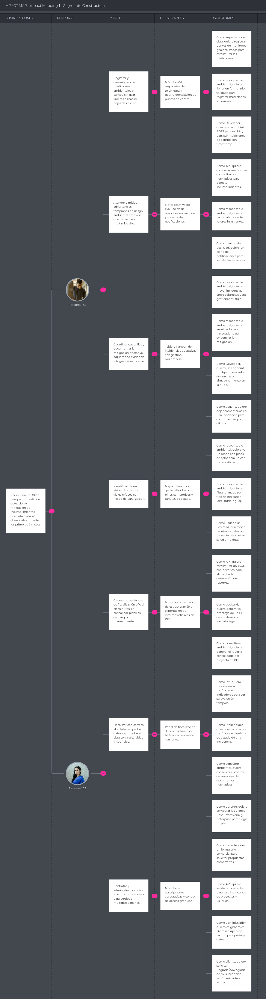

# Requirements Specification

## 3.1. User Stories

## 1. Landing Page (Presentación y Conversión)

| ID | Título | Descripción | Criterios de Aceptación | Relacionado con |
| :--- | :--- | :--- | :--- | :--- |
| US01 | Autenticación | *Como* **Usuario de EcoRoad**, *quiero* poder iniciar sesión *para* acceder a mi cuenta y perfil. | *Dado* que el usuario ingresa credenciales válidas, *cuando* hace clic en "Ingresar", *entonces* se redirige al dashboard correspondiente según su rol. | EP08: Usuario |
| US02 | Demo de Tablero Geolocalizado | *Como* **Gerente de Proyecto**, *quiero* ver una vista previa del mapa con sensores IoT *para* entender cómo se visualizarían los frentes de trabajo de mi obra. | *Dado* que el usuario navega la landing, *cuando* llega a la sección "Funciones", *entonces* observa un mapa demo con tramos viales y puntos de monitoreo simulados (PM10, ruido, agua). | EP05: Mapa |
| US03 | Explicación de planes | *Como* **Director de Obra**, *quiero* comparar los planes Starter, Professional y Enterprise *para* elegir el que se ajuste a la cartera de proyectos de mi empresa. | *Dado* que el usuario llega a la sección "Planes", *cuando* la visualiza, *entonces* se muestra una tabla comparativa diferenciando cantidad de proyectos viales, retención de historial y catálogo de alquiler de sensores IoT. | EP09: Suscripción |
| US04 | CTA Segmento Constructora / Conservadora Vial | *Como* **Gerente de Proyecto**, *quiero* un botón claro para probar la plataforma *para* evaluar cómo gestiona el flujo de monitoreo e incidencias en mi tramo vial. | *Dado* que el usuario está en la sección dirigida a ejecutoras y conservadoras viales, *cuando* hace clic en "Monitorea tu proyecto vial", *entonces* es redirigido al registro/login de la Web App. | EP08: Usuario |
| US05 | CTA Segmento Empresa Multi-Proyecto | *Como* **Director de Obra**, *quiero* un botón dirigido a la gestión de portafolio *para* acceder a la vista consolidada de mis carreteras y obras en mantenimiento. | *Dado* que el usuario está en la sección dirigida a empresas multi-proyecto, *cuando* hace clic en "Gestiona tu cartera vial", *entonces* es redirigido al dashboard consolidado tras autenticarse. | EP06: Dashboard |
| US06 | Caso de Uso / Testimonio | *Como* **Inspector Ambiental en Campo**, *quiero* ver un caso de éxito o cifras de impacto en proyectos viales *para* confiar en la efectividad de la plataforma frente a entes fiscalizadores. | *Dado* que el usuario hace scroll en la landing, *cuando* llega a la sección de impacto, *entonces* ve métricas sobre reducción de incidencias en obra y aceleración en cierres de alertas. | EP07: Reporte |
| US07 | Notificaciones Push Landing | *Como* **Inspector Ambiental en Campo**, *quiero* aceptar notificaciones del navegador *para* recibir alertas inmediatas de superación de límites ambientales sin estar dentro de la aplicación. | *Dado* que el usuario entra al sitio, *cuando* aparece el prompt de permiso, *entonces* el sistema registra la suscripción push para alertas críticas de sensores. | EP03: Alerta |
| US08 | Formulario de Contacto Comercial | *Como* **Director de Obra**, *quiero* solicitar una cotización personalizada de plataforma y alquiler de sensores IoT *para* que el equipo de ventas evalúe las necesidades de mi obra. | *Dado* que el usuario completa el formulario especificando número de proyectos y tipos de sensor requeridos, *cuando* lo envía, *entonces* se registra el lead comercial y se muestra mensaje de confirmación. | EP09: Suscripción |

---

## 2. Web Application (Frontend Interactivo)

| ID | Título | Descripción | Criterios de Aceptación | Relacionado con |
| :--- | :--- | :--- | :--- | :--- |
| US09 | Formulario de Registro de Indicador Manual | *Como* **Inspector Ambiental en Campo**, *quiero* un formulario validado por tipo de indicador (PM10, dB, pH) *para* registrar mediciones puntuales sin enviar errores al servidor. | *Dado* que un parámetro o coordenada en el tramo vial es obligatorio, *cuando* se deja vacío o fuera de rango normativo, *entonces* el botón "Guardar" se deshabilita y señala la observación. | EP02: Indicador |
| US10 | Tarjetas de Proyecto Vial (Cards) | *Como* **Gerente de Proyecto**, *quiero* ver tarjetas visuales de cada carretera o tramo *para* conocer su estado ambiental general de un vistazo. | *Dado* que se carga el portafolio vial, *cuando* se reciben los datos, *entonces* se renderiza una Card por proyecto con ubicación, tipo de obra, sensores activos, incidencias pendientes y semáforo de estado. | EP06: Dashboard |
| US11 | Tablero Kanban de Incidencias Viales | *Como* **Gerente de Proyecto**, *quiero* mover incidencias entre columnas (Pendiente / En Proceso / Atendida / Cerrada) *para* dar seguimiento al flujo de resolución. | *Dado* que se arrastra una incidencia de campo, *cuando* se suelta en la columna "Atendida" con su evidencia cargada, *entonces* actualiza su estado y permite al gestor proceder al cierre. | EP04: Incidencia |
| US12 | Vista de Mapa Interactivo Vial | *Como* **Gerente de Proyecto**, *quiero* ver el trazado del proyecto en un mapa geolocalizado con pines de sensores *para* identificar frentes de trabajo con condiciones de riesgo. | *Dado* que se cargan los sensores IoT del proyecto vial, *cuando* el mapa renderiza, *entonces* cada pin muestra el color del estado de la medición (Verde = Óptimo, Amarillo = Advertencia, Rojo = Crítico). | EP05: Mapa |
| US13 | Filtro por Tipo de Indicador Vial | *Como* **Gerente de Proyecto**, *quiero* filtrar el mapa/dashboard por tipo de parámetro (calidad del aire, ruido, vibraciones, agua, meteorología) *para* enfocar mi revisión. | *Dado* que existen diferentes sensores activos en el tramo, *cuando* el usuario selecciona un filtro (ej. Ruido dB), *entonces* la vista se actualiza mostrando solo dichos puntos de monitoreo. | EP02: Indicador |
| US14 | Adjuntar Evidencia Fotográfica de Acción Correctiva | *Como* **Inspector Ambiental en Campo**, *quiero* subir fotografías geolocalizadas desde mi dispositivo *para* respaldar la ejecución de una acción correctiva (ej. riego de vía). | *Dado* que el usuario registra la atención de una incidencia en campo, *cuando* adjunta la foto, *entonces* se muestra la barra de carga y se asocia la evidencia con fecha, hora y ubicación a la incidencia. | EP10: Documento |
| US15 | Barra de Progreso de Cumplimiento Vial | *Como* **Gerente de Proyecto**, *quiero* ver una barra de progreso del % de indicadores dentro de norma *para* medir el nivel de desempeño ambiental del proyecto en tiempo real. | *Dado* que los sensores IoT o registros de campo envían lecturas, *cuando* cambian las condiciones de riesgo, *entonces* la barra recalcula el % de cumplimiento del tramo. | EP06: Dashboard |
| US16 | Feed de Comentarios y Trazabilidad en Incidencia | *Como* **Inspector Ambiental en Campo**, *quiero* ver la bitácora de mensajes y cambios de estado de una incidencia *para* entender la secuencia de atención entre el personal de campo y la jefatura. | *Dado* que una incidencia registra interacciones, *cuando* se abre su detalle, *entonces* se muestran las notas, autores, timestamps y cambios de estado en orden cronológico. | EP04: Incidencia |
| US17 | Alertas y Notificaciones de Alerta Ambiental | *Como* **Inspector Ambiental en Campo**, *quiero* un icono de notificaciones en el header *para* enterarme en tiempo real cuando un sensor supere un umbral de advertencia o crítico. | *Dado* que la plataforma detecta un riesgo mediante un sensor IoT, *cuando* se genera la alerta, *entonces* el icono de la campana resalta en rojo e indica el número de eventos no leídos. | EP03: Alerta |
| US18 | Tabla de Incidencias Críticas en Portafolio | *Como* **Director de Obra**, *quiero* una tabla con filas destacadas *para* identificar de inmediato las incidencias críticas no resueltas entre todos los proyectos. | *Dado* que una incidencia se encuentra en nivel crítico, *cuando* se visualiza la tabla consolidada, *entonces* su fila se resalta en tono rojo mostrando el proyecto y tramo afectado. | EP04: Incidencia |
| US19 | Selector de Rango de Fechas e Histórico | *Como* **Gerente de Proyecto**, *quiero* seleccionar un rango de fechas *para* consultar el comportamiento histórico de las mediciones IoT en un periodo específico. | *Dado* que el usuario abre el selector temporal, *cuando* elige un rango, *entonces* los gráficos e indicadores se filtran mostrando los datos almacenados según el plan de suscripción. | EP06: Dashboard |
| US20 | Edición Visual de Punto de Monitoreo IoT | *Como* **Gerente de Proyecto**, *quiero* editar la ubicación o umbrales de alerta de un sensor sobre el mapa *para* ajustarlo al avance físico de los frentes de trabajo. | *Dado* que el usuario presiona "Editar sensor", *cuando* actualiza las coordenadas o umbrales y guarda, *entonces* el mapa y los parámetros del sensor se actualizan dinámicamente. | EP02: Indicador |
| US21 | Login Minimalista | *Como* **Inspector Ambiental en Campo**, *quiero* una interfaz de inicio de sesión limpia y accesible *para* ingresar rápidamente desde dispositivos móviles en campo o de escritorio. | *Dado* que el usuario no tiene una sesión activa, *cuando* navega a la URL de la aplicación, *entonces* visualiza un formulario de autenticación centrado y libre de distracciones. | EP08: Usuario |
| US22 | Vista de Lista de Proyectos Viales | *Como* **Director de Obra**, *quiero* alternar la vista del portafolio a una lista compacta *para* supervisar un alto número de carreteras en una sola pantalla. | *Dado* que el usuario activa el modo "Lista", *cuando* la pantalla renderiza, *entonces* los datos resumidos de los proyectos se muestran organizados en filas estructuradas. | EP01: Proyecto |
| US23 | Selector de Color de Marca y Personalización | *Como* **Director de Obra**, *quiero* configurar los colores institucionales en la plataforma *para* personalizar los tableros y reportes ambientales con la identidad de mi empresa. | *Dado* que se accede al panel de personalización Enterprise, *cuando* se selecciona el color primario, *entonces* la interfaz adapta sus acentos y encabezados de reporte al tono corporativo. | EP09: Suscripción |

---

## 3. RESTful API (Backend & Lógica de Negocio)

| ID | Título | Descripción | Criterios de Aceptación | Relacionado con |
|---|---|---|---|---|
| US24 | Auth JWT y Permisos por Casillas | *Como* **API Backend**, *quiero* emitir tokens JWT que incluyan los permisos asignados por checkboxes (Solo lectura, Operación en campo, Gestión total) *para* autorizar las solicitudes a la API. | *Dado* que las credenciales de un usuario son válidas, *cuando* responde el endpoint de autenticación, *entonces* retorna un Bearer token con los permisos vigentes del colaborador. | EP11: API |
| US25 | Swagger / Documentación de API | *Como* **API Backend**, *quiero* publicar la documentación Swagger OpenAPI *para* permitir integrar los endpoints de sensores, alertas e incidencias de forma autónoma. | *Dado* que la API está desplegada, *cuando* se navega a /swagger, *entonces* se muestran detallados los modelos de datos, parámetros y respuestas. | EP11: API |
| US26 | CRUD Proyectos Viales API | *Como* **API Backend**, *quiero* exponer endpoints GET/POST/PUT/DELETE *para* gestionar la información de carreteras, tramos y frentes de trabajo. | *Dado* que se realiza una petición al endpoint /api/v1/projects, *cuando* la estructura del JSON es válida, *entonces* el servidor procesa y retorna status 200/201 con la entidad persistida. | EP01: Proyecto |
| US27 | Endpoint de Ingesta de Datos IoT | *Como* **API Backend**, *quiero* proveer un endpoint POST seguro *para* recibir las lecturas de los sensores IoT de campo (aire, ruido, agua, vibraciones) y almacenarlas con marca de tiempo. | *Dado* que un dispositivo o gateway IoT envía la medición, *cuando* el JSON cumple con el esquema validado, *entonces* se guarda el dato asociado al sensor y al proyecto vial. | EP02: Indicador |
| US28 | Motor de Comparación de Umbrales | *Como* **API Backend**, *quiero* analizar cada lectura entrante frente a los umbrales configurados (Óptimo, Advertencia, Crítico) *para* detectar condiciones de riesgo de forma automatizada. | *Dado* que ingresa un dato ambiental, *cuando* sobrepasa el límite normativo o de advertencia, *entonces* la API actualiza el estado del indicador a  Advertencia o  Crítico. | EP03: Alerta |
| US29 | Generador Automático de Incidencias | *Como* **API Backend**, *quiero* instanciar una incidencia ambiental cuando una lectura de sensor alcance el estado Crítico. | *Dado* que un parámetro entra en estado Crítico , *cuando* el motor procesa el evento, *entonces* crea automáticamente una incidencia vinculada al tramo, punto de monitoreo y valor registrado. | EP04: Incidencia |
| US30 | API de Subida de Evidencias Fotográficas | *Como* **API Backend**, *quiero* disponer de un endpoint multipart/form-data *para* recibir y almacenar imágenes de campo en almacenamiento en la nube. | *Dado* que se envía un archivo de imagen válido desde la app, *cuando* se procesa la subida, *entonces* el servidor retorna la URL persistida y los metadatos del archivo. | EP10: Documento |
| US31 | Paginación y Filtrado de Peticiones | *Como* **API Backend**, *quiero* que los listados de mediciones e incidencias permitan paginación y filtros por proyecto *para* mantener alta velocidad de respuesta. | *Dado* que se consulta /api/v1/incidents?page=1&size=10&projectId=X, *cuando* el backend responde, *entonces* entrega únicamente los 10 registros solicitados junto con la metadata de paginación. | EP11: API |
| US32 | Cifrado de Contraseñas | *Como* **API Backend**, *quiero* asegurar el hash de las contraseñas mediante BCrypt *para* proteger la información de los usuarios registrados. | *Dado* que se registra un nuevo usuario o se actualiza su clave, *cuando* se almacena en la base de datos, *entonces* la contraseña queda encriptada con un factor de trabajo seguro. | EP08: Usuario |
| US33 | Cálculo de Estado Ambiental por Proyecto | *Como* **API Backend**, *quiero* evaluar el porcentaje de sensores en advertencia o estado crítico *para* determinar la condición ambiental global del proyecto vial. | *Dado* que se solicita el resumen de un proyecto, *cuando* la proporción de indicadores fuera de norma supera las métricas configuradas, *entonces* la API clasifica el proyecto en estado Crítico (Semáforo rojo). | EP06: Dashboard |
| US34 | Tarea Programada de Revisión de Incidencias | *Como* **API Backend**, *quiero* evaluar periódicamente las incidencias sin acción correctiva registrada *para* escalar su prioridad y notificar al responsable. | *Dado* que se ejecuta el job programado, *cuando* detecta una incidencia sin atención por más de 72 horas, *entonces* actualiza su estado a "Estancada" y gatilla notificaciones de escalamiento. | EP03: Alerta |
| US35 | Generador de Estructura para Reportes de Auditoría | *Como* **API Backend**, *quiero* compilar el historial consolidado de mediciones, alertas, incidencias, acciones correctivas y evidencias fotográficas de un proyecto. | *Dado* que se solicita la preparación de un reporte ambiental, *cuando* el backend procesa el periodo requerido, *entonces* estructura un payload JSON listo para ser maquetado en PDF. | EP07: Reporte |
| US36 | Endpoint de Exportación de Reportes PDF | *Como* **API Backend**, *quiero* compilar el archivo PDF consolidado de monitoreo e incidencias viales *para* permitir su descarga directa. | *Dado* que un usuario autorizado solicita el informe oficial, *cuando* el motor genera el documento, *entonces* la API retorna el archivo PDF resultante para su presentación ante la entidad fiscalizadora. | EP07: Reporte |
| US37 | Limitación de Rate Limiting en API | *Como* **API Backend**, *quiero* limitar la tasa de peticiones por IP y token *para* prevenir la saturación de los servidores o ciberataques. | *Dado* que un cliente excede el número máximo de peticiones permitidas por minuto, *cuando* realiza un nuevo llamado, *entonces* el API Gateway responde con HTTP 429 Too Many Requests. | EP11: API |
| US38 | Configuración de Umbrales por Normativa Aplicable | *Como* **API Backend**, *quiero* permitir la asignación de distintas tablas de umbrales según el tipo de entorno vial (urbano, periurbano, reserva natural). | *Dado* que se registra un proyecto vial con una clasificación normativa determinada, *cuando* se asignan los sensores, *entonces* el sistema carga los umbrales correspondientes a dicha regulación. | EP01: Proyecto |
| US39 | Validación de Cuotas por Plan de Suscripción | *Como* **API Backend**, *quiero* verificar los límites del plan activo (Starter, Professional, Enterprise) *para* controlar la creación de nuevos proyectos y usuarios. | *Dado* que una empresa intenta registrar un proyecto que sobrepasa el cupo de su suscripción activa, *cuando* procesa la solicitud, *entonces* el servidor rechaza la acción con status 403 y solicita un upgrade de plan. | EP09: Suscripción |

---

## 4. Requerimientos de Negocio Compartidos (Fullstack)

| ID | Título | Descripción | Criterios de Aceptación | Relacionado con |
|---|---|---|---|---|
| US40 | Creación de Proyecto Vial | *Como* **Gerente de Proyecto**, *quiero* registrar una obra vial definiendo ubicación, tramos y frentes de trabajo *para* iniciar el monitoreo ambiental. | *Dado* que se ingresan los datos del proyecto y sus tramos, *cuando* se guarda, *entonces* el proyecto se visualiza en la lista de portafolio y en el mapa general. | EP01: Proyecto |
| US41 | Asociación de Sensores IoT a Puntos de Monitoreo | *Como* **Inspector Ambiental en Campo**, *quiero* dar de alta puntos de monitoreo geolocalizados vinculados a sensores IoT (alquilados o propios) *para* automatizar la captura de datos. | *Dado* que se selecciona un tramo del proyecto, *cuando* se ingresan las coordenadas y el ID del sensor IoT (ej. monitor de aire PM10), *entonces* el punto queda habilitado para recibir telemetría. | EP02: Indicador |
| US42 | Asignación de Responsables y Permisos Dinámicos | *Como* **Director de Obra**, *quiero* registrar colaboradores y asignarles permisos por casilla (Lectura, Operación en campo, Gestión total) *para* adecuar el sistema al organigrama de la obra. | *Dado* que se crea o edita un usuario, *cuando* el administrador marca las casillas correspondientes, *entonces* la plataforma adapta los botones y accesos permitidos para dicho colaborador. | EP08: Usuario |
| US43 | Comunicación e Interacción en Incidencias | *Como* **Inspector Ambiental en Campo**, *quiero* registrar comentarios dentro de una incidencia *para* coordinar las acciones correctivas entre los equipos. | *Dado* que el usuario accede al detalle de una incidencia, *cuando* envía una observación, *entonces* el comentario se guarda en el historial con firma digital del usuario y timestamp. | EP04: Incidencia |
| US44 | Monitoreo de Salud Ambiental del Portafolio Vial | *Como* **Director de Obra**, *quiero* un panel general que resuma la salud ambiental de todas las carreteras en ejecución o conservación *para* mitigar riesgos legales o multas. | *Dado* que la empresa administra múltiples obras viales, *cuando* el director ingresa al dashboard multi-proyecto, *entonces* observa el mapa consolidado, total de alertas activas y semáforos ambientales de la cartera. | EP06: Dashboard |
| US45 | Generación de Reporte Consolidado de Auditoría | *Como* **Ingeniero Ambiental**, *quiero* exportar en PDF el informe periódico de un proyecto vial *para* entregarlo ante las autoridades de fiscalización ambiental. | *Dado* que el usuario selecciona el proyecto y el rango de fechas, *cuando* hace clic en "Exportar Reporte", *entonces* el sistema descarga un documento estructurado con mediciones, incidencias y fotos de evidencia. | EP07: Reporte |
| US46 | Alerta Preventiva de Advertencia (90% del Umbral) | *Como* **Inspector Ambiental en Campo**, *quiero* recibir una alerta de advertencia cuando una lectura alcance el nivel de riesgo (estado amarillo) *para* tomar medidas antes de superar el límite legal. | *Dado* que la lectura de un sensor alcanza el estado de Advertencia , *cuando* se registra la medición, *entonces* se genera una alerta preventiva en el sistema indicando el indicador y tramo afectado. | EP03: Alerta |
| US47 | Alerta y Escalamiento de Incidencias Estancadas | *Como* **Gerente de Proyecto**, *quiero* recibir notificaciones de escalamiento si una incidencia no presenta acciones correctivas en 72 horas *para* intervenir oportunamente. | *Dado* que transcurren 3 días sin cambios de estado ni evidencias en una incidencia abierta, *cuando* se ejecuta la validación, *entonces* la incidencia se marca como "Estancada" y se notifica al jefe de área. | EP03: Alerta |
| US48 | Archivado de Proyectos Viales Finalizados | *Como* **Director de Obra**, *quiero* archivar obras de infraestructura concluidas *para* mantener despejado el portafolio activo sin perder la trazabilidad de los datos. | *Dado* que una obra alcanza su cierre operativo, *cuando* el administrador selecciona "Archivar proyecto", *entonces* la obra se oculta de las vistas operativas primarias pero conserva todo su historial disponible para consultas. | EP01: Proyecto |
| US49 | Seguimiento Histórico y Tendencias por Parámetro | *Como* **Ingeniero Ambiental**, *quiero* consultar gráficos de tendencia histórica por sensor (PM10, ruido, turbidez) *para* evaluar la efectividad de las medidas de mitigación aplicadas en el tiempo. | *Dado* que se ingresa al detalle de un punto de monitoreo, *cuando* se selecciona la variable deseada, *entonces* la plataforma muestra la curva evolutiva del parámetro junto a las líneas de umbral normativo. | EP02: Indicador |
| US50 | Visualización de KPIs de Gestión Ambiental | *Como* **Director de Obra**, *quiero* revisar indicadores clave (% de incidencias cerradas, tiempo medio de atención de alertas, sensores activos) *para* auditar el rendimiento de la gestión en obra. | *Dado* que el usuario navega a la vista analítica del portafolio, *cuando* los datos cargan, *entonces* el panel despliega las métricas consolidadas del desempeño ambiental de la empresa. | EP06: Dashboard |
| US51 | Actualización Dinámica del Dashboard por Telemetría IoT | *Como* **Inspector Ambiental en Campo**, *quiero* que el dashboard ambiental actualice sus mapas y métricas en tiempo real al recibir datos IoT *para* visualizar emergencias de campo sin recargar la página. | *Dado* que un sensor registra una nueva lectura crítica en obra, *cuando* se procesa en la base de datos, *entonces* la interfaz web refresca automáticamente los indicadores y el estado del mapa sin intervención del usuario. | EP06: Dashboard |
| US52 | Historial del Ciclo de Vida de Incidencias | *Como* **Ingeniero Ambiental**, *quiero* consultar la bitácora inmutable de una incidencia *para* verificar quién registró la alerta, quién ejecutó la acción correctiva y quién approved el cierre. | *Dado* que se abre la pestaña de trazabilidad en una incidencia cerrada, *cuando* el usuario la explora, *entonces* se visualiza cada hito del proceso con su respectiva evidencia, usuario responsable y fecha/hora exacta. | EP04: Incidencia |
| US53 | Control de Accesos por Permisos Dinámicos | *Como* **Director de Obra**, *quiero* restringir las acciones de los usuarios según las casillas de verificación activadas en su perfil *para* evitar modificaciones no autorizadas en datos sensibles. | *Dado* que un usuario con rol de "Operación en campo" intenta modificar un umbral normativo, *cuando* intenta realizar la acción, *entonces* el sistema bloquea el procedimiento notificando la falta de autorización. | EP08: Usuario |
| US54 | Control de Versiones de Instrumentos de Gestión Ambiental | *Como* **Ingeniero Ambiental**, *quiero* gestionar versiones de los estudios e instrumentos ambientales subidos (EIA, DIA, PMA) *para* asegurar que la obra trabaje siempre con los documentos normativos vigentes. | *Dado* que se adjunta un nuevo archivo normativo para un tramo, *cuando* detecta la existencia de un documento previo con el mismo nombre, *entonces* incrementa el número de versión conservando el historial anterior. | EP10: Documento |
| US55 | Búsqueda Global de Proyectos, Tramos e Incidencias | *Como* **Director de Obra**, *quiero* disponer de un buscador centralizado *para* localizar rápidamente carreteras, frentes de trabajo o incidencias específicas mediante palabras clave o códigos. | *Dado* que el usuario ingresa un término en la barra de búsqueda superior, *cuando* ejecuta la consulta, *entonces* el sistema lista los proyectos, tramos e incidencias coincidentes de todo el portafolio. | EP01: Proyecto |
| US56 | Evidencias Obligatorias para Cierre de Incidencias | *Como* **Gerente de Proyecto**, *quiero* que sea obligatorio adjuntar evidencia fotográfica para marcar una incidencia como "Atendida" *para* garantizar la veracidad de la acción correctiva en campo. | *Dado* que un supervisor de campo intenta cambiar el estado de una incidencia crítica a "Atendida", *cuando* no ha subido al menos una imagen de respaldo, *entonces* el sistema bloquea el cambio solicitando la carga de evidencia. | EP10: Documento |
| US57 | Gestión de Planes de Suscripción y Alquiler IoT | *Como* **Director de Obra**, *quiero* modificar el plan de suscripción (Starter, Professional, Enterprise) o la cantidad de sensores IoT alquilados *para* adaptar la plataforma a los nuevos tramos o proyectos adjudicados. | *Dado* que la empresa solicita la ampliación de cobertura, *cuando* confirma la modificación del contrato, *entonces* el sistema habilita los cupos correspondientes y actualiza la facturación periódica. | EP09: Suscripción |

---

### 3.2. Impact Mapping

En esta sección se presenta el desglose estratégico del modelo de negocio de EcoRoad mediante la técnica de **Impact Mapping**, vinculando la meta de negocio SMART con los cambios de comportamiento requeridos en los segmentos de cliente, las soluciones funcionales provistas y las historias de usuario asociadas.

  

### 3.3. Product Backlog

| # Orden | User Story Id | Título | Descripción | Story Points (1/2/3/5/8) |
|---|---|---|---|---|
| 1 | US21 | Login Minimalista | Como usuario de EcoRoad, quiero una interfaz de login minimalista para reducir la fricción al entrar a la plataforma. | 2 |
| 2 | US24 | Auth JWT | Como Backend, quiero generar tokens JWT para asegurar todas las peticiones a la API. | 5 |
| 3 | US32 | Cifrado de Contraseñas | Como administrador del sistema, quiero cifrar contraseñas con BCrypt para proteger los datos de los usuarios. | 3 |
| 4 | US01 | Autenticación | Como usuario de EcoRoad, quiero poder iniciar sesión para acceder a mi cuenta y perfil. | 2 |
| 5 | US53 | Roles y Permisos | Como administrador de cuenta, quiero asignar roles (Admin, Supervisor, Lector) para proteger la información sensible del proyecto. | 8 |
| 6 | US40 | Creación de Proyecto Vial | Como jefe de gestión ambiental, quiero crear un proyecto asignando ubicación y fechas para tener su registro en la plataforma. | 3 |
| 7 | US26 | CRUD Proyectos API | Como Dev, quiero endpoints GET/POST/PUT/DELETE para la persistencia de proyectos viales. | 5 |
| 8 | US25 | Swagger / Documentación | Como Frontend, quiero ver la documentación de la API para integrarme de forma autónoma. | 2 |
| 9 | US38 | Validación de Umbral por Tipo de Norma | Como API, quiero permitir configurar distintos límites normativos según el tipo de zona/proyecto para adaptarse a la regulación vigente. | 5 |
| 10 | US42 | Asignación de Responsable por Proyecto | Como PMO/Gerente, quiero asignar un responsable ambiental a cada proyecto para dar claridad de accountability. | 3 |
| 11 | US41 | Registro de Punto de Monitoreo | Como supervisor de obra, quiero registrar puntos de monitoreo geolocalizados dentro de un proyecto para estructurar la toma de mediciones. | 5 |
| 12 | US20 | Edición Visual de Punto de Monitoreo | Como responsable de gestión ambiental, quiero un botón de editar en cada punto de monitoreo para corregir su ubicación o umbral normativo. | 2 |
| 13 | US22 | Vista de Lista de Proyectos | Como gerente de cartera de proyectos, quiero una vista de lista compacta para ver más proyectos en una sola pantalla. | 2 |
| 14 | US48 | Eliminación/Archivo de Proyecto | Como PMO Lead, quiero archivar proyectos finalizados para mantener organizado el portafolio activo. | 3 |
| 15 | US10 | Tarjetas de Proyecto (Cards) | Como usuario de EcoRoad, quiero ver tarjetas visuales de cada proyecto para entender su estado ambiental de un vistazo. | 3 |
| 16 | US51 | Actualización en Tiempo Real del Dashboard | Como usuario, quiero que el dashboard se actualice solo al registrarse una nueva medición para tener datos confiables sin recargar. | 8 |
| 17 | US27 | Endpoint de Registro de Indicador | Como Dev, quiero un endpoint POST para recibir mediciones ambientales de campo y persistirlas. | 5 |
| 18 | US09 | Formulario de Registro de Indicador | Como responsable de gestión ambiental, quiero llenar un formulario validado para registrar mediciones sin enviar errores al servidor. | 3 |
| 19 | US13 | Filtro por Tipo de Indicador | Como responsable de gestión ambiental, quiero filtrar el mapa/dashboard por tipo de indicador (aire, ruido, agua) para enfocar mi revisión. | 2 |
| 20 | US49 | Seguimiento de Indicadores por Proyecto | Como PM, quiero monitorear el estado histórico de los indicadores de un proyecto para ver su evolución en el tiempo. | 5 |
| 21 | US19 | Selector de Rango de Fechas | Como usuario de EcoRoad, quiero elegir un rango de fechas para revisar el histórico de mediciones de un periodo específico. | 3 |
| 22 | US28 | Motor de Comparación Normativa | Como API, quiero comparar cada medición contra el límite normativo correspondiente para determinar si hay incumplimiento. | 8 |
| 23 | US29 | Generador Automático de Incidencia | Como motor de reglas, quiero crear automáticamente un ticket de incidencia ante un incumplimiento detectado. | 5 |
| 24 | US46 | Alerta de Incumplimiento Inminente | Como responsable ambiental, quiero recibir una alerta cuando un indicador se acerque al límite normativo, no solo cuando lo supere. | 5 |
| 25 | US34 | Tarea Programada de Revisión de Vencimientos | Como proceso de fondo, quiero identificar incidencias sin resolución en X días para escalar su prioridad. | 3 |
| 26 | US47 | Alerta de Incidencia sin Atender | Como jefe de gestión ambiental, quiero recibir alerta si una incidencia no tiene seguimiento en 3 días para intervenir a tiempo. | 3 |
| 27 | US17 | Alertas y Notificaciones | Como usuario de EcoRoad, quiero un icono de notificaciones para ver alertas de incumplimientos recientes. | 2 |
| 28 | US11 | Tablero Kanban de Incidencias | Como responsable de gestión ambiental, quiero mover incidencias entre columnas (Abierta/En revisión/Resuelta) para gestionar mi flujo visualmente. | 8 |
| 29 | US18 | Tabla de Incidencias Críticas | Como gerente de cartera de proyectos, quiero una tabla con filas resaltadas para identificar las incidencias críticas de un vistazo. | 2 |
| 30 | US43 | Comentarios en Incidencia | Como usuario, quiero dejar comentarios en una incidencia para mantener la comunicación fluida entre campo y oficina. | 3 |
| 31 | US16 | Feed de Comentarios en Incidencia | Como usuario de EcoRoad, quiero ver el historial de comentarios de una incidencia para entender el contexto de su seguimiento. | 3 |
| 32 | US52 | Historial de Estados de Incidencia | Como Stakeholder, quiero ver el historial de cambios de una incidencia para entender su evolución completa. | 3 |
| 33 | US14 | Adjuntar Evidencia Fotográfica | Como responsable de gestión ambiental, quiero arrastrar fotos al navegador para adjuntarlas como evidencia de una medición. | 3 |
| 34 | US30 | API de Subida de Evidencias | Como Dev, quiero un endpoint multipart para subir archivos binarios (fotos/documentos) a almacenamiento en la nube. | 5 |
| 35 | US54 | Control de Versiones de Documento Normativo | Como consultor ambiental, quiero conservar el historial de versiones de instrumentos de gestión ambiental subidos para no perder revisiones anteriores. | 8 |
| 36 | US56 | Documentos Obligatorios por Hito Normativo | Como consultora ambiental, quiero marcar qué documentos son indispensables para un hito de auditoría, para estandarizar el proceso. | 3 |
| 37 | US55 | Búsqueda Global de Proyectos/Incidencias | Como Líder, quiero buscar proyectos o incidencias por nombre/código para ahorrar tiempo localizando información. | 5 |
| 38 | US12 | Vista de Mapa Interactivo | Como responsable de gestión ambiental, quiero ver un mapa con pines de colores por punto de monitoreo para identificar zonas críticas rápidamente. | 8 |
| 39 | US02 | Demo de Tablero Geolocalizado (Landing) | Como responsable de gestión ambiental, quiero ver una vista previa del mapa de indicadores para entender cómo se visualizaría mi obra. | 3 |
| 40 | US33 | Cálculo de Salud Ambiental del Proyecto | Como API, quiero calcular el % de indicadores fuera de norma para determinar el color de semáforo del proyecto. | 3 |
| 41 | US15 | Barra de Progreso de Cumplimiento | Como jefe de proyecto, quiero ver una barra de progreso del % de indicadores dentro de norma para medir el avance rápidamente. | 2 |
| 42 | US44 | Salud Ambiental del Portafolio | Como gerente de cartera, quiero ver un gráfico de salud ambiental de todos mis proyectos para tomar decisiones preventivas. | 5 |
| 43 | US50 | Visualización de KPIs Ambientales | Como Stakeholder, quiero ver indicadores clave (% cumplimiento, incidencias abiertas, tiempo promedio de resolución) para evaluar el desempeño. | 5 |
| 44 | US05 | CTA Segmento Empresa Multi-Proyecto (Landing) | Como gerente de cartera de proyectos, quiero un botón dirigido a gestión multi-proyecto para acceder a la vista que necesito. | 2 |
| 45 | US35 | Generador de JSON para Reporte de Auditoría | Como API, quiero estructurar un JSON con histórico de indicadores e incidencias para alimentar el motor de generación de PDF. | 5 |
| 46 | US36 | Endpoint de Exportación a PDF | Como backend, quiero generar la descarga de un PDF de auditoría para que el usuario lo presente ante el ente fiscalizador. | 5 |
| 47 | US45 | Reporte de Auditoría por Proyecto | Como consultora ambiental, quiero generar un reporte PDF por proyecto para presentarlo ante fiscalización. | 3 |
| 48 | US06 | Caso de Uso / Testimonio (Landing) | Como usuario de EcoRoad, quiero ver un caso de éxito o cifra de impacto para confiar en la efectividad de la plataforma. | 2 |
| 49 | US04 | CTA Segmento Consultora (Landing) | Como responsable de gestión ambiental, quiero un botón claro para probar la plataforma, para evaluar si resuelve mi problema de monitoreo. | 2 |
| 50 | US03 | Explicación de Planes (Landing) | Como gerente de cartera de proyectos, quiero comparar los planes Base, Profesional y Enterprise para elegir el que se ajuste a mi empresa. | 3 |
| 51 | US08 | Formulario de Contacto Comercial (Landing) | Como gerente de cartera de proyectos, quiero dejar mis datos de contacto para que ventas me contacte con una propuesta personalizada. | 2 |
| 52 | US39 | Gestión de Planes de Suscripción (API) | Como API, quiero validar el plan activo del cliente para restringir el número de proyectos/usuarios permitidos. | 5 |
| 53 | US57 | Upgrade/Downgrade de Plan | Como cliente, quiero cambiar mi plan de suscripción para ajustarlo a mi cantidad real de proyectos activos. | 5 |
| 54 | US23 | Selector de Color de Marca | Como administrador de cuenta Enterprise, quiero elegir el color corporativo para que el dashboard refleje la identidad de mi empresa. | 5 |
| 55 | US07 | Notificaciones Push Landing | Como usuario de EcoRoad, quiero aceptar notificaciones del navegador para recibir alertas de incumplimientos sin ingresar a la plataforma. | 5 |
| 56 | US31 | Paginación de Resultados | Como Frontend, quiero resultados paginados en los listados de indicadores/incidencias para optimizar el rendimiento. | 3 |
| 57 | US37 | Limitación de Peticiones (Rate Limiting) | Como Admin, quiero limitar peticiones por IP para evitar ataques de denegación de servicio. | 5 |
