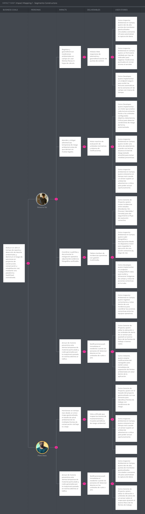

# Requirements Specification

## 3.1. User Stories

| ID | Título                                                   | Descripción                                                                                                                                                                                                                            | Criterios de Aceptación                                                                                                                                                                                                                                                                                                                                                                                                                                                                                                                                                                                                                                                                                                                                                                                                                                                     | Relacionado con |
| :--- |:---------------------------------------------------------|:---------------------------------------------------------------------------------------------------------------------------------------------------------------------------------------------------------------------------------------|:----------------------------------------------------------------------------------------------------------------------------------------------------------------------------------------------------------------------------------------------------------------------------------------------------------------------------------------------------------------------------------------------------------------------------------------------------------------------------------------------------------------------------------------------------------------------------------------------------------------------------------------------------------------------------------------------------------------------------------------------------------------------------------------------------------------------------------------------------------------------------| :--- |
| US01 | Inicio de Sesión                                         | *Como* **usuario** de EcoRoad, *quiero* iniciar sesión en la plataforma *para* acceder a las funcionalidades correspondientes a mi rol.                                                                                                | Escenario 1: Inicio de sesión exitoso Dado que el usuario ingresa credenciales válidas, cuando confirma el inicio de sesión, entonces el sistema autentica al usuario y le otorga acceso a las funcionalidades correspondientes a su rol.  Escenario 2: Credenciales inválidas Dado que el usuario ingresa credenciales incorrectas, cuando intenta iniciar sesión, entonces el sistema deniega el acceso e informa que las credenciales son inválidas                                                                                                                                                                                                                                                                                                                                                                                                          | EP02: Autenticación y Gestión de Acceso |
| US02 | Visualización de Soluciones Ambientales                  | *Como* **Visitante** del segmento Empresa Constructora / Mantenimiento Vial, *quiero* conocer qué tipos de problemas ambientales mide la plataforma *para* determinar si cumple con la normativa legal aplicable a mi obra vial.       | Escenario 1: Consulta de parámetros ambientales Dado que el visitante consulta las soluciones ambientales disponibles, cuando selecciona un sector ambiental, entonces el sistema presenta los parámetros ambientales que EcoRoad permite monitorear y la normativa asociada.  Escenario 2: Consulta de certificación de los equipos de medición Dado que el visitante requiere conocer la confiabilidad de las mediciones, cuando consulta la información de los instrumentos de medición, entonces el sistema presenta las certificaciones de calidad y calibración asociadas a los instrumentos.                                                                                                                                                                                                                                                             | EP01: Landing Page y Adquisición |
| US03 | Solicitud de Demostración Guiada                         | *Como* **Visitante** del segmento Empresa Constructora / Mantenimiento Vial, *quiero* solicitar una demostración personalizada de EcoRoad *para* conocer cómo la plataforma puede apoyar la gestión ambiental de mis proyectos viales. | Escenario 1: Registro de solicitud exitoso Dado que el visitante ingresa los datos de contacto y de su empresa, cuando envía la solicitud de demostración, entonces el sistema registra la solicitud y confirma su recepción.  Escenario 2: Validación de campos obligatorios Dado que el visitante omite uno o más datos de contacto obligatorios, cuando intenta enviar la solicitud de demostración, entonces el sistema rechaza el envío e informa los campos obligatorios pendientes.                                                                                                                                                                                                                                                                                                                                                                      | EP01: Landing Page y Adquisición |
| US04 | Revisión de Características Tecnológicas y Cumplimiento  | *Como* **Visitante** del segmento Empresa Constructora / Mantenimiento Vial, *quiero* conocer las características tecnológicas de EcoRoad *para* evaluar cómo la plataforma soporta el monitoreo ambiental de mis proyectos.           | Escenario 1: Consulta de características tecnológicas Dado que el visitante consulta las características tecnológicas de EcoRoad, cuando selecciona un componente tecnológico, entonces el sistema presenta su función dentro del proceso de monitoreo ambiental.  Escenario 2: Consulta de transmisión de datos Dado que el visitante consulta el funcionamiento tecnológico de EcoRoad, cuando revisa la información sobre la transmisión de datos, entonces el sistema presenta las características de actualización y transmisión de las mediciones.                                                                                                                                                                                                                                                                                                        | EP01: Landing Page y Adquisición |
| US05 | Visualización de Beneficios de la Plataforma             | *Como* **Visitante** del segmento Empresa Constructora / Mantenimiento Vial, *quiero* conocer las ventajas operativas y legales del sistema *para* evaluar la viabilidad de su implementación en mi proyecto vial.                     | Escenario 1: Consulta de beneficios de mitigación y automatización Dado que el visitante requiere evaluar la eficiencia operativa del sistema, cuando consulta los beneficios de la plataforma, entonces el sistema informa los beneficios relacionados con la automatización del seguimiento ambiental y la reducción de tareas administrativas.  Escenario 2: Consulta de beneficios de supervisión y soporte legal Dado que el visitante requiere validar el control de las operaciones en campo, cuando solicita el detalle de las ventajas de supervisión, entonces el sistema informa cómo se organizan las tareas del personal en obra y el acceso a asesoría de ingenieros especializados.                                                                                                                                                              | EP01: Landing Page y Adquisición |
| US06 | Comparación de Planes de Suscripción                     | *Como* **Visitante** del segmento Empresa Constructora / Mantenimiento Vial, *quiero* conocer los precios y las características de cada plan de suscripción *para* identificar cuál se adapta a las necesidades de mi empresa.         | Escenario 1: Consulta de planes Dado que el visitante consulta los planes de suscripción, cuando solicita la información de un plan, entonces el sistema informa el precio, las características, la cantidad de proyectos permitidos y la modalidad de contratación correspondiente.  Escenario 2: Solicitud de cotización personalizada Dado que el visitante selecciona el plan Enterprise, cuando solicita una cotización personalizada, entonces el sistema registra la solicitud para su atención comercial.                                                                                                                                                                                                                                                                                                                                               | EP01: Landing Page y Adquisición |
| US07 | Visualización de Testimonios y Opiniones                 | *Como* **Visitante** del segmento Empresa Constructora / Mantenimiento Vial, *quiero* conocer las opiniones de otros profesionales del sector construcción *para* determinar la confiabilidad de la plataforma en proyectos reales.    | Escenario 1: Consulta de identidad del profesional que emite la opinión Dado que el visitante revisa un testimonio, cuando accede a su detalle, entonces el sistema informa el nombre, cargo, empresa y calificación del profesional que emite la opinión.  Escenario 2: Consulta del logro alcanzado por el cliente Dado que el visitante revisa un testimonio específico, cuando accede a su detalle, entonces el sistema informa el logro o resultado alcanzado por el cliente en su obra.                                                                                                                                                                                                                                                                                                                                                                   | EP01: Landing Page y Adquisición |
| US08 | Acceso a Información Institucional y Canales de Contacto | *Como* **Visitante** del segmento Empresa Constructora / Mantenimiento Vial, *quiero* acceder a la información institucional y a los canales de contacto de EcoRoad *para* obtener información adicional sobre la plataforma.          | Escenario 1: Consulta de información institucional Dado que el visitante requiere conocer información institucional de EcoRoad, cuando consulta la información disponible, entonces el sistema informa los datos institucionales proporcionados por la empresa.  Escenario 2: Consulta de canales de contacto Dado que el visitante requiere comunicarse con EcoRoad, cuando consulta los canales de contacto disponibles, entonces el sistema informa los medios de comunicación institucional habilitados.                                                                                                                                                                                                                                                                                                                                                    | EP01: Landing Page y Adquisición |
| US09 | Visualización del Equipo de EcoRoad                      | *Como* **Visitante** del segmento Empresa Constructora / Mantenimiento Vial, *quiero* conocer al equipo responsable de EcoRoad *para* identificar a los profesionales que participan en el desarrollo y soporte de la plataforma.      | Escenario 1: Consulta de integrantes Dado que el visitante consulta la información del equipo de EcoRoad, cuando solicita la información de los integrantes, entonces el sistema informa el nombre y rol profesional de cada integrante disponible.  Escenario 2: Consulta de información profesional Dado que el visitante consulta la información de un integrante del equipo, cuando solicita sus datos profesionales, entonces el sistema informa la información profesional disponible del integrante.                                                                                                                                                                                                                                                                                                                                                     | EP01: Landing Page y Adquisición |
| US10 | Consulta de Estado y Ubicación de Sensores IoT           | *Como* **Ingeniero Ambiental**, *quiero* consultar la ubicación y el estado operativo de los sensores instalados en un proyecto *para* verificar la cobertura del monitoreo ambiental.                                                 | Escenario 1: Listado de sensores por proyecto Dado que el ingeniero ambiental selecciona un proyecto, cuando solicita el listado de sensores instalados, entonces el sistema informa la ubicación, el tipo de parámetro medido y el estado operativo de cada sensor.  Escenario 2: Consulta de sensores sin operación Dado que un proyecto tiene sensores registrados, cuando uno de los sensores se encuentra fuera de servicio, entonces el sistema informa dicho estado para el sensor correspondiente.                                                                                                                                                                                                                                                                                                                                                      | EP03: Monitoreo Ambiental |
| US11 | Visualización General de Proyectos                       | *Como* **Gerente de Proyecto**, *quiero* consultar el estado general de todos los proyectos a mi cargo *para* priorizar mi atención según el nivel de riesgo ambiental de cada uno.                                                    | Escenario 1: Consulta del listado de proyectos Dado que el gerente de proyecto accede a la vista general de proyectos, cuando solicita el listado, entonces el sistema informa, para cada proyecto, su ubicación, tipo, estado ambiental general, cantidad de sensores activos, alertas activas e incidencias pendientes.  Escenario 2: Consulta sin proyectos asignados Dado que el gerente de proyecto no tiene proyectos asignados, cuando solicita el listado, entonces el sistema informa que no existen proyectos disponibles.                                                                                                                                                                                                                                                                                                                            | EP03: Monitoreo Ambiental |
| US12 | Consulta de Resumen de un Proyecto                       | *Como* **Director de Obra**, *quiero* consultar el resumen del estado ambiental de un proyecto específico *para* tomar decisiones sobre la continuidad de las actividades en obra.                                                     | Escenario 1: Consulta exitosa Dado que el director de obra selecciona uno de sus proyectos, cuando solicita el resumen del proyecto, entonces el sistema informa el estado ambiental general, las alertas activas y las incidencias pendientes asociadas a dicho proyecto.  Escenario 2: Proyecto sin alertas ni incidencias Dado que el director de obra selecciona un proyecto sin alertas activas ni incidencias pendientes, cuando solicita el resumen, entonces el sistema informa que no existen alertas ni incidencias pendientes.                                                                                                                                                                                                                                                                                                                       | EP03: Monitoreo Ambiental |
| US13 | Dashboard Ambiental                                      | *Como* **Ingeniero Ambiental**, *quiero* consultar el dashboard ambiental de un proyecto *para* visualizar de forma centralizada el estado de sus tramos y puntos de monitoreo.                                                        | Escenario 1: Consulta de indicadores generales Dado que el ingeniero ambiental selecciona un proyecto, cuando solicita el dashboard ambiental, entonces el sistema informa los indicadores ambientales registrados para el proyecto.  Escenario 2: Consulta de indicadores por tramo Dado que el ingeniero ambiental consulta un proyecto con varios tramos o frentes de trabajo, cuando solicita el detalle por tramo, entonces el sistema informa el estado ambiental de cada tramo según los indicadores medidos.                                                                                                                                                                                                                                                                                                                                            | EP03: Monitoreo Ambiental |
| US14 | Consulta de Evolución Histórica de un Indicador          | *Como* **Ingeniero Ambiental**, *quiero* consultar la evolución histórica de un indicador ambiental *para* analizar el comportamiento del proyecto a lo largo del tiempo.                                                              | Escenario 1: Consulta de histórico Dado que el ingeniero ambiental selecciona un indicador y un rango de fechas, cuando solicita el histórico de mediciones, entonces el sistema informa la serie de valores registrados para dicho indicador durante el periodo solicitado.  Escenario 2: Rango sin mediciones Dado que el rango de fechas seleccionado no contiene mediciones registradas, cuando el ingeniero ambiental solicita el histórico, entonces el sistema informa que no existen mediciones disponibles para el periodo indicado.                                                                                                                                                                                                                                                                                                                   | EP03: Monitoreo Ambiental |
| US15 | Consulta del Nivel de Riesgo de un Indicador             | *Como* **Ingeniero Ambiental**, *quiero* conocer el nivel de riesgo asociado a cada indicador ambiental medido *para* identificar qué situaciones requieren atención prioritaria.                                                      | Escenario 1: Clasificación dentro de rango óptimo Dado que una medición se encuentra dentro de los umbrales establecidos para el indicador, cuando el sistema procesa la medición, entonces la clasifica en estado óptimo.  Escenario 2: Clasificación en estado de advertencia Dado que una medición se encuentra dentro del rango de advertencia establecido para el indicador, cuando el sistema procesa la medición, entonces la clasifica en estado de advertencia.  Escenario 3: Clasificación en estado crítico Dado que una medición supera el umbral crítico establecido para el indicador, cuando el sistema procesa la medición, entonces la clasifica en estado crítico y la asocia al indicador y al punto de monitoreo correspondiente.                                                                                                  | EP03: Monitoreo Ambiental |
| US16 | Consulta de Alertas Generadas                            | *Como* **Ingeniero Ambiental**, *quiero* consultar las alertas generadas en un proyecto *para* identificar rápidamente dónde se está presentando un problema ambiental.                                                                | Escenario 1: Consulta de detalle de alerta Dado que el ingeniero ambiental selecciona una alerta activa, cuando solicita su detalle, entonces el sistema informa el indicador afectado, el valor registrado, el nivel de riesgo, el proyecto, el tramo, el sensor que la generó y la fecha y hora de detección.  Escenario 2: Consulta de alertas de un proyecto Dado que el ingeniero ambiental selecciona un proyecto, cuando solicita las alertas generadas, entonces el sistema informa las alertas correspondientes al proyecto y su estado actual.                                                                                                                                                                                                                                                                                                        | EP04: Alertas e Incidencias |
| US17 | Notificación de Alertas Críticas                         | *Como* **Gerente de Proyecto**, *quiero* ser notificado cuando se genere una alerta crítica en alguno de mis proyectos *para* actuar de manera oportuna.                                                                               | Escenario 1: Generación de alerta crítica Dado que una medición es clasificada en estado crítico, cuando el sistema genera la alerta correspondiente, entonces notifica al gerente de proyecto responsable del proyecto asociado.  Escenario 2: Medición no crítica Dado que una medición no supera el umbral crítico establecido, cuando el sistema procesa la medición, entonces no genera una notificación de alerta crítica.                                                                                                                                                                                                                                                                                                                                                                                                                                | EP04: Alertas e Incidencias |
| US18 | Registro de Incidencia Ambiental                         | *Como* **Ingeniero Ambiental**, *quiero* que se registre una incidencia cuando una medición alcance un estado crítico *para* iniciar su atención y seguimiento.                                                                        | Escenario 1: Generación automática de incidencia Dado que una medición es clasificada en estado crítico, cuando el sistema procesa dicha medición, entonces genera una incidencia con el problema detectado, la ubicación, el proyecto, el indicador afectado y la fecha y hora, en estado "Pendiente".  Escenario 2: Registro manual de incidencia Dado que el ingeniero ambiental identifica una condición ambiental no detectada automáticamente, cuando registra una incidencia de forma manual, entonces el sistema almacena la incidencia con los datos ingresados y la asigna al estado "Pendiente".                                                                                                                                                                                                                                                     | EP04: Alertas e Incidencias |
| US19 | Asignación de Responsable de Incidencia                  | *Como* **Director de Obra**, *quiero* asignar un responsable a una incidencia ambiental *para* garantizar que sea atendida oportunamente.                                                                                              | Escenario 1: Asignación exitosa Dado que el director de obra selecciona una incidencia en estado "Pendiente", cuando asigna un responsable de atención, entonces el sistema registra al responsable asignado y cambia el estado de la incidencia a "En proceso".  Escenario 2: Incidencia no asignable Dado que la incidencia se encuentra en estado "Cerrada", cuando el director de obra intenta asignar un responsable, entonces el sistema rechaza la asignación.                                                                                                                                                                                                                                                                                                                                                                                           | EP04: Alertas e Incidencias |
| US20 | Registro de Acción Correctiva                            | *Como* **Inspector Ambiental**, *quiero* registrar la acción correctiva realizada frente a una incidencia ambiental *para* documentar la respuesta ejecutada en campo.                                                                 | Escenario 1: Registro exitoso Dado que el inspector ambiental tiene asignada una incidencia en estado "En proceso", cuando registra la acción correctiva realizada, entonces el sistema almacena la acción, la asocia a la incidencia y actualiza su estado a "Atendida".  Escenario 2: Registro sin información requerida Dado que el inspector ambiental intenta registrar una acción correctiva sin completar la información requerida, cuando confirma el registro, entonces el sistema rechaza la acción y solicita completar los datos obligatorios.                                                                                                                                                                                                                                                                                                      | EP04: Alertas e Incidencias |
| US21 | Actualización de Estado de Incidencia                    | *Como* **Ingeniero Ambiental**, *quiero* actualizar el estado de una incidencia ambiental *para* reflejar el avance real de su atención.                                                                                               | Escenario 1: Cierre de incidencia Dado que una incidencia se encuentra en estado "Atendida" y cuenta con evidencia registrada, cuando el ingeniero ambiental confirma el cierre, entonces el sistema cambia el estado de la incidencia a "Cerrada" y registra la fecha de cierre.  Escenario 2: Intento de cierre sin evidencia Dado que una incidencia en estado "Atendida" no cuenta con evidencia registrada, cuando el ingeniero ambiental intenta cerrarla, entonces el sistema rechaza el cierre e informa que se requiere registrar evidencia previamente.                                                                                                                                                                                                                                                                                               | EP04: Alertas e Incidencias |
| US22 | Registro de Evidencia de Campo                           | *Como* **Inspector Ambiental**, *quiero* registrar evidencia fotográfica y descriptiva de las acciones correctivas realizadas *para* mantener la trazabilidad de la atención de incidencias.                                           | Escenario 1: Registro exitoso Dado que el inspector ambiental completa una acción correctiva en campo, cuando adjunta la evidencia fotográfica, la descripción, la fecha, hora y ubicación geográfica, entonces el sistema asocia la evidencia a la incidencia correspondiente.  Escenario 2: Evidencia sin información requerida Dado que el inspector ambiental intenta registrar una evidencia sin completar los datos requeridos, cuando confirma el registro, entonces el sistema rechaza la evidencia y solicita completar la información pendiente.                                                                                                                                                                                                                                                                                                      | EP04: Alertas e Incidencias |
| US23 | Consulta del Historial Ambiental de un Proyecto          | *Como* **Director de Obra**, *quiero* consultar el historial ambiental de un proyecto *para* analizar su comportamiento a lo largo del tiempo y sustentar decisiones ante terceros.                                                    | Escenario 1: Consulta exitosa Dado que el director de obra selecciona un proyecto y un rango de fechas, cuando solicita el historial ambiental, entonces el sistema informa las mediciones, alertas, incidencias, acciones correctivas y evidencias registradas durante dicho periodo.  Escenario 2: Periodo sin registros Dado que el rango de fechas seleccionado no contiene registros ambientales, cuando el director de obra solicita el historial, entonces el sistema informa que no existen registros disponibles para el periodo indicado.                                                                                                                                                                                                                                                                                                             | EP05: Historial y Reportes |
| US24 | Generación de Reporte Ambiental                          | *Como* **Gerente de Proyecto**, *quiero* generar un reporte con la información ambiental de un proyecto *para* presentarlo ante la empresa o las autoridades correspondientes.                                                         | Escenario 1: Generación exitosa Dado que el gerente de proyecto selecciona un proyecto y un rango de fechas con información registrada, cuando solicita la generación del reporte, entonces el sistema genera un documento con los indicadores ambientales, alertas, incidencias, acciones correctivas y evidencias del periodo seleccionado.  Escenario 2: Periodo sin información Dado que el rango de fechas seleccionado no contiene información registrada, cuando el gerente de proyecto solicita el reporte, entonces el sistema informa que no existe información disponible para el periodo indicado.                                                                                                                                                                                                                                                  | EP05: Historial y Reportes |
| US25 | Registro de Colaboradores y Asignación de Permisos       | *Como* **Administrador de la Constructora**, *quiero* registrar a los colaboradores de mi empresa y asignarles permisos específicos *para* adaptar el acceso a la plataforma según el rol de cada uno.                                 | Escenario 1: Registro exitoso de colaborador Dado que el administrador ingresa los datos de un nuevo colaborador y selecciona los permisos correspondientes, cuando confirma el registro, entonces el sistema crea la cuenta del colaborador con los permisos asignados.  Escenario 2: Modificación de permisos existentes Dado que el administrador selecciona un colaborador ya registrado, cuando modifica el nivel de permisos asignado, entonces el sistema actualiza los permisos asignados al colaborador.                                                                                                                                                                                                                                                                                                                                               | EP02: Autenticación y Gestión de Acceso |
| US26 | Restricción de Acceso según Permisos Asignados           | *Como* **Administrador de la Constructora**, *quiero* que el sistema restrinja el acceso de cada colaborador según los permisos asignados *para* garantizar la seguridad de la información del proyecto.                               | Escenario 1: Acceso restringido Dado que un colaborador cuenta únicamente con permiso de "Solo Lectura", cuando intenta registrar una acción correctiva, entonces el sistema deniega la acción e informa que no cuenta con autorización para realizarla.  Escenario 2: Acceso autorizado Dado que un colaborador cuenta con permisos para registrar acciones correctivas, cuando intenta registrar una acción correctiva, entonces el sistema permite realizar la operación.                                                                                                                                                                                                                                                                                                                                                                                    | EP02: Autenticación y Gestión de Acceso |
| TS01 | Ingesta de Mediciones de Sensores IoT                    | *Como* **Developer**, *quiero* implementar un endpoint REST para recibir y validar las mediciones enviadas por los sensores IoT, *para* registrar los datos ambientales en el sistema y permitir su posterior procesamiento.           | Escenario 1: Registro de una medición válida Dado que un sensor IoT se encuentra registrado y activo, cuando el cliente envía una petición POST con una medición ambiental válida y credenciales autorizadas, entonces el API registra la medición y retorna HTTP 201 Created con la información del registro creado.  Escenario 2: Datos de medición inválidos Dado que el cliente envía una petición de medición con datos faltantes o valores inválidos, cuando el API valida la petición, entonces rechaza el registro y retorna HTTP 400 Bad Request indicando los errores de validación.  Escenario 3: Sensor no registrado Dado que el identificador del sensor enviado no se encuentra registrado, cuando el cliente realiza la petición de registro de medición, entonces el API retorna HTTP 404 Not Found e indica que el sensor no existe. | EP06: RESTful API |
| TS02 | Autenticación mediante Token JWT                         | *Como* **Developer**, *quiero* implementar un servicio REST de autenticación que valide las credenciales de los usuarios y genere un token JWT, *para* proteger el acceso a los recursos privados de la API.                           | Escenario 1: Autenticación válida Dado que un usuario proporciona credenciales registradas y válidas, cuando realiza una petición de autenticación, entonces el API valida las credenciales y retorna HTTP 200 OK junto con un token JWT válido y la información de su rol.  Escenario 2: Credenciales inválidas Dado que un usuario proporciona credenciales incorrectas, cuando realiza una petición de autenticación, entonces el API rechaza el acceso y retorna HTTP 401 Unauthorized.  Escenario 3: Token inválido o expirado Dado que un cliente utiliza un token JWT inválido o expirado, cuando intenta acceder a un recurso protegido de la API, entonces el API rechaza la petición y retorna HTTP 401 Unauthorized.                                                                                                                        | EP06: RESTful API |
| TS03 | Consulta de Proyectos mediante API                       | *Como* **Developer**, *quiero* implementar un endpoint REST para consultar los proyectos registrados y su información básica, *para* que los componentes de la plataforma puedan obtener los proyectos disponibles.                    | Escenario 1: Consulta autorizada de proyectos Dado que el usuario se encuentra autenticado y tiene permisos para consultar proyectos, cuando realiza una petición GET al recurso de proyectos, entonces el API retorna HTTP 200 OK con la colección de proyectos disponibles.  Escenario 2: Empresa sin proyectos registrados Dado que la empresa del usuario autenticado no tiene proyectos registrados, cuando realiza una petición de consulta de proyectos, entonces el API retorna HTTP 200 OK con una colección vacía.                                                                                                                                                                                                                                                                                                                                    | EP06: RESTful API |
| TS04 | Consulta del Resumen Ambiental de un Proyecto            | *Como* **Developer**, *quiero* implementar un endpoint REST para consultar el resumen ambiental de un proyecto, *para* proporcionar los indicadores necesarios para el monitoreo de su estado ambiental.                               | Escenario 1: Consulta de un proyecto autorizado Dado que el proyecto existe y pertenece a la empresa del usuario autenticado, cuando el cliente realiza una petición GET para consultar su resumen ambiental, entonces el API retorna HTTP 200 OK con el estado ambiental, sensores activos, alertas activas e incidencias pendientes.  Escenario 2: Proyecto inexistente Dado que el identificador del proyecto no se encuentra registrado, cuando el cliente realiza la petición de consulta, entonces el API retorna HTTP 404 Not Found.  Escenario 3: Proyecto no autorizado Dado que el proyecto existe pero no pertenece a la empresa del usuario autenticado, cuando el cliente intenta consultar su información, entonces el API rechaza la petición y retorna HTTP 403 Forbidden.                                                             | EP06: RESTful API |
| TS05 | Generación Automática de Incidencias Ambientales         | *Como* **Developer**, *quiero* implementar el procesamiento automático de las mediciones clasificadas como críticas, *para* generar una incidencia ambiental y registrar su información para su posterior atención.                    | Escenario 1: Medición con estado crítico Dado que una medición registrada alcanza un nivel de riesgo crítico, cuando el sistema procesa la medición, entonces genera una incidencia ambiental con estado PENDIENTE y registra el proyecto, indicador, ubicación y fecha de detección.  Escenario 2: Medición sin estado crítico Dado que una medición registrada presenta un nivel de riesgo no crítico, cuando el sistema procesa la medición, entonces no genera una nueva incidencia ambiental.                                                                                                                                                                                                                                                                                                                                                              | EP06: RESTful API |
| TS06 | Registro de Evidencia de una Incidencia                  | *Como* **Developer**, *quiero* implementar un endpoint REST para registrar evidencias asociadas a una incidencia ambiental, *para* mantener la trazabilidad de las acciones realizadas durante su atención.                            | Escenario 1: Registro de evidencia válido Dado que existe una incidencia en estado EN PROCESO, cuando el cliente autorizado envía una petición POST con la evidencia y los datos requeridos, entonces el API registra la evidencia, la asocia con la incidencia y retorna HTTP 201 Created.  Escenario 2: Incidencia inexistente Dado que el identificador de la incidencia no se encuentra registrado, cuando el cliente intenta registrar una evidencia, entonces el API retorna HTTP 404 Not Found.  Escenario 3: Datos de evidencia incompletos Dado que la petición no contiene los datos obligatorios para registrar la evidencia, cuando el API valida la petición, entonces rechaza el registro y retorna HTTP 400 Bad Request.                                                                                                                | EP06: RESTful API |
| TS07 | Actualización de Permisos de Usuario                     | *Como* **Developer**, *quiero* implementar un endpoint REST para actualizar los permisos de los colaboradores, *para* controlar las operaciones que cada usuario puede realizar dentro de la plataforma.                               | Escenario 1: Administrador actualiza permisos Dado que el usuario autenticado tiene permisos de administrador y el colaborador existe, cuando realiza una petición PUT con los nuevos permisos, entonces el API actualiza los permisos y retorna HTTP 200 OK.  Escenario 2: Usuario sin permisos de administrador Dado que el usuario autenticado no tiene permisos de administrador, cuando intenta actualizar los permisos de otro colaborador, entonces el API rechaza la petición y retorna HTTP 403 Forbidden.  Escenario 3: Colaborador inexistente Dado que el identificador del colaborador no se encuentra registrado, cuando el administrador intenta actualizar sus permisos, entonces el API retorna HTTP 404 Not Found.                                                                                                                   | EP06: RESTful API |
---

### 3.2. Impact Mapping

En esta sección se presenta el desglose estratégico del modelo de negocio de EcoRoad mediante la técnica de **Impact Mapping**, vinculando la meta de negocio SMART con los cambios de comportamiento requeridos en los segmentos de cliente, las soluciones funcionales provistas y las historias de usuario asociadas.

  

## 3.3. Product Backlog
| # Orden | User Story Id | Título                                                   | Descripción                                                                                                                                                                                                        | Story Points (1/2/3/5/8) |
| :--- | :--- |:---------------------------------------------------------|:-------------------------------------------------------------------------------------------------------------------------------------------------------------------------------------------------------------------| :--- |
| 1 | US02 | Visualización de Soluciones Ambientales                  | Como Visitante, quiero conocer qué tipos de problemas ambientales mide la plataforma para determinar si cumple con la normativa legal aplicable a mi obra vial.                                                    | 2 |
| 2 | TS01 | Ingesta de Mediciones de Sensores IoT                    | Como Developer, quiero implementar un endpoint REST para recibir y validar las mediciones enviadas por los sensores IoT, para registrar los datos ambientales en el sistema y permitir su posterior procesamiento. | 8 |
| 3 | US04 | Revisión de Características Tecnológicas y Cumplimiento  | Como Visitante, quiero conocer las características tecnológicas de EcoRoad para evaluar cómo la plataforma soporta el monitoreo ambiental de mis proyectos.                                                        | 2 |
| 4 | US15 | Consulta del Nivel de Riesgo de un Indicador             | Como Ingeniero Ambiental, quiero conocer el nivel de riesgo asociado a cada indicador ambiental medido para identificar qué situaciones requieren atención prioritaria.                                            | 5 |
| 5 | US06 | Comparación de Planes de Suscripción                     | Como Visitante, quiero conocer los precios y las características de cada plan de suscripción para identificar cuál se adapta a las necesidades de mi empresa.                                                      | 3 |
| 6 | US03 | Solicitud de Demostración Guiada                         | Como Visitante, quiero solicitar una demostración personalizada de EcoRoad para conocer cómo la plataforma puede apoyar la gestión ambiental de mis proyectos viales.                                              | 3 |
| 7 | US16 | Consulta de Alertas Generadas                            | Como Ingeniero Ambiental, quiero consultar las alertas generadas en un proyecto para identificar rápidamente dónde se está presentando un problema ambiental.                                                      | 3 |
| 8 | US17 | Notificación de Alertas Críticas                         | Como Gerente de Proyecto, quiero ser notificado cuando se genere una alerta crítica en alguno de mis proyectos para actuar de manera oportuna.                                                                     | 5 |
| 9 | TS05 | Generación Automática de Incidencias Ambientales         | Como Developer, quiero implementar el procesamiento automático de las mediciones clasificadas como críticas, para generar una incidencia ambiental y registrar su información para su posterior atención.          | 5 |
| 10 | US18 | Registro de Incidencia Ambiental                         | Como Ingeniero Ambiental, quiero que se registre una incidencia cuando una medición alcance un estado crítico para iniciar su atención y seguimiento.                                                              | 5 |
| 11 | US05 | Visualización de Beneficios de la Plataforma             | Como Visitante, quiero conocer las ventajas operativas y legales del sistema para evaluar la viabilidad de su implementación en mi proyecto vial.                                                                  | 2 |
| 12 | US07 | Visualización de Testimonios y Opiniones                 | Como Visitante, quiero conocer las opiniones de otros profesionales del sector construcción para determinar la confiabilidad de la plataforma en proyectos reales.                                                 | 2 |
| 13 | US08 | Acceso a Información Institucional y Canales de Contacto | Como Visitante, quiero acceder a la información institucional y a los canales de contacto de EcoRoad para obtener información adicional sobre la plataforma.                                                       | 2 |
| 14 | US09 | Visualización del Equipo de EcoRoad                      | Como Visitante, quiero conocer al equipo responsable de EcoRoad para identificar a los profesionales que participan en el desarrollo y soporte de la plataforma.                                                   | 1 |
| 15 | US01 | Inicio de Sesión                                         | Como usuario de EcoRoad, quiero iniciar sesión en la plataforma para acceder a las funcionalidades correspondientes a mi rol.                                                                                      | 3 |
| 16 | TS02 | Autenticación mediante Token JWT                         | Como Developer, quiero implementar un servicio REST de autenticación que valide las credenciales de los usuarios y genere un token JWT, para proteger el acceso a los recursos privados de la API.                 | 5 |
| 17 | US10 | Consulta de Estado y Ubicación de Sensores IoT           | Como Ingeniero Ambiental, quiero consultar la ubicación y el estado operativo de los sensores instalados en un proyecto para verificar la cobertura del monitoreo ambiental.                                       | 3 |
| 18 | TS03 | Consulta de Proyectos mediante API                       | Como Developer, quiero implementar un endpoint REST para consultar los proyectos registrados y su información básica, para que los componentes de la plataforma puedan obtener los proyectos disponibles.          | 2 |
| 19 | US11 | Visualización General de Proyectos                       | Como Gerente de Proyecto, quiero consultar el estado general de todos los proyectos a mi cargo para priorizar mi atención según el nivel de riesgo ambiental de cada uno.                                          | 5 |
| 20 | TS04 | Consulta del Resumen Ambiental de un Proyecto            | Como Developer, quiero implementar un endpoint REST para consultar el resumen ambiental de un proyecto, para proporcionar los indicadores necesarios para el monitoreo de su estado ambiental.                     | 3 |
| 21 | US12 | Consulta de Resumen de un Proyecto                       | Como Director de Obra, quiero consultar el resumen del estado ambiental de un proyecto específico para tomar decisiones sobre la continuidad de las actividades en obra.                                           | 3 |
| 22 | US19 | Asignación de Responsable de Incidencia                  | Como Director de Obra, quiero asignar un responsable a una incidencia ambiental para garantizar que sea atendida oportunamente.                                                                                    | 3 |
| 23 | US20 | Registro de Acción Correctiva                            | Como Inspector Ambiental, quiero registrar la acción correctiva realizada frente a una incidencia ambiental para documentar la respuesta ejecutada en campo.                                                       | 3 |
| 24 | TS06 | Registro de Evidencia de una Incidencia                  | Como Developer, quiero implementar un endpoint REST para registrar evidencias asociadas a una incidencia ambiental, para mantener la trazabilidad de las acciones realizadas durante su atención.                  | 3 |
| 25 | US22 | Registro de Evidencia de Campo                           | Como Inspector Ambiental, quiero registrar evidencia fotográfica y descriptiva de las acciones correctivas realizadas para mantener la trazabilidad de la atención de incidencias.                                 | 5 |
| 26 | US21 | Actualización de Estado de Incidencia                    | Como Ingeniero Ambiental, quiero actualizar el estado de una incidencia ambiental para reflejar el avance real de su atención.                                                                                     | 3 |
| 27 | US13 | Dashboard Ambiental                                      | Como Ingeniero Ambiental, quiero consultar el dashboard ambiental de un proyecto para visualizar de forma centralizada el estado de sus tramos y puntos de monitoreo.                                              | 8 |
| 28 | US14 | Consulta de Evolución Histórica de un Indicador          | Como Ingeniero Ambiental, quiero consultar la evolución histórica de un indicador ambiental para analizar el comportamiento del proyecto a lo largo del tiempo.                                                    | 5 |
| 29 | US23 | Consulta del Historial Ambiental de un Proyecto          | Como Director de Obra, quiero consultar el historial ambiental de un proyecto para analizar su comportamiento a lo largo del tiempo y sustentar decisiones ante terceros.                                          | 5 |
| 30 | US24 | Generación de Reporte Ambiental                          | Como Gerente de Proyecto, quiero generar un reporte con la información ambiental de un proyecto para presentarlo ante la empresa o las autoridades correspondientes.                                               | 8 |
| 31 | US25 | Registro de Colaboradores y Asignación de Permisos       | Como Administrador de la Constructora, quiero registrar a los colaboradores de mi empresa y asignarles permisos específicos para adaptar el acceso a la plataforma según el rol de cada uno.                       | 5 |
| 32 | US26 | Restricción de Acceso según Permisos Asignados           | Como Administrador de la Constructora, quiero que el sistema restrinja el acceso de cada colaborador según los permisos asignados para garantizar la seguridad de la información del proyecto.                     | 3 |
| 33 | TS07 | Actualización de Permisos de Usuario                     | Como Developer, quiero implementar un endpoint REST para actualizar los permisos de los colaboradores, para controlar las operaciones que cada usuario puede realizar dentro de la plataforma.                     | 3 |