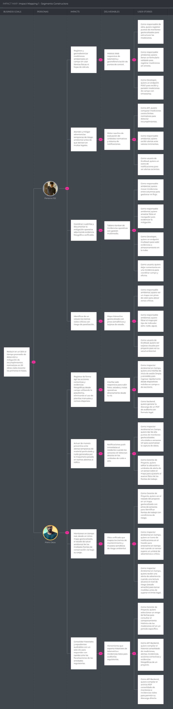

# Requirements Specification

## 3.1. User Stories

| ID | Título | Descripción | Criterios de Aceptación | Relacionado con |
| :--- | :--- | :--- | :--- | :--- |
| US01 | Autenticación | *Como* **Visitante**, *quiero* iniciar sesión en la plataforma *para* acceder a mi cuenta y perfil según mi rol. | *Dado* que el visitante ingresa credenciales válidas, *cuando* confirma el inicio de sesión, *entonces* el sistema lo redirige a la vista correspondiente a su rol. | EP08: Usuario |
| US02 | Demo de Tablero Geolocalizado | *Como* **Visitante**, *quiero* ver una vista previa simulada del monitoreo con sensores IoT *para* entender cómo se visualizarían los frentes de trabajo y tramos viales de mi obra. | *Dado* que el visitante navega en la landing page, *cuando* llega a la sección de funciones, *entonces* el sistema presenta una simulación de tramos viales con puntos de monitoreo de PM10, ruido y agua. | EP05: Mapa |
| US03 | Explicación de planes | *Como* **Visitante**, *quiero* comparar los planes Starter, Professional y Enterprise *para* elegir el que mejor se adapte a la cantidad de proyectos viales y usuarios de mi empresa. | *Dado* que el visitante llega a la sección de planes de suscripción, *cuando* la consulta, *entonces* el sistema muestra una comparación diferenciando número de proyectos, retención de historial y límites de usuarios por plan. | EP09: Suscripción |
| US04 | CTA Segmento Constructoras Viales | *Como* **Visitante del segmento Constructoras Viales**, *quiero* acceder a información específica sobre la gestión de monitoreo e incidencias *para* evaluar si se ajusta a mis frentes de construcción. | *Dado* que el visitante está en la sección dirigida a ejecutoras viales, *cuando* solicita conocer la plataforma, *entonces* el sistema lo redirige al registro de la Web Application. | EP08: Usuario |
| US05 | CTA Segmento Mantenimiento Vial | *Como* **Visitante del segmento Mantenimiento Vial**, *quiero* acceder a la propuesta de gestión multi-proyecto *para* evaluar la vista consolidada de mis tramos en conservación y rehabilitación vial. | *Dado* que el visitante está en la sección de mantenimiento vial, *cuando* solicita gestionar su cartera vial, *entonces* el sistema lo redirige al dashboard consolidado tras autenticarse. | EP06: Dashboard |
| US06 | Caso de Uso / Testimonio | *Como* **Visitante**, *quiero* ver métricas de impacto en proyectos viales reales *para* confiar en la efectividad de la plataforma frente a entes fiscalizadores como el OEFA o MTC. | *Dado* que el visitante recorre la landing page, *cuando* llega a la sección de impacto, *entonces* el sistema presenta cifras sobre reducción de riesgos y aceleración en el cierre de incidencias. | EP07: Reporte |
| US07 | Notificaciones Push Landing | *Como* **Visitante**, *quiero* aceptar notificaciones del navegador *para* recibir avisos inmediatos de superación de límites ambientales sin estar dentro de la aplicación. | *Dado* que el visitante ingresa al sitio web, *cuando* el sistema solicita autorización de notificaciones y el visitante la concede, *entonces* el sistema registra la suscripción push para alertas críticas de los sensores IoT. | EP03: Alerta |
| US08 | Formulario de Contacto Comercial y Alquiler IoT | *Como* **Visitante**, *quiero* solicitar una cotización personalizada de la plataforma y alquiler de dispositivos IoT *para* que el equipo de ventas evalúe las necesidades de mi obra. | *Dado* que el visitante completa el formulario especificando número de proyectos y tipos de sensores (PM10, ruido, agua), *cuando* lo envía, *entonces* el sistema registra el lead y confirma la recepción de la solicitud. | EP09: Suscripción |
| US09 | Formulario de Registro de Indicador Manual | *Como* **Inspector Ambiental en Campo**, *quiero* un formulario validado por tipo de indicador (PM10, PM2.5, dB, pH) *para* registrar mediciones puntuales sin enviar errores al servidor. | *Dado* que un parámetro o coordenada del tramo vial es obligatorio, *cuando* se omite o excede el rango normativo, *entonces* el sistema impide el registro del indicador y señala la observación correspondiente. | EP02: Indicador |
| US10 | Tarjetas de Proyecto Vial (Cards) | *Como* **Gerente de Proyecto**, *quiero* ver tarjetas visuales de cada carretera o tramo en mantenimiento *para* conocer su estado ambiental general de un vistazo. | *Dado* que se carga el portafolio vial, *cuando* se reciben los datos, *entonces* el sistema presenta cada proyecto con ubicación, tipo de obra, sensores activos, incidencias pendientes y nivel de estado ambiental. | EP06: Dashboard |
| US11 | Tablero Kanban de Incidencias Viales | *Como* **Gerente de Proyecto**, *quiero* mover incidencias entre estados (Pendiente / En Proceso / Atendida / Cerrada) *para* dar seguimiento al flujo de resolución correctiva. | *Dado* que se traslada una incidencia de campo a un nuevo estado con su evidencia cargada, *cuando* se confirma el cambio, *entonces* el sistema actualiza su estado operativo en tiempo real. | EP04: Incidencia |
| US12 | Vista de Mapa Interactivo Vial | *Como* **Gerente de Proyecto**, *quiero* ver el trazado del proyecto geolocalizado con sus sensores *para* identificar frentes de trabajo con condiciones de riesgo. | *Dado* que se cargan los sensores IoT del proyecto vial, *cuando* el sistema procesa las lecturas, *entonces* cada punto de monitoreo refleja su nivel de estado (Óptimo, Advertencia o Crítico). | EP05: Mapa |
| US13 | Filtro por Tipo de Indicador Vial | *Como* **Gerente de Proyecto**, *quiero* filtrar el mapa y dashboard por tipo de parámetro (aire PM10/PM2.5, ruido dB, agua, vibraciones) *para* enfocar mi revisión operativa. | *Dado* que existen diferentes sensores activos en el tramo, *cuando* el usuario selecciona un filtro específico, *entonces* el sistema actualiza la vista mostrando solo los puntos de monitoreo correspondientes. | EP02: Indicador |
| US14 | Adjuntar Evidencia Fotográfica de Acción Correctiva | *Como* **Inspector Ambiental en Campo**, *quiero* subir fotografías y descripciones desde mi dispositivo móvil *para* respaldar la ejecución de una acción correctiva (ej. riego de vía). | *Dado* que el usuario registra la atención de una incidencia en campo, *cuando* adjunta la fotografía y confirma el registro, *entonces* el sistema asocia la evidencia con fecha, hora y ubicación a la incidencia correspondiente. | EP10: Documento |
| US15 | Indicador de Cumplimiento Vial | *Como* **Gerente de Proyecto**, *quiero* ver el porcentaje de indicadores dentro de norma *para* medir el nivel de desempeño ambiental del proyecto en tiempo real. | *Dado* que los sensores IoT envían lecturas continuas, *cuando* cambian las condiciones de riesgo, *entonces* el sistema recalcula automáticamente el porcentaje de cumplimiento del tramo. | EP06: Dashboard |
| US16 | Feed de Comentarios y Trazabilidad en Incidencia | *Como* **Inspector Ambiental en Campo**, *quiero* ver la bitácora de mensajes y cambios de estado de una incidencia *para* entender la secuencia de atención entre el personal de campo y la jefatura. | *Dado* que una incidencia registra interacciones, *cuando* el usuario consulta su detalle, *entonces* el sistema presenta las notas, autores, marcas de tiempo y cambios de estado en orden cronológico. | EP04: Incidencia |
| US17 | Alertas y Notificaciones de Alerta Ambiental | *Como* **Inspector Ambiental en Campo**, *quiero* enterarme en tiempo real cuando un sensor supere un umbral de advertencia o crítico *para* poder actuar oportunamente. | *Dado* que la plataforma detecta un riesgo mediante telemetría IoT, *cuando* se genera la alerta, *entonces* el sistema notifica al usuario e indica el número de eventos no leídos. | EP03: Alerta |
| US18 | Tabla de Incidencias Críticas en Portafolio | *Como* **Director de Obra**, *quiero* un resumen de incidencias críticas *para* identificar de inmediato las no resueltas entre todos los proyectos de la empresa. | *Dado* que una incidencia se encuentra en nivel crítico, *cuando* se consulta la vista consolidada, *entonces* el sistema destaca dicha incidencia junto con el proyecto y tramo afectado. | EP04: Incidencia |
| US19 | Selector de Rango de Fechas e Histórico | *Como* **Gerente de Proyecto**, *quiero* seleccionar un rango de fechas *para* consultar el comportamiento histórico de las mediciones IoT según los permisos de mi plan. | *Dado* que el usuario define un rango de fechas, *cuando* lo confirma, *entonces* el sistema filtra los gráficos e indicadores mostrando los datos almacenados en dicho periodo (30 días, 12 meses o histórico completo, según el plan). | EP06: Dashboard |
| US20 | Edición de Punto de Monitoreo IoT | *Como* **Gerente de Proyecto**, *quiero* editar la ubicación o los umbrales de alerta de un sensor *para* ajustarlo al avance físico de los frentes de trabajo o tramos viales. | *Dado* que el usuario actualiza la ubicación o los umbrales de alerta de un sensor, *cuando* confirma los cambios, *entonces* el sistema actualiza dinámicamente los parámetros del punto de monitoreo. | EP02: Indicador |
| US21 | Autenticación en la Web Application | *Como* **Inspector Ambiental en Campo**, *quiero* iniciar sesión de forma rápida y segura *para* acceder a mis tareas desde el campo o la oficina. | *Dado* que el usuario no tiene una sesión activa, *cuando* intenta acceder a la aplicación, *entonces* el sistema solicita autenticación antes de conceder el acceso. | EP08: Usuario |
| US22 | Vista de Lista de Proyectos Viales | *Como* **Director de Obra**, *quiero* alternar el portafolio a una vista compacta *para* supervisar un alto número de carreteras o frentes en una sola pantalla. | *Dado* que el usuario activa la vista de lista, *cuando* el sistema la procesa, *entonces* presenta los datos resumidos de los proyectos organizados de forma compacta. | EP01: Proyecto |
| US23 | Gestión de Permisos por Nivel de Acceso | *Como* **Administrador de la Constructora**, *quiero* asignar niveles de acceso específicos a los colaboradores (Solo Lectura, Operación en Campo, Gestión Total) *para* controlar sus accesos dentro de la plataforma. | *Dado* que el administrador define el nivel de acceso de un usuario, *cuando* guarda los cambios, *entonces* el sistema restringe automáticamente las funcionalidades no autorizadas para ese usuario. | EP08: Usuario |
| US24 | Auth JWT y Permisos por Nivel de Acceso | *Como* **Developer**, *quiero* que la API emita tokens JWT que incluyan los permisos asignados por nivel de acceso (Solo Lectura, Operación en Campo, Gestión Total) *para* autorizar las solicitudes realizadas desde las aplicaciones cliente. | *Dado* que las credenciales enviadas son válidas, *cuando* se invoca el endpoint de autenticación, *entonces* la API retorna un Bearer token con los permisos vigentes del colaborador. | EP11: API |
| US25 | Swagger / Documentación de API | *Como* **Developer**, *quiero* disponer de documentación Swagger/OpenAPI de la API *para* integrar los endpoints de sensores IoT, alertas e incidencias de forma autónoma. | *Dado* que la API está desplegada, *cuando* se accede a la ruta de documentación, *entonces* el sistema presenta los modelos de datos, parámetros y respuestas de cada endpoint. | EP11: API |
| US26 | CRUD Proyectos Viales API | *Como* **Developer**, *quiero* exponer endpoints GET/POST/PUT/DELETE *para* gestionar la información de carreteras, tramos y frentes de trabajo de constructoras y conservadoras. | *Dado* que se realiza una petición al endpoint /api/v1/projects, *cuando* la estructura del payload es válida, *entonces* la API procesa la solicitud y retorna el código de estado correspondiente (200/201) junto con la entidad persistida. | EP01: Proyecto |
| US27 | Endpoint de Ingesta de Datos IoT | *Como* **Developer**, *quiero* implementar un endpoint seguro *para* recibir las lecturas automáticas de los sensores IoT de campo (PM10, PM2.5, ruido, agua, pH) con marca de tiempo. | *Dado* que un dispositivo o gateway IoT envía una medición, *cuando* el payload cumple con el esquema validado, *entonces* la API almacena el dato asociado al sensor y al proyecto vial. | EP02: Indicador |
| US28 | Motor de Comparación de Umbrales | *Como* **Developer**, *quiero* implementar un motor que analice cada lectura entrante frente a los umbrales configurados (Óptimo, Advertencia, Crítico) *para* detectar condiciones de riesgo de forma automatizada. | *Dado* que ingresa un dato ambiental, *cuando* este supera el límite normativo configurado, *entonces* la API actualiza el estado del indicador a Advertencia o Crítico según corresponda. | EP03: Alerta |
| US29 | Generador Automático de Incidencias | *Como* **Developer**, *quiero* que la API instancie automáticamente una incidencia ambiental *cuando* una lectura de sensor IoT alcance el estado Crítico. | *Dado* que un parámetro entra en estado Crítico, *cuando* el motor procesa el evento, *entonces* la API crea una incidencia vinculada al tramo, al punto de monitoreo y al valor registrado. | EP04: Incidencia |
| US30 | API de Subida de Evidencias Fotográficas | *Como* **Developer**, *quiero* implementar un endpoint multipart/form-data *para* recibir y almacenar imágenes de campo y notas de acciones correctivas en la nube. | *Dado* que se envía un archivo de imagen válido desde la aplicación, *cuando* la API procesa la subida, *entonces* retorna la URL persistida y los metadatos asociados a la evidencia. | EP10: Documento |
| US31 | Paginación y Filtrado de Peticiones | *Como* **Developer**, *quiero* que los listados de mediciones e incidencias soporten paginación y filtros por proyecto *para* mantener un buen desempeño en la interfaz. | *Dado* que se consulta el endpoint /api/v1/incidents con parámetros de página, tamaño y proyecto, *cuando* la API responde, *entonces* retorna únicamente los registros solicitados junto con su metadata de paginación. | EP11: API |
| US32 | Cifrado de Contraseñas | *Como* **Developer**, *quiero* asegurar el hash de las contraseñas mediante BCrypt *para* proteger la información confidencial de los usuarios registrados en la plataforma. | *Dado* que se registra un nuevo usuario o se actualiza su contraseña, *cuando* el dato se persiste en la base de datos, *entonces* la API almacena la contraseña cifrada con un factor de trabajo seguro. | EP08: Usuario |
| US33 | Cálculo de Estado Ambiental por Proyecto | *Como* **Developer**, *quiero* implementar el cálculo del porcentaje de sensores en advertencia o estado crítico *para* determinar la condición ambiental global de un proyecto vial. | *Dado* que se solicita el resumen de un proyecto, *cuando* la proporción de indicadores fuera de norma supera el umbral definido, *entonces* la API clasifica el proyecto en estado crítico. | EP06: Dashboard |
| US34 | Tarea Programada de Revisión de Incidencias | *Como* **Developer**, *quiero* implementar un proceso programado que evalúe periódicamente las incidencias sin acción correctiva registrada *para* escalar su prioridad y notificar al responsable de obra. | *Dado* que se ejecuta el proceso programado, *cuando* detecta una incidencia sin atención por más de 72 horas, *entonces* la API actualiza su estado a estancada y dispara la notificación correspondiente. | EP03: Alerta |
| US35 | Generador de Estructura para Reportes de Auditoría | *Como* **Developer**, *quiero* compilar el historial consolidado de mediciones, alertas, incidencias, acciones correctivas y evidencias de un proyecto *para* disponerlo como base de los reportes de auditoría. | *Dado* que se solicita la preparación de un reporte ambiental, *cuando* la API procesa el periodo requerido, *entonces* retorna un payload estructurado listo para su maquetación en PDF. | EP07: Reporte |
| US36 | Endpoint de Exportación de Reportes PDF | *Como* **Developer**, *quiero* implementar un endpoint que compile el archivo PDF consolidado de monitoreo e incidencias viales *para* permitir su descarga ante fiscalizaciones. | *Dado* que un usuario autorizado solicita el informe oficial, *cuando* el motor genera el documento, *entonces* la API retorna el archivo PDF resultante para su descarga. | EP07: Reporte |
| US37 | Limitación de Rate Limiting en API | *Como* **Developer**, *quiero* limitar la tasa de peticiones por IP y token *para* prevenir la saturación de los servidores o ataques contra la infraestructura SaaS. | *Dado* que un cliente excede el número máximo de peticiones permitidas por minuto, *cuando* realiza una nueva llamada, *entonces* la API responde con el código de estado 429 (Too Many Requests). | EP11: API |
| US38 | Configuración de Umbrales por Normativa Aplicable | *Como* **Developer**, *quiero* permitir la asignación de distintas tablas de umbrales según el tipo de entorno vial y las normativas ambientales peruanas (ECA, MTC). | *Dado* que se registra un proyecto vial con una clasificación determinada, *cuando* se asignan sus sensores, *entonces* la API carga los límites normativos correspondientes a dicha clasificación. | EP01: Proyecto |
| US39 | Validación de Cuotas por Plan de Suscripción | *Como* **Developer**, *quiero* verificar los límites del plan activo (Starter, Professional, Enterprise) *para* controlar la creación de proyectos y la cantidad de usuarios permitidos. | *Dado* que una empresa intenta registrar un proyecto que sobrepasa el cupo de su suscripción, *cuando* la API procesa la solicitud, *entonces* la rechaza con el código de estado 403. | EP09: Suscripción |
| US40 | Creación de Proyecto Vial | *Como* **Gerente de Proyecto**, *quiero* registrar una obra vial definiendo ubicación, tramos y frentes de trabajo *para* iniciar el monitoreo ambiental centralizado. | *Dado* que se ingresan los datos del proyecto y sus tramos, *cuando* se confirma el registro, *entonces* el sistema incorpora el proyecto al portafolio y a la vista general de monitoreo. | EP01: Proyecto |
| US41 | Asociación de Sensores IoT a Puntos de Monitoreo | *Como* **Inspector Ambiental en Campo**, *quiero* dar de alta puntos de monitoreo geolocalizados vinculados a sensores IoT (propios o alquilados) *para* automatizar la captura de datos. | *Dado* que se selecciona un tramo del proyecto, *cuando* se ingresan las coordenadas y el identificador del sensor IoT (PM10, ruido, agua), *entonces* el sistema habilita el punto para recibir telemetría. | EP02: Indicador |
| US42 | Gestión de Suscripción y Alquileres de Dispositivos IoT | *Como* **Director de Obra**, *quiero* contratar o asociar dispositivos de monitoreo IoT mediante alquiler mensual independiente del plan de suscripción *para* adaptarlos a mi obra. | *Dado* que se gestiona el inventario de equipos del proyecto, *cuando* se seleccionan los sensores requeridos (aire, ruido, vibraciones), *entonces* el sistema actualiza el contrato de alquiler IoT correspondiente. | EP09: Suscripción |
| US43 | Comunicación e Interacción en Incidencias | *Como* **Inspector Ambiental en Campo**, *quiero* registrar comentarios y notas dentro de una incidencia *para* coordinar las acciones correctivas entre los equipos operativos. | *Dado* que el usuario accede al detalle de una incidencia, *cuando* registra una observación, *entonces* el sistema guarda el comentario en el historial junto con el autor y la marca de tiempo. | EP04: Incidencia |
| US44 | Monitoreo de Salud Ambiental del Portafolio Vial | *Como* **Director de Obra**, *quiero* un panel general que resuma la salud ambiental de todas las carreteras en ejecución o conservación *para* mitigar riesgos legales y multas. | *Dado* que la empresa administra múltiples obras viales, *cuando* el director consulta el panel multi-proyecto, *entonces* el sistema presenta el estado consolidado y el nivel de riesgo de cada obra de la cartera. | EP06: Dashboard |
| US45 | Generación de Reporte Consolidado de Auditoría | *Como* **Ingeniero Ambiental**, *quiero* exportar en PDF el informe periódico de un proyecto vial *para* entregarlo ante las autoridades de fiscalización (OEFA / MTC). | *Dado* que el usuario selecciona el proyecto y el rango de fechas, *cuando* solicita exportar el reporte, *entonces* el sistema genera y entrega un documento estructurado con mediciones y evidencias fotográficas. | EP07: Reporte |
| US46 | Alerta Preventiva de Advertencia | *Como* **Inspector Ambiental en Campo**, *quiero* recibir una alerta de advertencia cuando una lectura alcance el nivel de riesgo (estado amarillo) *para* tomar medidas preventivas. | *Dado* que la lectura de un sensor alcanza el estado de Advertencia, *cuando* se registra la medición, *entonces* el sistema genera una alerta preventiva indicando el indicador y el tramo afectado. | EP03: Alerta |
| US47 | Alerta y Escalamiento de Incidencias Estancadas | *Como* **Gerente de Proyecto**, *quiero* recibir notificaciones de escalamiento si una incidencia no presenta acciones correctivas en 72 horas *para* intervenir oportunamente. | *Dado* que transcurren 72 horas sin cambios de estado en una incidencia abierta, *cuando* se ejecuta la validación correspondiente, *entonces* el sistema marca la incidencia como estancada y notifica al responsable. | EP03: Alerta |
| US48 | Archivado de Proyectos Viales Finalizados | *Como* **Director de Obra**, *quiero* archivar obras de infraestructura concluidas *para* mantener despejado el portafolio activo sin perder la trazabilidad de la información histórica. | *Dado* que una obra alcanza su cierre operativo, *cuando* el administrador solicita archivarla, *entonces* el sistema la retira de las vistas operativas primarias conservando su trazabilidad histórica. | EP01: Proyecto |
| US49 | Seguimiento Histórico y Tendencias por Parámetro | *Como* **Ingeniero Ambiental**, *quiero* consultar la tendencia histórica por sensor (PM10, PM2.5, ruido, turbidez, pH) *para* evaluar la efectividad de las medidas aplicadas. | *Dado* que se consulta el detalle de un punto de monitoreo, *cuando* se selecciona la variable deseada, *entonces* el sistema presenta la evolución histórica del parámetro frente a los umbrales normativos. | EP02: Indicador |
| US50 | Visualización de KPIs de Gestión Ambiental | *Como* **Director de Obra**, *quiero* revisar indicadores clave (% de incidencias cerradas, tiempo medio de atención de alertas, sensores activos) *para* auditar el rendimiento en obra. | *Dado* que el usuario accede a la vista analítica del portafolio, *cuando* los datos se procesan, *entonces* el sistema presenta las métricas consolidadas del desempeño ambiental. | EP06: Dashboard |
| US51 | Actualización Dinámica del Dashboard por Telemetría IoT | *Como* **Inspector Ambiental en Campo**, *quiero* que el dashboard ambiental actualice sus indicadores en tiempo real al recibir datos IoT *para* visualizar emergencias sin recargar manualmente. | *Dado* que un sensor registra una nueva lectura crítica en obra, *cuando* el sistema la procesa, *entonces* actualiza automáticamente los indicadores y el estado del mapa sin requerir recarga manual. | EP06: Dashboard |
| US52 | Historial del Ciclo de Vida de Incidencias | *Como* **Ingeniero Ambiental**, *quiero* consultar la bitácora inmutable de una incidencia *para* verificar quién registró la alerta, quién ejecutó la acción correctiva y quién aprobó el cierre. | *Dado* que se consulta la trazabilidad de una incidencia cerrada, *cuando* el usuario la explora, *entonces* el sistema presenta cada hito del proceso con su evidencia y marca de tiempo correspondiente. | EP04: Incidencia |
| US53 | Control de Accesos por Permisos Dinámicos | *Como* **Director de Obra**, *quiero* restringir las acciones de los usuarios según su nivel de acceso asignado *para* evitar modificaciones no autorizadas. | *Dado* que un usuario sin privilegios de gestión intenta modificar un umbral normativo, *cuando* ejecuta la acción, *entonces* el sistema bloquea el procedimiento por falta de autorización. | EP08: Usuario |
| US54 | Control de Versiones de Instrumentos de Gestión Ambiental | *Como* **Ingeniero Ambiental**, *quiero* gestionar versiones de los documentos ambientales subidos (PMA, DIA, EIA) *para* asegurar que la obra trabaje con la normativa vigente. | *Dado* que se adjunta un nuevo archivo normativo para un tramo, *cuando* el sistema detecta un documento previo con el mismo nombre, *entonces* incrementa la versión conservando el historial. | EP10: Documento |
| US55 | Búsqueda Global de Proyectos, Tramos e Incidencias | *Como* **Director de Obra**, *quiero* disponer de un buscador centralizado *para* localizar rápidamente carreteras, frentes de trabajo o incidencias específicas mediante códigos o palabras clave. | *Dado* que el usuario ingresa un término de búsqueda, *cuando* ejecuta la consulta, *entonces* el sistema lista los proyectos, tramos e incidencias coincidentes de la cartera. | EP01: Proyecto |
| US56 | Evidencias Obligatorias para Cierre de Incidencias | *Como* **Gerente de Proyecto**, *quiero* que sea obligatorio adjuntar evidencia fotográfica para marcar una incidencia como "Atendida" *para* garantizar la veracidad de la mitigación. | *Dado* que un supervisor intenta cambiar el estado de una incidencia a "Atendida", *cuando* no ha adjuntado al menos una evidencia fotográfica, *entonces* el sistema bloquea el cambio de estado. | EP10: Documento |
| US57 | Gestión del Flujo Completo de Respuesta Ambiental | *Como* **Inspector Ambiental en Campo**, *quiero* ejecutar el ciclo completo (*Monitorear → analizar → detectar riesgo → alertar → gestionar incidencia → accionar → evidenciar → cerrar*) *para* asegurar la trazabilidad. | *Dado* que se detecta una superación de umbrales en la vía, *cuando* el equipo completa cada fase de respuesta en la plataforma, *entonces* el sistema archiva la incidencia con el registro completo del ciclo. | EP04: Incidencia |
| US58 | Integración con Servicio de Geolocalización de Terceros | *Como* **Developer**, *quiero* integrar la API con un servicio externo de mapas y geocodificación *para* obtener coordenadas y trazados viales precisos de los tramos registrados. | *Dado* que se registra un tramo vial con una dirección o referencia geográfica, *cuando* la API consulta el servicio externo de geocodificación, *entonces* almacena las coordenadas normalizadas devueltas para su uso en los tableros geolocalizados. | EP12: Integración |

---

### 3.2. Impact Mapping

En esta sección se presenta el desglose estratégico del modelo de negocio de EcoRoad mediante la técnica de **Impact Mapping**, vinculando la meta de negocio SMART con los cambios de comportamiento requeridos en los segmentos de cliente, las soluciones funcionales provistas y las historias de usuario asociadas.

  

### 3.3. Product Backlog

| # Orden | User Story Id | Título | Descripción | Story Points (1/2/3/5/8) |
|---|---|---|---|---|
| 1 | US21 | Login Minimalista | Como **Inspector Ambiental en Campo**, quiero una interfaz de inicio de sesión limpia y accesible para ingresar rápidamente desde dispositivos móviles en campo o de escritorio. | 2 |
| 2 | US24 | Auth JWT y Permisos por Casillas | Como **API Backend**, quiero emitir tokens JWT que incluyan los permisos asignados por checkboxes (Solo lectura, Operación en campo, Gestión total) para autorizar las solicitudes a la API. | 5 |
| 3 | US32 | Cifrado de Contraseñas | Como **API Backend**, quiero asegurar el hash de las contraseñas mediante BCrypt para proteger la información de los usuarios registrados. | 3 |
| 4 | US01 | Autenticación | Como **Inspector Ambiental en Campo**, quiero poder iniciar sesión para acceder a mi cuenta y perfil. | 2 |
| 5 | US53 | Control de Accesos por Permisos Dinámicos | Como **usuario de EcoRoad**, quiero restringir las acciones de los usuarios según las casillas de verificación activadas en su perfil para evitar modificaciones no autorizadas en datos sensibles. | 8 |
| 6 | US40 | Creación de Proyecto Vial | Como **usuario de EcoRoad**, quiero registrar una obra vial definiendo ubicación, tramos y frentes de trabajo para iniciar el monitoreo ambiental. | 3 |
| 7 | US26 | CRUD Proyectos Viales API | Como **API Backend**, quiero exponer endpoints GET/POST/PUT/DELETE para gestionar la información de carreteras, tramos y frentes de trabajo. | 5 |
| 8 | US25 | Swagger / Documentación de API | Como **API Backend**, quiero publicar la documentación Swagger OpenAPI para permitir integrar los endpoints de sensores, alertas e incidencias de forma autónoma. | 2 |
| 9 | US38 | Configuración de Umbrales por Normativa Aplicable | Como **API Backend**, quiero permitir la asignación de distintas tablas de umbrales según el tipo de entorno vial (urbano, periurbano, reserva natural). | 5 |
| 10 | US42 | Asignación de Responsables y Permisos Dinámicos | Como **usuario de EcoRoad**, quiero registrar colaboradores y asignarles permisos por casilla (Lectura, Operación en campo, Gestión total) para adecuar el sistema al organigrama de la obra. | 3 |
| 11 | US41 | Asociación de Sensores IoT a Puntos de Monitoreo | Como **usuario de EcoRoad**, quiero dar de alta puntos de monitoreo geolocalizados vinculados a sensores IoT (alquilados o propios) para automatizar la captura de datos. | 5 |
| 12 | US20 | Edición Visual de Punto de Monitoreo IoT | Como **Gerente de Proyecto**, quiero editar la ubicación o umbrales de alerta de un sensor sobre el mapa para ajustarlo al avance físico de los frentes de trabajo. | 2 |
| 13 | US22 | Vista de Lista de Proyectos Viales | Como **Director de Obra**, quiero alternar la vista del portafolio a una lista compacta para supervisar un alto número de carreteras en una sola pantalla. | 2 |
| 14 | US48 | Archivado de Proyectos Viales Finalizados | Como **usuario de EcoRoad**, quiero archivar obras de infraestructura concluidas para mantener despejado el portafolio activo sin perder la trazabilidad de los datos. | 3 |
| 15 | US10 | Tarjetas de Proyecto Vial (Cards) | Como **Gerente de Proyecto**, quiero ver tarjetas visuales de cada carretera o tramo para conocer su estado ambiental general de un vistazo. | 3 |
| 16 | US51 | Actualización Dinámica del Dashboard por Telemetría IoT | Como **usuario de EcoRoad**, quiero que el dashboard ambiental actualice sus mapas y métricas en tiempo real al recibir datos IoT para visualizar emergencias de campo sin recargar la página. | 8 |
| 17 | US27 | Endpoint de Ingesta de Datos IoT | Como **API Backend**, quiero proveer un endpoint POST seguro para recibir las lecturas de los sensores IoT de campo (aire, ruido, agua, vibraciones) y almacenarlas con marca de tiempo. | 5 |
| 18 | US09 | Formulario de Registro de Indicador Manual | Como **Inspector Ambiental en Campo**, quiero un formulario validado por tipo de indicador (PM10, dB, pH) para registrar mediciones puntuales sin enviar errores al servidor. | 3 |
| 19 | US13 | Filtro por Tipo de Indicador Vial | Como **Gerente de Proyecto**, quiero filtrar el mapa/dashboard por tipo de parámetro (calidad del aire, ruido, vibraciones, agua, meteorología) para enfocar mi revisión. | 2 |
| 20 | US49 | Seguimiento Histórico y Tendencias por Parámetro | Como **usuario de EcoRoad**, quiero consultar gráficos de tendencia histórica por sensor (PM10, ruido, turbidez) para evaluar la efectividad de las medidas de mitigación aplicadas en el tiempo. | 5 |
| 21 | US19 | Selector de Rango de Fechas e Histórico | Como **Gerente de Proyecto**, quiero seleccionar un rango de fechas para consultar el comportamiento histórico de las mediciones IoT en un periodo específico. | 3 |
| 22 | US28 | Motor de Comparación de Umbrales | Como **API Backend**, quiero analizar cada lectura entrante frente a los umbrales configurados (Óptimo, Advertencia, Crítico) para detectar condiciones de riesgo de forma automatizada. | 8 |
| 23 | US29 | Generador Automático de Incidencias | Como **API Backend**, quiero instanciar una incidencia ambiental cuando una lectura de sensor alcance el estado Crítico. | 5 |
| 24 | US46 | Alerta Preventiva de Advertencia (90% del Umbral) | Como **usuario de EcoRoad**, quiero recibir una alerta de advertencia cuando una lectura alcance el nivel de riesgo (estado amarillo) para tomar medidas antes de superar el límite legal. | 5 |
| 25 | US34 | Tarea Programada de Revisión de Incidencias | Como **API Backend**, quiero evaluar periódicamente las incidencias sin acción correctiva registrada para escalar su prioridad y notificar al responsable. | 3 |
| 26 | US47 | Alerta y Escalamiento de Incidencias Estancadas | Como **usuario de EcoRoad**, quiero recibir notificaciones de escalamiento si una incidencia no presenta acciones correctivas en 72 horas para intervenir oportunamente. | 3 |
| 27 | US17 | Alertas y Notificaciones de Alerta Ambiental | Como **Inspector Ambiental en Campo**, quiero un icono de notificaciones en el header para enterarme en tiempo real cuando un sensor supere un umbral de advertencia o crítico. | 2 |
| 28 | US11 | Tablero Kanban de Incidencias Viales | Como **Gerente de Proyecto**, quiero mover incidencias entre columnas (Pendiente / En Proceso / Atendida / Cerrada) para dar seguimiento al flujo de resolución. | 8 |
| 29 | US18 | Tabla de Incidencias Críticas en Portafolio | Como **Director de Obra**, quiero una tabla con filas destacadas para identificar de inmediato las incidencias críticas no resueltas entre todos los proyectos. | 2 |
| 30 | US43 | Comunicación e Interacción en Incidencias | Como **usuario de EcoRoad**, quiero registrar comentarios dentro de una incidencia para coordinar las acciones correctivas entre los equipos. | 3 |
| 31 | US16 | Feed de Comentarios y Trazabilidad en Incidencia | Como **Inspector Ambiental en Campo**, quiero ver la bitácora de mensajes y cambios de estado de una incidencia para entender la secuencia de atención entre el personal de campo y la jefatura. | 3 |
| 32 | US52 | Historial del Ciclo de Vida de Incidencias | Como **usuario de EcoRoad**, quiero consultar la bitácora inmutable de una incidencia para verificar quién registró la alerta, quién ejecutó la acción correctiva y quién aprobó el cierre. | 3 |
| 33 | US14 | Adjuntar Evidencia Fotográfica de Acción Correctiva | Como **Inspector Ambiental en Campo**, quiero subir fotografías geolocalizadas desde mi dispositivo para respaldar la ejecución de una acción correctiva (ej. riego de vía). | 3 |
| 34 | US30 | API de Subida de Evidencias Fotográficas | Como **API Backend**, quiero disponer de un endpoint multipart/form-data para recibir y almacenar imágenes de campo en almacenamiento en la nube. | 5 |
| 35 | US54 | Control de Versiones de Instrumentos de Gestión Ambiental | Como **usuario de EcoRoad**, quiero gestionar versiones de los estudios e instrumentos ambientales subidos (EIA, DIA, PMA) para asegurar que la obra trabaje siempre con los documentos normativos vigentes. | 8 |
| 36 | US56 | Evidencias Obligatorias para Cierre de Incidencias | Como **usuario de EcoRoad**, quiero que sea obligatorio adjuntar evidencia fotográfica para marcar una incidencia como "Atendida" para garantizar la veracidad de la acción correctiva en campo. | 3 |
| 37 | US55 | Búsqueda Global de Proyectos, Tramos e Incidencias | Como **usuario de EcoRoad**, quiero disponer de un buscador centralizado para localizar rápidamente carreteras, frentes de trabajo o incidencias específicas mediante palabras clave o códigos. | 5 |
| 38 | US12 | Vista de Mapa Interactivo Vial | Como **Gerente de Proyecto**, quiero ver el trazado del proyecto en un mapa geolocalizado con pines de sensores para identificar frentes de trabajo con condiciones de riesgo. | 8 |
| 39 | US02 | Demo de Tablero Geolocalizado | Como **Gerente de Proyecto**, quiero ver una vista previa del mapa con sensores IoT para entender cómo se visualizarían los frentes de trabajo de mi obra. | 3 |
| 40 | US33 | Cálculo de Estado Ambiental por Proyecto | Como **API Backend**, quiero evaluar el porcentaje de sensores en advertencia o estado crítico para determinar la condición ambiental global del proyecto vial. | 3 |
| 41 | US15 | Barra de Progreso de Cumplimiento Vial | Como **Gerente de Proyecto**, quiero ver una barra de progreso del % de indicadores dentro de norma para medir el nivel de desempeño ambiental del proyecto en tiempo real. | 2 |
| 42 | US44 | Monitoreo de Salud Ambiental del Portafolio Vial | Como **usuario de EcoRoad**, quiero un panel general que resuma la salud ambiental de todas las carreteras en ejecución o conservación para mitigar riesgos legales o multas. | 5 |
| 43 | US50 | Visualización de KPIs de Gestión Ambiental | Como **usuario de EcoRoad**, quiero revisar indicadores clave (% de incidencias cerradas, tiempo medio de atención de alertas, sensores activos) para auditar el rendimiento de la gestión en obra. | 5 |
| 44 | US05 | CTA Segmento Empresa Multi-Proyecto | Como **Director de Obra**, quiero un botón dirigido a la gestión de portafolio para acceder a la vista consolidada de mis carreteras y obras en mantenimiento. | 2 |
| 45 | US35 | Generador de Estructura para Reportes de Auditoría | Como **API Backend**, quiero compilar el historial consolidado de mediciones, alertas, incidencias, acciones correctivas y evidencias fotográficas de un proyecto. | 5 |
| 46 | US36 | Endpoint de Exportación de Reportes PDF | Como **API Backend**, quiero compilar el archivo PDF consolidado de monitoreo e incidencias viales para permitir su descarga directa. | 5 |
| 47 | US45 | Generación de Reporte Consolidado de Auditoría | Como **usuario de EcoRoad**, quiero exportar en PDF el informe periódico de un proyecto vial para entregarlo ante las autoridades de fiscalización ambiental. | 3 |
| 48 | US06 | Caso de Uso / Testimonio | Como **Inspector Ambiental en Campo**, quiero ver un caso de éxito o cifras de impacto en proyectos viales para confiar en la efectividad de la plataforma frente a entes fiscalizadores. | 2 |
| 49 | US04 | CTA Segmento Constructora / Conservadora Vial | Como **Gerente de Proyecto**, quiero un botón claro para probar la plataforma para evaluar cómo gestiona el flujo de monitoreo e incidencias en mi tramo vial. | 2 |
| 50 | US03 | Explicación de planes | Como **Director de Obra**, quiero comparar los planes Starter, Professional y Enterprise para elegir el que se ajuste a la cartera de proyectos de mi empresa. | 3 |
| 51 | US08 | Formulario de Contacto Comercial | Como **Director de Obra**, quiero solicitar una cotización personalizada de plataforma y alquiler de sensores IoT para que el equipo de ventas evalúe las necesidades de mi obra. | 2 |
| 52 | US39 | Validación de Cuotas por Plan de Suscripción | Como **API Backend**, quiero verificar los límites del plan activo (Starter, Professional, Enterprise) para controlar la creación de nuevos proyectos y usuarios. | 5 |
| 53 | US57 | Gestión de Planes de Suscripción y Alquiler IoT | Como **usuario de EcoRoad**, quiero modificar el plan de suscripción (Starter, Professional, Enterprise) o la cantidad de sensores IoT alquilados para adaptar la plataforma a los nuevos tramos o proyectos adjudicados. | 5 |
| 54 | US23 | Selector de Color de Marca y Personalización | Como **Director de Obra**, quiero configurar los colores institucionales en la plataforma para personalizar los tableros y reportes ambientales con la identidad de mi empresa. | 5 |
| 55 | US07 | Notificaciones Push Landing | Como **Inspector Ambiental en Campo**, quiero aceptar notificaciones del navegador para recibir alertas inmediatas de superación de límites ambientales sin estar dentro de la aplicación. | 5 |
| 56 | US31 | Paginación y Filtrado de Peticiones | Como **API Backend**, quiero que los listados de mediciones e incidencias permitan paginación y filtros por proyecto para mantener alta velocidad de respuesta. | 3 |
| 57 | US37 | Limitación de Rate Limiting en API | Como **API Backend**, quiero limitar la tasa de peticiones por IP y token para prevenir la saturación de los servidores o ciberataques. | 5 |