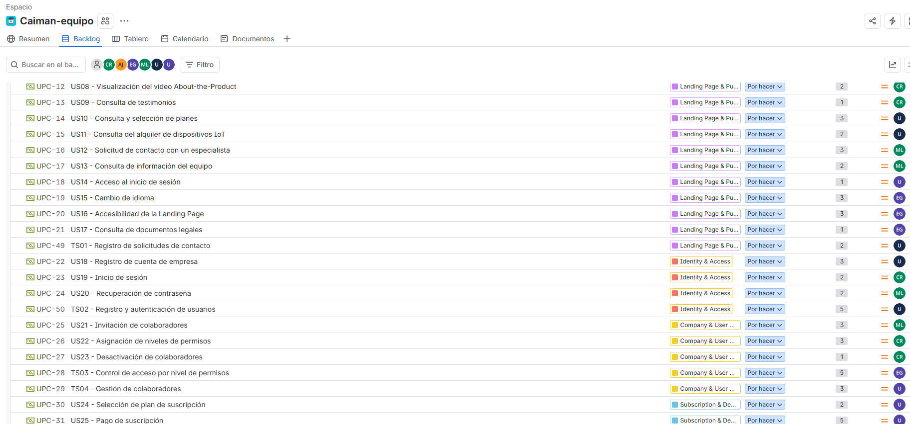

# Requirements Specification

## 3.1. User Stories

| **Epic / Story ID** | **Título**                                         | **Descripción**                                                                                                                                                                                                                                         | **Criterios de Aceptación**                                                                                                                                                                                                                                                                                                                                                                                                                                                                                                                                                                                                                                                                                                                                                                                                                                                                                           | **Relacionado con (Epic ID)** |
|---------------------|----------------------------------------------------|---------------------------------------------------------------------------------------------------------------------------------------------------------------------------------------------------------------------------------------------------------|-----------------------------------------------------------------------------------------------------------------------------------------------------------------------------------------------------------------------------------------------------------------------------------------------------------------------------------------------------------------------------------------------------------------------------------------------------------------------------------------------------------------------------------------------------------------------------------------------------------------------------------------------------------------------------------------------------------------------------------------------------------------------------------------------------------------------------------------------------------------------------------------------------------------------|-------------------------------|
| **EP01**            | **Landing Page & Public Experience**               | Agrupa las funcionalidades del sitio web estático (Landing Page) que comunican la propuesta de valor de EcoRoad a los visitantes de cada segmento y los dirigen a la Web Application.                                                                   | –                                                                                                                                                                                                                                                                                                                                                                                                                                                                                                                                                                                                                                                                                                                                                                                                                                                                                                                     | –                             |
| US01                | Visualización de la propuesta de valor             | Como visitante del segmento de empresas constructoras viales, quiero conocer la propuesta de valor de EcoRoad para evaluar si responde a las necesidades de gestión ambiental de mis obras.                                                             | **Escenario 1: Visualización de la propuesta de valor** Dado que el visitante accede a la Landing Page Cuando se carga la sección principal (Home) Entonces visualiza el título, la descripción de la propuesta de valor y la opción para comenzar a usar EcoRoad. **Escenario 2: Redirección para comenzar a usar EcoRoad** Dado que el visitante se encuentra en la sección principal Cuando elige comenzar a usar EcoRoad Entonces el sistema lo redirige a la vista de registro de la Web Application.                                                                                                                                                                                                                                                                                                                                                                                       | EP01                          |
| US02                | Visualización de indicadores de la plataforma      | Como visitante del segmento de empresas de mantenimiento y rehabilitación vial, quiero conocer los indicadores de operación de EcoRoad para confiar en el desempeño de la plataforma antes de contratarla.                                              | **Escenario 1: Visualización de indicadores** Dado que el visitante se encuentra en la sección principal Cuando la sección se muestra completa Entonces visualiza la cantidad de nodos IoT activos, la latencia y el porcentaje de cumplimiento regulatorio de la plataforma. **Escenario 2: Visualización de la unidad de medida** Dado que el visitante accede a la Landing Page Cuando se carga el contenido Entonces cada indicador se muestra con su unidad de medida.                                                                                                                                                                                                                                                                                                                                                                                                                      | EP01                          |
| US03                | Visualización en distintos dispositivos            | Como visitante supervisor de campo de una empresa constructora vial, quiero acceder a la Landing Page desde mi smartphone para consultar la información desde el frente de obra.                                                                        | **Escenario 1: Visualización en dispositivo móvil** Dado que el visitante accede desde un smartphone Cuando se carga cualquier sección de la Landing Page Entonces el contenido se muestra completo y adaptado al ancho de la pantalla. **Escenario 2: Visualización en computadora** Dado que el visitante accede desde un navegador de escritorio Cuando se carga cualquier sección de la Landing Page Entonces el contenido se muestra completo y distribuido para pantallas amplias.                                                                                                                                                                                                                                                                                                                                                                                                         | EP01                          |
| US04                | Navegación entre secciones                         | Como visitante, quiero desplazarme entre las secciones de la Landing Page para encontrar rápidamente la información que busco.                                                                                                                          | **Escenario 1: Acceso a una sección** Dado que el visitante se encuentra en la Landing Page Cuando elige una sección de la navegación Entonces el contenido de esa sección se muestra en pantalla. **Escenario 2: Navegación desde dispositivo móvil** Dado que el visitante accede desde un smartphone Cuando abre la navegación Entonces las secciones de la Landing Page se muestran disponibles para su selección.                                                                                                                                                                                                                                                                                                                                                                                                                                                                           | EP01                          |
| US05                | Consulta de soluciones de monitoreo                | Como visitante del segmento de empresas de mantenimiento y rehabilitación vial, quiero conocer las soluciones de monitoreo de EcoRoad para identificar cuáles aplican al polvo, ruido y vibraciones que genera la maquinaria en mis frentes de trabajo. | **Escenario 1: Consulta de soluciones** Dado que el visitante navega a la sección de soluciones Cuando la sección se muestra Entonces visualiza las soluciones de calidad del aire y polvo, ruido, recursos hídricos y hábitats sensibles, cada una con su descripción y los estándares que aplica. **Escenario 2: Detalle de una solución** Dado que el visitante se encuentra en la sección de soluciones Cuando selecciona una solución Entonces se muestra la descripción completa de esa solución.                                                                                                                                                                                                                                                                                                                                                                                          | EP01                          |
| US06                | Consulta de beneficios de la plataforma            | Como visitante, quiero conocer los beneficios de EcoRoad frente al registro manual para decidir si adoptarlo en mi empresa.                                                                                                                             | **Escenario 1: Consulta de beneficios** Dado que el visitante navega a la sección de beneficios Cuando la sección se muestra Entonces visualiza los beneficios de cero paralizaciones y multas, registros técnicos inalterables, auditorías automatizadas, trazabilidad por progresiva, flujo de mitigación inmediata y respaldo legal de especialistas, cada uno con su descripción. **Escenario 2: Resultados de cada beneficio** Dado que el visitante se encuentra en la sección de beneficios Cuando se muestran los beneficios Entonces cada beneficio incluye un resultado concreto, como la mitigación inmediata en menos de 15 minutos o el ahorro de horas mensuales de trabajo administrativo.                                                                                                                                                                                        | EP01                          |
| US07                | Consulta de funcionalidades de la plataforma       | Como visitante gerente de proyecto de una empresa constructora vial, quiero conocer las funcionalidades principales de EcoRoad para comprender cómo gestiona el cumplimiento ambiental de varias obras.                                                 | **Escenario 1: Consulta de funcionalidades** Dado que el visitante navega a la sección de características Cuando la sección se muestra Entonces visualiza las funcionalidades de dashboards georreferenciados multiproyecto, alertas regulatorias automáticas, cadena de custodia de evidencias y generación de reportes oficiales. **Escenario 2: Detalle de una funcionalidad** Dado que el visitante se encuentra en la sección de características Cuando elige una funcionalidad Entonces se muestra su descripción completa.                                                                                                                                                                                                                                                                                                                                                                | EP01                          |
| US08                | Visualización del video About-the-Product          | Como visitante, quiero ver un video sobre EcoRoad para entender el producto en pocos minutos.                                                                                                                                                           | **Escenario 1: Reproducción del video** Dado que el visitante se encuentra en la sección de características Cuando inicia la reproducción del video About-the-Product Entonces el video se reproduce dentro de la Landing Page. **Escenario 2: Video no disponible** Dado que el video no puede cargarse Cuando el visitante accede a la sección de características Entonces se informa que el video no está disponible y el resto del contenido permanece visible.                                                                                                                                                                                                                                                                                                                                                                                                                              | EP01                          |
| US09                | Consulta de testimonios                            | Como visitante, quiero leer testimonios de profesionales del sector vial para confiar en los resultados de EcoRoad.                                                                                                                                     | **Escenario 1: Consulta de testimonios** Dado que el visitante navega a la sección de testimonios Cuando la sección se muestra Entonces visualiza testimonios con el nombre, el cargo, la empresa y la opinión de cada persona. **Escenario 2: Testimonios de ambos segmentos** Dado que el visitante se encuentra en la sección de testimonios Cuando se muestran los testimonios Entonces incluyen al menos uno de un profesional de una empresa constructora vial y uno de una empresa de mantenimiento y rehabilitación vial.                                                                                                                                                                                                                                                                                                                                                                | EP01                          |
| US10                | Consulta y selección de planes                     | Como visitante, quiero consultar los planes y precios de EcoRoad y elegir el que se ajuste a la escala de mis proyectos para comenzar mi registro con ese plan.                                                                                         | **Escenario 1: Consulta de precios mensuales** Dado que el visitante accede a la sección de planes Cuando la sección se muestra Entonces visualiza los planes con sus características. **Escenario 2: Consulta de precios anuales** Dado que el visitante revisa los planes Cuando elige la modalidad de pago anual Entonces se muestran los precios anuales con el ahorro correspondiente. **Escenario 3: Selección de un plan Starter o Professional** Dado que el visitante revisa los planes Cuando elige el plan Starter o Professional Entonces el sistema lo redirige a la vista de registro de la Web Application con ese plan preseleccionado. **Escenario 4: Selección del plan Enterprise** Dado que el visitante revisa el plan Enterprise Cuando elige contactar a ventas Entonces el sistema lo redirige a la solicitud de contacto con un especialista.   | EP01                          |
| US11                | Consulta del alquiler de dispositivos IoT          | Como visitante del segmento de empresas de mantenimiento y rehabilitación vial, quiero conocer las condiciones de alquiler de los dispositivos IoT para monitorear mis frentes de trabajo sin comprar los equipos.                                      | **Escenario 1: Consulta de dispositivos disponibles** Dado que el visitante navega a la información de alquiler de dispositivos Cuando la información se muestra Entonces visualiza los tipos de dispositivo (aire, ruido, aire y ruido combinado, vibraciones, estación meteorológica y calidad del agua) con su tarifa mensual. **Escenario 2: Alquiler independiente de la suscripción** Dado que el visitante se encuentra en la información de alquiler Cuando se muestra el detalle del servicio Entonces se indica que el alquiler es independiente de la suscripción y que la empresa puede usar dispositivos compatibles propios.                                                                                                                                                                                                                                                       | EP01                          |
| US12                | Solicitud de contacto con un especialista          | Como visitante interesado, quiero dejar mis datos de contacto para que un especialista me brinde una demostración de EcoRoad.                                                                                                                           | **Escenario 1: Envío exitoso** Dado que el visitante ingresa su nombre, un correo electrónico válido y el nombre de su empresa Cuando envía la solicitud Entonces el sistema registra la solicitud y confirma su recepción al visitante. **Escenario 2: Correo inválido** Dado que el visitante ingresa un correo con formato inválido Cuando intenta enviar la solicitud Entonces la solicitud no se registra y se informa el motivo del error. **Escenario 3: Datos obligatorios incompletos** Dado que el visitante deja sin completar un dato obligatorio Cuando intenta enviar la solicitud Entonces la solicitud no se registra y se indica el dato faltante.                                                                                                                                                                                                                  | EP01                          |
| US13                | Consulta de información del equipo                 | Como visitante, quiero conocer al equipo que desarrolla EcoRoad para evaluar la experiencia de quienes respaldan el producto.                                                                                                                           | **Escenario 1: Consulta de integrantes** Dado que el visitante navega a la sección del equipo Cuando la sección se muestra Entonces visualiza la foto, el nombre y la carrera de cada integrante. **Escenario 2: Visualización del video About-the-Team** Dado que el visitante se encuentra en la sección del equipo Cuando inicia la reproducción del video About-the-Team Entonces el video se reproduce dentro de la Landing Page.                                                                                                                                                                                                                                                                                                                                                                                                                                                           | EP01                          |
| US14                | Acceso al inicio de sesión                         | Como visitante con una cuenta registrada, quiero acceder al inicio de sesión desde la Landing Page para ingresar a la Web Application.                                                                                                                  | **Escenario 1: Redirección al inicio de sesión** Dado que el visitante se encuentra en la Landing Page Cuando elige iniciar sesión Entonces el sistema lo redirige a la vista de inicio de sesión de la Web Application.                                                                                                                                                                                                                                                                                                                                                                                                                                                                                                                                                                                                                                                                                     | EP01, EP02                    |
| US15                | Cambio de idioma                                   | Como visitante, quiero cambiar el idioma de la Landing Page entre inglés y español latinoamericano para leer el contenido en el idioma que prefiero.                                                                                                    | **Escenario 1: Idioma por defecto** Dado que el visitante accede por primera vez a la Landing Page Cuando se carga la página Entonces el contenido se muestra en inglés (en_US). **Escenario 2: Cambio a español** Dado que el visitante se encuentra en la Landing Page en inglés Cuando elige el idioma español Entonces todo el contenido se muestra en español latinoamericano (es_419).                                                                                                                                                                                                                                                                                                                                                                                                                                                                                                     | EP01                          |
| US16                | Accesibilidad de la Landing Page                   | Como visitante con una discapacidad visual o motriz, quiero utilizar la Landing Page con tecnologías de asistencia para acceder a la misma información que los demás visitantes.                                                                        | **Escenario 1: Navegación con teclado** Dado que el visitante utiliza únicamente el teclado Cuando recorre la Landing Page Entonces puede acceder a todas las secciones y acciones disponibles. **Escenario 2: Lectura con lector de pantalla** Dado que el visitante utiliza un lector de pantalla Cuando recorre la Landing Page Entonces las imágenes informativas cuentan con texto alternativo y los elementos interactivos con atributos ARIA que describen su función.                                                                                                                                                                                                                                                                                                                                                                                                                    | EP01                          |
| US17                | Consulta de documentos legales                     | Como visitante, quiero consultar los términos y condiciones y la política de privacidad para conocer las reglas de uso de EcoRoad y el tratamiento de mis datos antes de registrarme.                                                                   | **Escenario 1: Acceso a los términos y condiciones** Dado que el visitante se encuentra en cualquier sección de la Landing Page Cuando elige el enlace de términos de servicio del pie de página Entonces se muestran los términos y condiciones del servicio. **Escenario 2: Acceso a la política de privacidad** Dado que el visitante se encuentra en cualquier sección de la Landing Page Cuando elige el enlace de política de privacidad del pie de página Entonces se muestra la política de privacidad.                                                                                                                                                                                                                                                                                                                                                                                  | EP01                          |
| TS01                | Registro de solicitudes de contacto                | Como Developer, quiero exponer un endpoint para registrar solicitudes de contacto para que la Landing Page envíe los datos de los visitantes interesados.                                                                                               | **Escenario 1: Solicitud válida** Dado que el cliente envía los datos obligatorios de una solicitud de contacto Cuando realiza una solicitud POST a /api/v1/contact-requests Entonces el servicio responde con código 201 y el identificador de la solicitud registrada. **Escenario 2: Correo con formato inválido** Dado que el cliente envía un correo con formato inválido Cuando realiza una solicitud POST a /api/v1/contact-requests Entonces el servicio responde con código 400 y un mensaje que indica el campo inválido. **Escenario 3: Datos obligatorios ausentes** Dado que el cliente omite un dato obligatorio Cuando realiza una solicitud POST a /api/v1/contact-requests Entonces el servicio responde con código 400 y la lista de datos faltantes.                                                                                                              | EP01                          |
| **EP02**            | **Identity & Access**                              | Agrupa el registro de cuentas de empresa, el inicio de sesión y la recuperación de acceso a la Web Application.                                                                                                                                         | –                                                                                                                                                                                                                                                                                                                                                                                                                                                                                                                                                                                                                                                                                                                                                                                                                                                                                                                     | –                             |
| US18                | Registro de cuenta de empresa                      | Como administrador de una empresa constructora o de mantenimiento y rehabilitación vial, quiero registrar la cuenta de mi empresa para comenzar a usar EcoRoad.                                                                                         | **Escenario 1: Registro exitoso** Dado que el administrador ingresa los datos de la empresa, su segmento y credenciales válidas Cuando confirma el registro Entonces el sistema crea la cuenta de la empresa y asigna al administrador el nivel de permisos Gestión Total. **Escenario 2: Correo ya registrado** Dado que existe una cuenta con el mismo correo electrónico Cuando el administrador intenta registrarse Entonces el sistema no crea la cuenta e informa que el correo ya está registrado. **Escenario 3: Contraseña que no cumple la política** Dado que el administrador ingresa una contraseña que incumple la política de seguridad Cuando intenta registrarse Entonces el sistema no crea la cuenta e informa los requisitos de la contraseña.                                                                                                                   | EP02                          |
| US19                | Inicio de sesión                                   | Como usuario registrado, quiero iniciar sesión con mis credenciales para acceder a los proyectos de mi empresa.                                                                                                                                         | **Escenario 1: Credenciales válidas** Dado que el usuario no está autenticado Cuando ingresa credenciales válidas Entonces el sistema inicia su sesión y le muestra los proyectos a los que tiene acceso. **Escenario 2: Credenciales inválidas** Dado que el usuario no está autenticado Cuando ingresa credenciales inválidas Entonces el sistema no inicia la sesión e informa que las credenciales son incorrectas sin indicar cuál dato falló.                                                                                                                                                                                                                                                                                                                                                                                                                                              | EP02                          |
| US20                | Recuperación de contraseña                         | Como usuario registrado, quiero recuperar mi contraseña para volver a acceder a mi cuenta cuando la olvido.                                                                                                                                             | **Escenario 1: Correo registrado** Dado que el usuario ingresa el correo de una cuenta registrada Cuando solicita la recuperación de contraseña Entonces el sistema envía a ese correo un enlace temporal para definir una nueva contraseña. **Escenario 2: Correo no registrado** Dado que el usuario ingresa un correo sin cuenta registrada Cuando solicita la recuperación de contraseña Entonces el sistema muestra el mismo mensaje de confirmación sin revelar si la cuenta existe.                                                                                                                                                                                                                                                                                                                                                                                                       | EP02                          |
| TS02                | Registro y autenticación de usuarios               | Como Developer, quiero exponer endpoints de registro y autenticación para que la Web Application gestione las sesiones de los usuarios de forma segura.                                                                                                 | **Escenario 1: Registro válido** Dado que el cliente envía los datos de una cuenta nueva Cuando realiza una solicitud POST a /api/v1/authentication/sign-up Entonces el servicio responde con código 201 y los datos de la cuenta creada sin incluir la contraseña. **Escenario 2: Autenticación válida** Dado que el cliente envía credenciales válidas Cuando realiza una solicitud POST a /api/v1/authentication/sign-in Entonces el servicio responde con código 200 y un token de acceso con tiempo de expiración. **Escenario 3: Autenticación inválida** Dado que el cliente envía credenciales inválidas Cuando realiza una solicitud POST a /api/v1/authentication/sign-in Entonces el servicio responde con código 401 y no entrega un token.                                                                                                                              | EP02                          |
| **EP03**            | **Company & User Management**                      | Agrupa la gestión de los colaboradores de cada empresa y de sus niveles de permisos (Solo Lectura, Operación en Campo y Gestión Total).                                                                                                                 | –                                                                                                                                                                                                                                                                                                                                                                                                                                                                                                                                                                                                                                                                                                                                                                                                                                                                                                                     | –                             |
| US21                | Invitación de colaboradores                        | Como administrador de la empresa, quiero invitar colaboradores a mi cuenta para que accedan a la plataforma con su propio usuario.                                                                                                                      | **Escenario 1: Invitación dentro del límite del plan** Dado que la empresa no alcanzó el límite de usuarios de su plan Cuando el administrador invita a un colaborador con un correo válido Entonces el sistema registra la invitación y la envía al correo indicado. **Escenario 2: Límite de usuarios alcanzado** Dado que la empresa alcanzó el límite de usuarios de su plan Cuando el administrador intenta invitar a otro colaborador Entonces el sistema no registra la invitación e informa el límite del plan.                                                                                                                                                                                                                                                                                                                                                                          | EP03, EP04                    |
| US22                | Asignación de niveles de permisos                  | Como administrador de la empresa, quiero asignar a cada colaborador un nivel de permisos para que acceda solo a las funciones que necesita según su rol.                                                                                                | **Escenario 1: Asignación de un nivel de permisos** Dado que el administrador selecciona a un colaborador Cuando le asigna el nivel Solo Lectura, Operación en Campo o Gestión Total Entonces el sistema guarda el nivel y el colaborador solo accede a las funciones de ese nivel. **Escenario 2: Modificación de un nivel de permisos** Dado que un colaborador tiene un nivel de permisos asignado Cuando el administrador le asigna un nivel distinto Entonces el sistema aplica el nuevo nivel desde el siguiente acceso del colaborador.                                                                                                                                                                                                                                                                                                                                                   | EP03                          |
| US23                | Desactivación de colaboradores                     | Como administrador de la empresa, quiero desactivar a un colaborador que ya no pertenece a mi organización para evitar que acceda a información de mis proyectos.                                                                                       | **Escenario 1: Desactivación de un colaborador** Dado que el administrador selecciona a un colaborador activo Cuando lo desactiva Entonces el colaborador no puede iniciar sesión y sus registros históricos se conservan.                                                                                                                                                                                                                                                                                                                                                                                                                                                                                                                                                                                                                                                                                   | EP03                          |
| TS03                | Control de acceso por nivel de permisos            | Como Developer, quiero restringir los endpoints según el nivel de permisos del usuario para que cada colaborador solo ejecute las operaciones autorizadas.                                                                                              | **Escenario 1: Operación no autorizada** Dado que un usuario con nivel Solo Lectura está autenticado Cuando realiza una solicitud POST a un endpoint de registro Entonces el servicio responde con código 403 y no modifica los datos. **Escenario 2: Operación autorizada** Dado que un usuario con nivel Operación en Campo está autenticado Cuando realiza una solicitud POST a /api/v1/measurements con datos válidos Entonces el servicio responde con código 201. **Escenario 3: Usuario sin autenticar** Dado que el cliente no envía un token de acceso Cuando realiza una solicitud a un endpoint protegido Entonces el servicio responde con código 401.                                                                                                                                                                                                                   | EP03                          |
| TS04                | Gestión de colaboradores                           | Como Developer, quiero exponer endpoints para gestionar colaboradores para que la Web Application administre los usuarios de cada empresa.                                                                                                              | **Escenario 1: Registro de un colaborador** Dado que el administrador envía los datos de un colaborador dentro del límite de su plan Cuando realiza una solicitud POST a /api/v1/collaborators Entonces el servicio responde con código 201 y los datos del colaborador. **Escenario 2: Límite del plan superado** Dado que la empresa alcanzó el límite de usuarios de su plan Cuando el administrador realiza una solicitud POST a /api/v1/collaborators Entonces el servicio responde con código 409 y un mensaje que indica el límite. **Escenario 3: Consulta de colaboradores** Dado que existen colaboradores registrados en la empresa Cuando el administrador realiza una solicitud GET a /api/v1/collaborators Entonces el servicio responde con código 200 y la lista de colaboradores de esa empresa.                                                                    | EP03                          |
| **EP04**            | **Subscription & Device Rental**                   | Agrupa la contratación y el pago de planes de suscripción, los límites asociados y el alquiler mensual de dispositivos IoT.                                                                                                                             | –                                                                                                                                                                                                                                                                                                                                                                                                                                                                                                                                                                                                                                                                                                                                                                                                                                                                                                                     | –                             |
| US24                | Selección de plan de suscripción                   | Como administrador de la empresa, quiero seleccionar un plan y una modalidad de facturación para contratar el servicio según la escala de mis proyectos.                                                                                                | **Escenario 1: Selección de plan** Dado que el administrador revisa los planes disponibles Cuando elige un plan y una modalidad de facturación mensual o anual Entonces el sistema registra una suscripción en estado pendiente de pago con el plan elegido. **Escenario 2: Plan preseleccionado desde la Landing Page** Dado que el administrador llega desde la Landing Page con un plan elegido Cuando completa su registro Entonces el plan elegido se muestra preseleccionado.                                                                                                                                                                                                                                                                                                                                                                                                              | EP04                          |
| US25                | Pago de suscripción                                | Como administrador de la empresa, quiero pagar mi suscripción mediante un medio de pago en línea para activar los servicios de mi empresa.                                                                                                              | **Escenario 1: Pago aprobado** Dado que existe una suscripción en estado pendiente de pago Cuando el administrador completa un pago que el servicio de pagos aprueba Entonces el sistema activa la suscripción y confirma el pago al administrador. **Escenario 2: Pago rechazado** Dado que existe una suscripción en estado pendiente de pago Cuando el servicio de pagos rechaza el pago Entonces la suscripción permanece pendiente y el sistema informa el motivo del rechazo.                                                                                                                                                                                                                                                                                                                                                                                                              | EP04                          |
| US26                | Cambio de plan de suscripción                      | Como administrador de la empresa, quiero cambiar de plan cuando mis proyectos crecen para ajustar el servicio a mis necesidades.                                                                                                                        | **Escenario 1: Cambio a un plan superior** Dado que la empresa tiene una suscripción activa Cuando el administrador cambia a un plan superior Entonces el sistema aplica los nuevos límites desde ese momento. **Escenario 2: Cambio a un plan inferior con excedentes** Dado que la empresa tiene más proyectos o usuarios que los permitidos por el plan inferior Cuando el administrador intenta cambiar a ese plan Entonces el sistema no aplica el cambio e informa los recursos que exceden el límite.                                                                                                                                                                                                                                                                                                                                                                                     | EP04                          |
| US27                | Solicitud de alquiler de dispositivos IoT          | Como administrador de la empresa, quiero solicitar el alquiler mensual de dispositivos IoT para monitorear mis proyectos sin comprar los equipos.                                                                                                       | **Escenario 1: Solicitud de alquiler** Dado que la empresa tiene una suscripción activa Cuando el administrador solicita dispositivos indicando el tipo, la cantidad y el proyecto de destino Entonces el sistema registra la solicitud con su tarifa mensual. **Escenario 2: Registro de dispositivos propios** Dado que la empresa cuenta con equipos compatibles Cuando el administrador los registra como dispositivos propios Entonces los dispositivos quedan disponibles para asociarse a puntos de monitoreo sin cargo de alquiler.                                                                                                                                                                                                                                                                                                                                                      | EP04                          |
| US28                | Aplicación de límites según el plan                | Como administrador de la empresa, quiero que la plataforma aplique los límites de mi plan para conocer cuándo necesito ampliar mi suscripción.                                                                                                          | **Escenario 1: Límite de proyectos alcanzado** Dado que la empresa alcanzó el límite de proyectos de su plan Cuando un usuario intenta registrar otro proyecto Entonces el sistema no registra el proyecto e informa el límite del plan. **Escenario 2: Límite del historial** Dado que la empresa tiene el plan Starter Cuando un usuario consulta el historial ambiental Entonces el sistema muestra solo los registros de los últimos 30 días.                                                                                                                                                                                                                                                                                                                                                                                                                                                | EP04, EP05, EP10              |
| TS05                | Consulta de planes de suscripción                  | Como Developer, quiero exponer un endpoint de consulta de planes de suscripción para que la Landing Page y la Web Application muestren los mismos planes y precios.                                                                                     | **Escenario 1: Consulta de planes** Dado que existen planes de suscripción registrados Cuando el cliente realiza una solicitud GET a /api/v1/subscription-plans Entonces el servicio responde con código 200 y la lista de planes con nombre, precio mensual, precio anual, límites y características. **Escenario 2: Sin planes registrados** Dado que no existen planes de suscripción registrados Cuando el cliente realiza una solicitud GET a /api/v1/subscription-plans Entonces el servicio responde con código 200 y una lista vacía.                                                                                                                                                                                                                                                                                                                                                    | EP01, EP04                    |
| TS06                | Pago de suscripción con servicio externo           | Como Developer, quiero integrar el endpoint de pagos con un servicio externo de pasarela de pagos para procesar el cobro de las suscripciones sin almacenar datos de tarjetas.                                                                          | **Escenario 1: Pago aprobado por el servicio externo** Dado que existe una suscripción pendiente de pago Cuando el cliente realiza una solicitud POST a /api/v1/subscriptions/{subscriptionId}/payments y el servicio externo aprueba el cobro Entonces el servicio responde con código 200 y la suscripción en estado activa. **Escenario 2: Pago rechazado por el servicio externo** Dado que existe una suscripción pendiente de pago Cuando el servicio externo rechaza el cobro Entonces el servicio responde con código 402 y el motivo del rechazo. **Escenario 3: Servicio externo no disponible** Dado que el servicio externo no responde Cuando el cliente realiza una solicitud POST a /api/v1/subscriptions/{subscriptionId}/payments Entonces el servicio responde con código 503 y la suscripción permanece pendiente de pago.                                        | EP04                          |
| **EP05**            | **Project & Monitoring Point Management**          | Agrupa el registro y la consulta de proyectos viales, sus tramos, frentes de trabajo y puntos de monitoreo.                                                                                                                                             | –                                                                                                                                                                                                                                                                                                                                                                                                                                                                                                                                                                                                                                                                                                                                                                                                                                                                                                                     | –                             |
| US29                | Registro de proyecto vial                          | Como gerente de proyecto, quiero registrar un proyecto vial con su tipo, ubicación y fechas para gestionar su monitoreo ambiental.                                                                                                                      | **Escenario 1: Registro exitoso** Dado que el gerente ingresa el nombre, el tipo de proyecto, la ubicación y las fechas Cuando confirma el registro Entonces el sistema registra el proyecto y lo muestra entre los proyectos de la empresa. **Escenario 2: Datos obligatorios incompletos** Dado que el gerente deja sin completar un dato obligatorio Cuando intenta registrar el proyecto Entonces el sistema no registra el proyecto e indica el dato faltante.                                                                                                                                                                                                                                                                                                                                                                                                                              | EP05                          |
| US30                | Registro de tramos y frentes de trabajo            | Como ingeniero ambiental, quiero dividir el proyecto en tramos y frentes de trabajo para asociar las mediciones al lugar exacto donde se tomaron.                                                                                                       | **Escenario 1: Registro de un tramo** Dado que existe un proyecto registrado Cuando el ingeniero registra un tramo con su progresiva inicial y final Entonces el sistema asocia el tramo al proyecto. **Escenario 2: Progresivas inconsistentes** Dado que el ingeniero ingresa una progresiva final menor que la inicial Cuando intenta registrar el tramo Entonces el sistema no registra el tramo e informa la inconsistencia.                                                                                                                                                                                                                                                                                                                                                                                                                                                                | EP05                          |
| US31                | Registro de puntos de monitoreo                    | Como ingeniero ambiental, quiero registrar puntos de monitoreo con sus coordenadas para ubicar con precisión dónde se mide cada indicador.                                                                                                              | **Escenario 1: Registro de un punto** Dado que existe un tramo registrado Cuando el ingeniero registra un punto con su nombre y coordenadas Entonces el sistema asocia el punto al tramo. **Escenario 2: Punto sin tramo** Dado que el ingeniero no indica un tramo Cuando intenta registrar el punto Entonces el sistema no registra el punto e informa que el tramo es obligatorio.                                                                                                                                                                                                                                                                                                                                                                                                                                                                                                            | EP05                          |
| US32                | Consulta de proyectos de la empresa                | Como gerente de proyecto, quiero consultar todos los proyectos de mi empresa desde una misma cuenta para priorizar recursos según su estado ambiental.                                                                                                  | **Escenario 1: Listado de proyectos** Dado que la empresa tiene proyectos registrados Cuando el gerente consulta sus proyectos Entonces el sistema muestra para cada proyecto su nombre, tipo, estado ambiental, sensores activos, alertas e incidencias pendientes. **Escenario 2: Filtro por estado ambiental** Dado que el gerente consulta sus proyectos Cuando filtra por estado ambiental Crítico Entonces el sistema muestra solo los proyectos con ese estado.                                                                                                                                                                                                                                                                                                                                                                                                                           | EP05                          |
| US33                | Edición y archivo de proyectos                     | Como gerente de proyecto, quiero editar o archivar un proyecto para mantener actualizado el portafolio de mi empresa.                                                                                                                                   | **Escenario 1: Edición de un proyecto** Dado que existe un proyecto registrado Cuando el gerente modifica sus datos Entonces el sistema guarda los cambios. **Escenario 2: Archivo de un proyecto** Dado que existe un proyecto activo Cuando el gerente lo archiva Entonces el sistema deja de recibir mediciones para ese proyecto y conserva su historial.                                                                                                                                                                                                                                                                                                                                                                                                                                                                                                                                    | EP05                          |
| TS07                | Gestión de proyectos, tramos y puntos de monitoreo | Como Developer, quiero exponer endpoints para gestionar proyectos, tramos y puntos de monitoreo para que la Web Application administre la estructura de cada obra.                                                                                      | **Escenario 1: Registro de un proyecto** Dado que el cliente envía los datos obligatorios de un proyecto Cuando realiza una solicitud POST a /api/v1/projects Entonces el servicio responde con código 201 y los datos del proyecto registrado. **Escenario 2: Consulta de un proyecto inexistente** Dado que no existe un proyecto con el identificador indicado Cuando el cliente realiza una solicitud GET a /api/v1/projects/{projectId} Entonces el servicio responde con código 404. **Escenario 3: Registro de un punto de monitoreo** Dado que existe un tramo registrado Cuando el cliente realiza una solicitud POST a /api/v1/sections/{sectionId}/monitoring-points con coordenadas válidas Entonces el servicio responde con código 201.                                                                                                                                | EP05                          |
| **EP06**            | **Sensor & Measurement Monitoring**                | Agrupa el registro de sensores IoT, la configuración de umbrales y la captura de mediciones, ya sea automática, manual o sin conexión.                                                                                                                  | –                                                                                                                                                                                                                                                                                                                                                                                                                                                                                                                                                                                                                                                                                                                                                                                                                                                                                                                     | –                             |
| US34                | Registro de sensores IoT                           | Como ingeniero ambiental, quiero registrar un sensor y asociarlo a un punto de monitoreo para recibir sus mediciones automáticamente.                                                                                                                   | **Escenario 1: Registro de un sensor** Dado que existe un punto de monitoreo registrado Cuando el ingeniero registra un sensor con su identificador y su indicador (PM10, PM2.5, ruido, vibraciones, turbidez, pH, temperatura o humedad) Entonces el sistema asocia el sensor al punto de monitoreo. **Escenario 2: Identificador duplicado** Dado que ya existe un sensor con el mismo identificador Cuando el ingeniero intenta registrarlo Entonces el sistema no registra el sensor e informa que el identificador ya existe.                                                                                                                                                                                                                                                                                                                                                               | EP06                          |
| US35                | Configuración de umbrales normativos               | Como ingeniero ambiental, quiero definir los límites de cada indicador para que la plataforma evalúe las mediciones contra la normativa aplicable.                                                                                                      | **Escenario 1: Definición de umbrales** Dado que existe un indicador configurable Cuando el ingeniero define los límites de Advertencia y Crítico Entonces el sistema guarda el perfil de umbrales y lo aplica a las nuevas mediciones. **Escenario 2: Límites incoherentes** Dado que el ingeniero define un límite Crítico menor que el de Advertencia Cuando intenta guardar el perfil de umbrales Entonces el sistema no guarda el perfil e informa la incoherencia.                                                                                                                                                                                                                                                                                                                                                                                                                         | EP06                          |
| US36                | Consulta de mediciones en tiempo real              | Como ingeniero ambiental, quiero consultar las mediciones más recientes de cada sensor para conocer el estado ambiental de mi obra sin esperar reportes manuales.                                                                                       | **Escenario 1: Consulta de la última medición** Dado que un sensor envía mediciones Cuando el ingeniero consulta ese sensor Entonces el sistema muestra el valor, la unidad, la fecha y la hora de la última medición. **Escenario 2: Sensor sin datos recientes** Dado que un sensor no envía mediciones desde hace más tiempo del esperado Cuando el ingeniero consulta ese sensor Entonces el sistema informa que no hay datos recientes.                                                                                                                                                                                                                                                                                                                                                                                                                                                     | EP06                          |
| US37                | Registro manual de mediciones                      | Como inspector de campo, quiero registrar manualmente una medición tomada con un equipo portátil para incorporar al sistema los datos que no envían los sensores.                                                                                       | **Escenario 1: Registro de una medición** Dado que el inspector selecciona un punto de monitoreo Cuando ingresa el indicador, el valor y la fecha de la medición Entonces el sistema registra la medición como manual y la evalúa contra los umbrales. **Escenario 2: Valor fuera de rango** Dado que el inspector ingresa un valor fuera del rango físico del indicador Cuando intenta registrar la medición Entonces el sistema no registra la medición e informa el rango permitido.                                                                                                                                                                                                                                                                                                                                                                                                          | EP06                          |
| US38                | Registro de datos sin conexión                     | Como inspector de campo, quiero registrar mediciones y evidencias sin conexión a internet para trabajar en tramos sin señal.                                                                                                                            | **Escenario 1: Almacenamiento local** Dado que el dispositivo del inspector no tiene conexión a internet Cuando el inspector registra una medición Entonces el sistema la conserva en el dispositivo con estado pendiente de sincronización. **Escenario 2: Sincronización al recuperar la conexión** Dado que existen registros pendientes de sincronización Cuando el dispositivo recupera la conexión Entonces el sistema los envía, los marca como sincronizados y conserva su fecha y hora originales.                                                                                                                                                                                                                                                                                                                                                                                      | EP06                          |
| TS08                | Recepción automática de mediciones                 | Como Developer, quiero exponer un endpoint para recibir las mediciones de los sensores IoT para que la plataforma capture los datos ambientales sin intervención manual.                                                                                | **Escenario 1: Medición válida** Dado que el sensor está registrado Cuando el cliente realiza una solicitud POST a /api/v1/measurements con un valor numérico, la unidad y la fecha Entonces el servicio responde con código 201 y el identificador de la medición. **Escenario 2: Sensor no registrado** Dado que el identificador del sensor no existe Cuando el cliente realiza una solicitud POST a /api/v1/measurements Entonces el servicio responde con código 404. **Escenario 3: Valor no numérico** Dado que el cliente envía un valor no numérico Cuando realiza una solicitud POST a /api/v1/measurements Entonces el servicio responde con código 400 y un mensaje que indica el campo inválido.                                                                                                                                                                        | EP06                          |
| TS09                | Sincronización de mediciones por lote              | Como Developer, quiero exponer un endpoint de sincronización por lote para que los registros hechos sin conexión se envíen en una sola operación.                                                                                                       | **Escenario 1: Lote válido** Dado que el cliente envía un lote de mediciones registradas sin conexión Cuando realiza una solicitud POST a /api/v1/measurements/batch Entonces el servicio responde con código 200 y el resumen de registros aceptados y rechazados. **Escenario 2: Lote vacío** Dado que el cliente envía un lote sin mediciones Cuando realiza una solicitud POST a /api/v1/measurements/batch Entonces el servicio responde con código 400.                                                                                                                                                                                                                                                                                                                                                                                                                                    | EP06                          |
| **EP07**            | **Risk Detection & Alerts**                        | Agrupa la clasificación automática del nivel de riesgo de las mediciones y la generación, notificación y seguimiento de alertas.                                                                                                                        | –                                                                                                                                                                                                                                                                                                                                                                                                                                                                                                                                                                                                                                                                                                                                                                                                                                                                                                                     | –                             |
| US39                | Clasificación del nivel de riesgo                  | Como ingeniero ambiental, quiero que cada medición se clasifique automáticamente como Óptimo, Advertencia o Crítico para identificar riesgos antes de que escalen a una multa.                                                                          | **Escenario 1: Medición dentro de los límites** Dado que existe un perfil de umbrales para el indicador Cuando se registra una medición que no supera el límite de Advertencia Entonces el sistema la clasifica como Óptimo. **Escenario 2: Medición que supera el límite de Advertencia** Dado que existe un perfil de umbrales para el indicador Cuando se registra una medición que supera el límite de Advertencia Entonces el sistema la clasifica como Advertencia. **Escenario 3: Medición que supera el límite Crítico** Dado que existe un perfil de umbrales para el indicador Cuando se registra una medición que supera el límite Crítico Entonces el sistema la clasifica como Crítico.                                                                                                                                                                                 | EP07                          |
| US40                | Generación de alertas                              | Como director de obra, quiero que el sistema genere una alerta cuando una medición supera un límite para conocer de inmediato qué ocurre, dónde y con qué nivel de riesgo.                                                                              | **Escenario 1: Alerta por superación de un límite** Dado que una medición se clasifica como Advertencia o Crítico Cuando el sistema procesa la medición Entonces genera una alerta con el indicador afectado, el valor, el nivel de riesgo, el proyecto, el tramo, el sensor y la fecha y hora de detección. **Escenario 2: Medición en estado Óptimo** Dado que una medición se clasifica como Óptimo Cuando el sistema procesa la medición Entonces no genera una alerta.                                                                                                                                                                                                                                                                                                                                                                                                                      | EP07                          |
| US41                | Notificación de alertas críticas                   | Como director de obra, quiero recibir una notificación inmediata cuando se genera una alerta crítica para actuar antes de una paralización o multa.                                                                                                     | **Escenario 1: Notificación dentro de la plataforma** Dado que se genera una alerta crítica en un proyecto Cuando el sistema registra la alerta Entonces notifica a los usuarios con acceso de gestión a ese proyecto. **Escenario 2: Notificación por correo electrónico** Dado que se genera una alerta crítica en un proyecto Cuando el sistema registra la alerta Entonces envía un correo electrónico con el resumen de la alerta a los responsables del proyecto.                                                                                                                                                                                                                                                                                                                                                                                                                          | EP07                          |
| US42                | Consulta de alertas                                | Como ingeniero ambiental, quiero consultar las alertas de mis proyectos para priorizar las que requieren atención.                                                                                                                                      | **Escenario 1: Listado de alertas** Dado que existen alertas registradas Cuando el ingeniero consulta las alertas Entonces el sistema las muestra de la más reciente a la más antigua. **Escenario 2: Filtro de alertas** Dado que el ingeniero consulta las alertas Cuando filtra por proyecto, nivel de riesgo, indicador o rango de fechas Entonces el sistema muestra solo las alertas que cumplen el filtro.                                                                                                                                                                                                                                                                                                                                                                                                                                                                                | EP07                          |
| US43                | Reconocimiento de alertas                          | Como ingeniero ambiental, quiero reconocer una alerta para que el equipo sepa que está siendo atendida.                                                                                                                                                 | **Escenario 1: Reconocimiento de una alerta** Dado que existe una alerta sin reconocer Cuando el ingeniero la reconoce Entonces el sistema registra el usuario, la fecha y la hora del reconocimiento. **Escenario 2: Alerta ya reconocida** Dado que una alerta ya fue reconocida Cuando otro usuario intenta reconocerla Entonces el sistema conserva el primer reconocimiento y lo informa.                                                                                                                                                                                                                                                                                                                                                                                                                                                                                                   | EP07                          |
| TS10                | Consulta de alertas con filtros                    | Como Developer, quiero exponer un endpoint de consulta de alertas con filtros para que la Web Application muestre las alertas de cada proyecto.                                                                                                         | **Escenario 1: Consulta con filtro** Dado que existen alertas de distintos niveles de riesgo Cuando el cliente realiza una solicitud GET a /api/v1/alerts?level=CRITICAL Entonces el servicio responde con código 200 y solo las alertas de nivel Crítico. **Escenario 2: Filtro inválido** Dado que el cliente envía un nivel de riesgo inexistente Cuando realiza una solicitud GET a /api/v1/alerts Entonces el servicio responde con código 400 y los valores permitidos.                                                                                                                                                                                                                                                                                                                                                                                                                    | EP07                          |
| TS11                | Envío de notificaciones con servicio externo       | Como Developer, quiero integrar el envío de notificaciones con un servicio externo de correo electrónico para avisar de las alertas críticas a los responsables del proyecto.                                                                           | **Escenario 1: Envío exitoso** Dado que se genera una alerta crítica Cuando el servicio solicita el envío al servicio externo de correo y este lo acepta Entonces el servicio registra la notificación como enviada. **Escenario 2: Servicio externo no disponible** Dado que el servicio externo de correo no responde Cuando el servicio solicita el envío de la notificación Entonces la alerta se conserva y la notificación queda en estado pendiente de reintento.                                                                                                                                                                                                                                                                                                                                                                                                                         | EP07                          |
| **EP08**            | **Incident & Corrective Action Management**        | Agrupa la gestión de incidencias ambientales desde su creación hasta su cierre: asignación, acciones correctivas, evidencias y verificación.                                                                                                            | –                                                                                                                                                                                                                                                                                                                                                                                                                                                                                                                                                                                                                                                                                                                                                                                                                                                                                                                     | –                             |
| US44                | Creación automática de incidencias                 | Como director de obra, quiero que se cree automáticamente una incidencia ante un estado crítico para dar seguimiento a cada evento hasta su cierre.                                                                                                     | **Escenario 1: Incidencia por alerta crítica** Dado que se genera una alerta crítica sin incidencia abierta para el mismo indicador y punto de monitoreo Cuando el sistema procesa la alerta Entonces crea una incidencia en estado Pendiente vinculada a la alerta. **Escenario 2: Alerta crítica con incidencia abierta** Dado que existe una incidencia abierta para el mismo indicador y punto de monitoreo Cuando se genera otra alerta crítica Entonces el sistema vincula la alerta a la incidencia existente sin crear una nueva.                                                                                                                                                                                                                                                                                                                                                        | EP08                          |
| US45                | Consulta de incidencias                            | Como gerente de proyecto, quiero consultar las incidencias abiertas y su estado para saber quién las atiende y con qué avance.                                                                                                                          | **Escenario 1: Listado de incidencias** Dado que existen incidencias registradas Cuando el gerente consulta las incidencias Entonces el sistema muestra para cada una su estado, responsable, proyecto y fecha de creación. **Escenario 2: Filtro por estado** Dado que el gerente consulta las incidencias Cuando filtra por un estado (Pendiente, En proceso, Atendida o Cerrada) Entonces el sistema muestra solo las incidencias en ese estado.                                                                                                                                                                                                                                                                                                                                                                                                                                              | EP08                          |
| US46                | Asignación de responsable                          | Como director de obra, quiero asignar un responsable a cada incidencia para que su atención tenga un dueño claro.                                                                                                                                       | **Escenario 1: Asignación de responsable** Dado que existe una incidencia en estado Pendiente Cuando el director asigna a un colaborador con acceso al proyecto Entonces el sistema cambia la incidencia a En proceso y notifica al responsable. **Escenario 2: Responsable sin acceso al proyecto** Dado que el colaborador seleccionado no tiene acceso al proyecto Cuando el director intenta asignarlo Entonces el sistema no registra la asignación e informa el motivo.                                                                                                                                                                                                                                                                                                                                                                                                                    | EP08                          |
| US47                | Registro de acciones correctivas                   | Como inspector de campo, quiero registrar la acción correctiva que ejecuté para documentar cómo se mitigó el riesgo.                                                                                                                                    | **Escenario 1: Registro de una acción correctiva** Dado que el inspector es responsable de una incidencia En proceso Cuando registra la descripción y la fecha de la acción correctiva Entonces el sistema asocia la acción a la incidencia. **Escenario 2: Acción marcada como ejecutada** Dado que existe una acción correctiva registrada Cuando el inspector la marca como ejecutada Entonces el sistema cambia la incidencia a Atendida.                                                                                                                                                                                                                                                                                                                                                                                                                                                    | EP08                          |
| US48                | Registro de evidencias                             | Como inspector de campo, quiero adjuntar evidencia fotográfica a una acción correctiva para respaldar el cumplimiento ante una fiscalización.                                                                                                           | **Escenario 1: Evidencia válida** Dado que existe una acción correctiva registrada Cuando el inspector adjunta una fotografía en un formato permitido Entonces el sistema guarda la evidencia con su fecha, hora y ubicación. **Escenario 2: Formato no permitido** Dado que el inspector adjunta un archivo en un formato no permitido Cuando intenta guardar la evidencia Entonces el sistema no la guarda e informa los formatos permitidos.                                                                                                                                                                                                                                                                                                                                                                                                                                                  | EP08                          |
| US49                | Verificación y cierre de incidencias               | Como director de obra, quiero verificar la acción correctiva y cerrar la incidencia para dejar el evento resuelto con respaldo verificable.                                                                                                             | **Escenario 1: Cierre con evidencia** Dado que una incidencia está Atendida y tiene al menos una evidencia Cuando el director la verifica y la cierra Entonces el sistema cambia la incidencia a Cerrada y registra el usuario, la fecha y la hora del cierre. **Escenario 2: Cierre sin evidencia** Dado que una incidencia no tiene evidencias Cuando el director intenta cerrarla Entonces el sistema no la cierra e informa que requiere al menos una evidencia.                                                                                                                                                                                                                                                                                                                                                                                                                             | EP08                          |
| TS12                | Ciclo de vida de incidencias                       | Como Developer, quiero exponer un endpoint para cambiar el estado de una incidencia para que el sistema respete el flujo Pendiente, En proceso, Atendida y Cerrada.                                                                                     | **Escenario 1: Transición válida** Dado que una incidencia está en estado Pendiente Cuando el cliente realiza una solicitud PATCH a /api/v1/incidents/{incidentId}/status con el estado En proceso Entonces el servicio responde con código 200 y la incidencia actualizada. **Escenario 2: Transición inválida** Dado que una incidencia está en estado Pendiente Cuando el cliente realiza una solicitud PATCH con el estado Cerrada Entonces el servicio responde con código 409 y un mensaje que indica la transición no permitida.                                                                                                                                                                                                                                                                                                                                                          | EP08                          |
| TS13                | Almacenamiento de evidencias                       | Como Developer, quiero exponer un endpoint para adjuntar evidencias a una incidencia para que las fotografías se conserven con su metadato.                                                                                                             | **Escenario 1: Evidencia válida** Dado que existe una incidencia con una acción correctiva Cuando el cliente realiza una solicitud POST a /api/v1/incidents/{incidentId}/evidences con una imagen permitida Entonces el servicio responde con código 201 y los metadatos de fecha, hora y ubicación de la evidencia. **Escenario 2: Tipo de archivo no soportado** Dado que el cliente envía un archivo que no es una imagen permitida Cuando realiza la solicitud POST Entonces el servicio responde con código 415. **Escenario 3: Archivo que excede el tamaño máximo** Dado que el cliente envía una imagen que excede el tamaño máximo Cuando realiza la solicitud POST Entonces el servicio responde con código 413.                                                                                                                                                           | EP08                          |
| **EP09**            | **Dashboard & Georeferenced Map**                  | Agrupa la visualización geolocalizada del estado ambiental de los proyectos y sus puntos de monitoreo.                                                                                                                                                  | –                                                                                                                                                                                                                                                                                                                                                                                                                                                                                                                                                                                                                                                                                                                                                                                                                                                                                                                     | –                             |
| US50                | Mapa general de proyectos                          | Como gerente de proyecto, quiero ver todos mis proyectos en un solo mapa para comparar su estado ambiental y priorizar recursos.                                                                                                                        | **Escenario 1: Visualización del mapa** Dado que la empresa tiene proyectos registrados Cuando el gerente accede al mapa general Entonces el sistema muestra cada proyecto en su ubicación con su tipo, estado ambiental, sensores activos, alertas e incidencias pendientes. **Escenario 2: Resumen de un proyecto** Dado que el gerente se encuentra en el mapa general Cuando selecciona un proyecto Entonces el sistema muestra su resumen y le permite acceder a su dashboard.                                                                                                                                                                                                                                                                                                                                                                                                              | EP09, EP05                    |
| US51                | Dashboard geolocalizado por proyecto               | Como ingeniero ambiental, quiero ver los sensores de un proyecto sobre un mapa con su estado en tiempo real para identificar de inmediato los tramos en riesgo.                                                                                         | **Escenario 1: Visualización de sensores** Dado que un proyecto tiene sensores registrados Cuando el ingeniero accede al dashboard del proyecto Entonces el sistema muestra cada sensor en su ubicación con su valor actual y su nivel de riesgo. **Escenario 2: Histórico de un sensor** Dado que el ingeniero se encuentra en el dashboard del proyecto Cuando selecciona un sensor Entonces el sistema muestra el histórico reciente de sus mediciones.                                                                                                                                                                                                                                                                                                                                                                                                                                       | EP09, EP06                    |
| US52                | Comparación del estado ambiental entre proyectos   | Como gerente de proyecto, quiero comparar el estado ambiental de mis proyectos para decidir en cuál intervenir primero.                                                                                                                                 | **Escenario 1: Comparación de proyectos** Dado que la empresa tiene dos o más proyectos activos Cuando el gerente selecciona los proyectos a comparar Entonces el sistema muestra para cada uno la cantidad de alertas e incidencias abiertas por nivel de riesgo. **Escenario 2: Un solo proyecto disponible** Dado que la empresa tiene un solo proyecto activo Cuando el gerente intenta comparar proyectos Entonces el sistema informa que se requieren al menos dos proyectos.                                                                                                                                                                                                                                                                                                                                                                                                              | EP09                          |
| TS14                | Consulta de datos geolocalizados                   | Como Developer, quiero exponer un endpoint con los puntos de monitoreo y su última medición para que la Web Application los represente sobre un servicio externo de mapas.                                                                              | **Escenario 1: Consulta de puntos de monitoreo** Dado que el proyecto tiene puntos de monitoreo con mediciones Cuando el cliente realiza una solicitud GET a /api/v1/projects/{projectId}/monitoring-points Entonces el servicio responde con código 200 y, para cada punto, sus coordenadas, su última medición y su nivel de riesgo. **Escenario 2: Proyecto inexistente** Dado que no existe un proyecto con el identificador indicado Cuando el cliente realiza la solicitud GET Entonces el servicio responde con código 404.                                                                                                                                                                                                                                                                                                                                                               | EP09                          |
| **EP10**            | **Environmental History & Compliance Reports**     | Agrupa la consulta del historial ambiental, la generación de reportes de cumplimiento y la inalterabilidad de los registros.                                                                                                                            | –                                                                                                                                                                                                                                                                                                                                                                                                                                                                                                                                                                                                                                                                                                                                                                                                                                                                                                                     | –                             |
| US53                | Consulta del historial ambiental                   | Como gerente de proyecto, quiero consultar el historial de mediciones, alertas e incidencias de un proyecto para analizar su comportamiento ambiental.                                                                                                  | **Escenario 1: Consulta por periodo** Dado que el proyecto tiene registros históricos Cuando el gerente consulta un indicador en un rango de fechas Entonces el sistema muestra las mediciones, alertas e incidencias de ese periodo. **Escenario 2: Periodo fuera del historial del plan** Dado que el rango de fechas excede el historial permitido por el plan Cuando el gerente realiza la consulta Entonces el sistema muestra solo el periodo disponible e informa el límite del plan.                                                                                                                                                                                                                                                                                                                                                                                                     | EP10, EP04                    |
| US54                | Generación de reportes de cumplimiento             | Como ingeniero ambiental, quiero generar un reporte de cumplimiento con indicadores, incidencias, acciones y evidencias de un periodo para presentarlo ante una fiscalización del MTC o del OEFA.                                                       | **Escenario 1: Generación de un reporte** Dado que el proyecto tiene registros en el periodo seleccionado Cuando el ingeniero genera el reporte Entonces el sistema consolida los indicadores, las incidencias, las acciones correctivas y las evidencias del periodo. **Escenario 2: Periodo sin registros** Dado que el proyecto no tiene registros en el periodo seleccionado Cuando el ingeniero intenta generar el reporte Entonces el sistema no genera el reporte e informa que no hay datos en el periodo.                                                                                                                                                                                                                                                                                                                                                                               | EP10                          |
| US55                | Exportación de reportes                            | Como ingeniero ambiental, quiero exportar el reporte de cumplimiento en un archivo para entregarlo a las entidades fiscalizadoras.                                                                                                                      | **Escenario 1: Exportación en PDF** Dado que existe un reporte generado Cuando el ingeniero lo exporta Entonces el sistema entrega el reporte en un archivo PDF. **Escenario 2: Reporte según el plan** Dado que la empresa tiene el plan Starter Cuando el ingeniero genera un reporte Entonces el reporte incluye solo el contenido básico correspondiente a ese plan.                                                                                                                                                                                                                                                                                                                                                                                                                                                                                                                         | EP10, EP04                    |
| US56                | Registro inalterable de mediciones y evidencias    | Como gerente de proyecto, quiero que las mediciones y evidencias no puedan modificarse una vez registradas para presentar expedientes confiables ante una fiscalización.                                                                                | **Escenario 1: Intento de modificación** Dado que existe una medición registrada Cuando un usuario intenta modificar su valor Entonces el sistema no modifica el registro e informa que los registros son inalterables. **Escenario 2: Corrección de un registro** Dado que existe una medición registrada con un error Cuando un usuario registra una corrección Entonces el sistema guarda la corrección como un nuevo registro y conserva el original con el usuario, la fecha y la hora.                                                                                                                                                                                                                                                                                                                                                                                                     | EP10, EP06                    |
| TS15                | Generación de reportes                             | Como Developer, quiero exponer endpoints para generar y descargar reportes de cumplimiento para que la Web Application los entregue al usuario.                                                                                                         | **Escenario 1: Reporte válido** Dado que el cliente envía un proyecto y un periodo válidos Cuando realiza una solicitud POST a /api/v1/reports Entonces el servicio responde con código 201 y el identificador del reporte. **Escenario 2: Periodo inválido** Dado que el cliente envía una fecha final anterior a la inicial Cuando realiza una solicitud POST a /api/v1/reports Entonces el servicio responde con código 400 y un mensaje que indica el error. **Escenario 3: Descarga de un reporte** Dado que existe un reporte generado Cuando el cliente realiza una solicitud GET a /api/v1/reports/{reportId}/download Entonces el servicio responde con código 200 y el archivo del reporte.                                                                                                                                                                                | EP10                          |
| **EP11**            | **Platform & API Foundations**                     | Agrupa las Technical Stories transversales del RESTful API: documentación, internacionalización y comportamiento común de los servicios.                                                                                                                | –                                                                                                                                                                                                                                                                                                                                                                                                                                                                                                                                                                                                                                                                                                                                                                                                                                                                                                                     | –                             |
| TS16                | Documentación del API con OpenAPI                  | Como Developer, quiero documentar los endpoints con OpenAPI para que el equipo de frontend conozca sus parámetros y respuestas.                                                                                                                         | **Escenario 1: Acceso a la documentación** Dado que el servicio se encuentra desplegado Cuando el desarrollador accede a la ruta de documentación Swagger Entonces se muestran los endpoints con sus verbos, parámetros y ejemplos de respuesta. **Escenario 2: Prueba de un endpoint documentado** Dado que el desarrollador se encuentra en la documentación Cuando ejecuta una solicitud de prueba a un endpoint Entonces se muestra la respuesta real del servicio.                                                                                                                                                                                                                                                                                                                                                                                                                          | EP11                          |
| TS17                | Mensajes del API en dos idiomas                    | Como Developer, quiero que el API devuelva sus mensajes en inglés o español según el idioma solicitado para mantener la experiencia consistente con la interfaz.                                                                                        | **Escenario 1: Idioma por defecto** Dado que el cliente no indica un idioma Cuando realiza una solicitud al API Entonces el servicio responde con los mensajes en inglés. **Escenario 2: Idioma español** Dado que el cliente indica el idioma español en la cabecera Accept-Language Cuando realiza una solicitud al API Entonces el servicio responde con los mensajes en español.                                                                                                                                                                                                                                                                                                                                                                                                                                                                                                             | EP11                          |
| TS18                | Formato estándar de errores                        | Como Developer, quiero que todos los endpoints devuelvan los errores con una estructura común para que la Web Application muestre mensajes consistentes al usuario.                                                                                     | **Escenario 1: Error de validación** Dado que el cliente envía datos inválidos a un endpoint Cuando el servicio rechaza la solicitud Entonces responde con código 400 y un cuerpo que incluye el código de error, el mensaje, la ruta consultada y la fecha y hora. **Escenario 2: Recurso inexistente** Dado que el cliente consulta un recurso que no existe Cuando realiza una solicitud GET Entonces el servicio responde con código 404 y un cuerpo con la misma estructura. **Escenario 3: Error interno** Dado que ocurre un fallo inesperado en el servicio Cuando el cliente realiza una solicitud Entonces el servicio responde con código 500 y un cuerpo con la misma estructura, sin exponer detalles internos.                                                                                                                                                         | EP11                          |
| TS19                | Acceso al API desde los clientes autorizados       | Como Developer, quiero que el API acepte solicitudes solo desde la Landing Page y la Web Application desplegadas para evitar el acceso desde orígenes no autorizados.                                                                                   | **Escenario 1: Origen autorizado** Dado que la solicitud proviene del dominio de la Web Application o de la Landing Page desplegadas Cuando el cliente realiza una solicitud al API Entonces el servicio la procesa y responde con las cabeceras que permiten el acceso desde ese origen. **Escenario 2: Origen no autorizado** Dado que la solicitud proviene de un dominio no autorizado Cuando el navegador realiza una solicitud al API Entonces el servicio no incluye las cabeceras de acceso para ese origen y el navegador bloquea la respuesta.                                                                                                                                                                                                                                                                                                                                         | EP11                          |

### 3.2. Impact Mapping

En esta sección se presenta el desglose estratégico del modelo de negocio de EcoRoad mediante la técnica de **Impact Mapping**, vinculando la meta de negocio SMART con los cambios de comportamiento requeridos en los segmentos de cliente, las soluciones funcionales provistas y las historias de usuario asociadas.

  

## 3.3. Product Backlog

El Product Backlog de EcoRoad centraliza la totalidad de las historias de usuario y requerimientos técnicos, priorizados estratégicamente de acuerdo con su impacto y valor para el negocio.

| # Orden | User Story Id | Título | Descripción | Story Points (1 / 2 / 3 / 5 / 8) |
| --- | --- | --- | --- | --- |
| 1 | US01 | Visualización de la propuesta de valor | Como visitante, quiero conocer la propuesta de valor de EcoRoad para evaluar si responde a las necesidades de gestión ambiental de mis obras. | 2 |
| 2 | US10 | Consulta y selección de planes | Como visitante, quiero consultar los planes y precios de EcoRoad y elegir el que se ajuste a la escala de mis proyectos para comenzar mi registro con ese plan. | 3 |
| 3 | US06 | Consulta de beneficios de la plataforma | Como visitante, quiero conocer los beneficios de EcoRoad frente al registro manual para decidir si adoptarlo en mi empresa. | 2 |
| 4 | US07 | Consulta de funcionalidades de la plataforma | Como visitante, quiero conocer las funcionalidades principales de EcoRoad para comprender cómo gestiona el cumplimiento ambiental de varias obras. | 2 |
| 5 | US05 | Consulta de soluciones de monitoreo | Como visitante, quiero conocer las soluciones de monitoreo de EcoRoad para identificar cuáles aplican al polvo, ruido y vibraciones que genera la maquinaria en mis frentes de trabajo. | 2 |
| 6 | US12 | Solicitud de contacto con un especialista | Como visitante interesado, quiero dejar mis datos de contacto para que un especialista me brinde una demostración de EcoRoad. | 3 |
| 7 | TS01 | Registro de solicitudes de contacto | Como Developer, quiero exponer un endpoint para registrar solicitudes de contacto para que la Landing Page envíe los datos de los visitantes interesados. | 2 |
| 8 | US03 | Visualización en distintos dispositivos | Como visitante, quiero acceder a la Landing Page desde mi smartphone para consultar la información desde el frente de obra. | 3 |
| 9 | US04 | Navegación entre secciones | Como visitante, quiero desplazarme entre las secciones de la Landing Page para encontrar rápidamente la información que busco. | 2 |
| 10 | US02 | Visualización de indicadores de la plataforma | Como visitante, quiero conocer los indicadores de operación de EcoRoad para confiar en el desempeño de la plataforma antes de contratarla. | 1 |
| 11 | US09 | Consulta de testimonios | Como visitante, quiero leer testimonios de profesionales del sector vial para confiar en los resultados de EcoRoad. | 1 |
| 12 | US13 | Consulta de información del equipo | Como visitante, quiero conocer al equipo que desarrolla EcoRoad para evaluar la experiencia de quienes respaldan el producto. | 2 |
| 13 | US08 | Visualización del video About-the-Product | Como visitante, quiero ver un video sobre EcoRoad para entender el producto en pocos minutos. | 2 |
| 14 | US11 | Consulta del alquiler de dispositivos IoT | Como visitante, quiero conocer las condiciones de alquiler de los dispositivos IoT para monitorear mis frentes de trabajo sin comprar los equipos. | 2 |
| 15 | US15 | Cambio de idioma | Como visitante, quiero cambiar el idioma de la Landing Page entre inglés y español latinoamericano para leer el contenido en el idioma que prefiero. | 3 |
| 16 | US16 | Accesibilidad de la Landing Page | Como visitante con una discapacidad visual o motriz, quiero utilizar la Landing Page con tecnologías de asistencia para acceder a la misma información que los demás visitantes. | 3 |
| 17 | US17 | Consulta de documentos legales | Como visitante, quiero consultar los términos y condiciones y la política de privacidad para conocer las reglas de uso de EcoRoad y el tratamiento de mis datos antes de registrarme. | 1 |
| 18 | US14 | Acceso al inicio de sesión | Como visitante con una cuenta registrada, quiero acceder al inicio de sesión desde la Landing Page para ingresar a la Web Application. | 1 |
| 19 | TS05 | Consulta de planes de suscripción | Como Developer, quiero exponer un endpoint de consulta de planes de suscripción para que la Landing Page y la Web Application muestren los mismos planes y precios. | 2 |
| 20 | TS19 | Acceso al API desde los clientes autorizados | Como Developer, quiero que el API acepte solicitudes solo desde la Landing Page y la Web Application desplegadas para evitar el acceso desde orígenes no autorizados. | 2 |
| 21 | TS16 | Documentación del API con OpenAPI | Como Developer, quiero documentar los endpoints con OpenAPI para que el equipo de frontend conozca sus parámetros y respuestas. | 2 |
| 22 | TS18 | Formato estándar de errores | Como Developer, quiero que todos los endpoints devuelvan los errores con una estructura común para que la Web Application muestre mensajes consistentes al usuario. | 2 |
| 23 | TS08 | Recepción automática de mediciones | Como Developer, quiero exponer un endpoint para recibir las mediciones de los sensores IoT para que la plataforma capture los datos ambientales sin intervención manual. | 5 |
| 24 | US36 | Consulta de mediciones en tiempo real | Como ingeniero ambiental, quiero consultar las mediciones más recientes de cada sensor para conocer el estado ambiental de mi obra sin esperar reportes manuales. | 5 |
| 25 | US39 | Clasificación del nivel de riesgo | Como ingeniero ambiental, quiero que cada medición se clasifique automáticamente como Óptimo, Advertencia o Crítico para identificar riesgos antes de que escalen a una multa. | 5 |
| 26 | US40 | Generación de alertas | Como director de obra, quiero que el sistema genere una alerta cuando una medición supera un límite para conocer de inmediato qué ocurre, dónde y con qué nivel de riesgo. | 5 |
| 27 | US51 | Dashboard geolocalizado por proyecto | Como ingeniero ambiental, quiero ver los sensores de un proyecto sobre un mapa con su estado en tiempo real para identificar de inmediato los tramos en riesgo. | 8 |
| 28 | TS14 | Consulta de datos geolocalizados | Como Developer, quiero exponer un endpoint con los puntos de monitoreo y su última medición para que la Web Application los represente sobre un servicio externo de mapas. | 5 |
| 29 | US44 | Creación automática de incidencias | Como director de obra, quiero que se cree automáticamente una incidencia ante un estado crítico para dar seguimiento a cada evento hasta su cierre. | 5 |
| 30 | US47 | Registro de acciones correctivas | Como inspector de campo, quiero registrar la acción correctiva que ejecuté para documentar cómo se mitigó el riesgo. | 3 |
| 31 | US48 | Registro de evidencias | Como inspector de campo, quiero adjuntar evidencia fotográfica a una acción correctiva para respaldar el cumplimiento ante una fiscalización. | 5 |
| 32 | TS13 | Almacenamiento de evidencias | Como Developer, quiero exponer un endpoint para adjuntar evidencias a una incidencia para que las fotografías se conserven con su metadato. | 5 |
| 33 | US49 | Verificación y cierre de incidencias | Como director de obra, quiero verificar la acción correctiva y cerrar la incidencia para dejar el evento resuelto con respaldo verificable. | 3 |
| 34 | TS12 | Ciclo de vida de incidencias | Como Developer, quiero exponer un endpoint para cambiar el estado de una incidencia para que el sistema respete el flujo Pendiente, En proceso, Atendida y Cerrada. | 3 |
| 35 | US38 | Registro de datos sin conexión | Como inspector de campo, quiero registrar mediciones y evidencias sin conexión a internet para trabajar en tramos sin señal. | 8 |
| 36 | TS09 | Sincronización de mediciones por lote | Como Developer, quiero exponer un endpoint de sincronización por lote para que los registros hechos sin conexión se envíen en una sola operación. | 5 |
| 37 | US37 | Registro manual de mediciones | Como inspector de campo, quiero registrar manualmente una medición tomada con un equipo portátil para incorporar al sistema los datos que no envían los sensores. | 3 |
| 38 | US54 | Generación de reportes de cumplimiento | Como ingeniero ambiental, quiero generar un reporte de cumplimiento con indicadores, incidencias, acciones y evidencias de un periodo para presentarlo ante una fiscalización del MTC o del OEFA. | 5 |
| 39 | TS15 | Generación de reportes | Como Developer, quiero exponer endpoints para generar y descargar reportes de cumplimiento para que la Web Application los entregue al usuario. | 5 |
| 40 | US50 | Mapa general de proyectos | Como gerente de proyecto, quiero ver todos mis proyectos en un solo mapa para comparar su estado ambiental y priorizar recursos. | 5 |
| 41 | US41 | Notificación de alertas críticas | Como director de obra, quiero recibir una notificación inmediata cuando se genera una alerta crítica para actuar antes de una paralización o multa. | 5 |
| 42 | TS11 | Envío de notificaciones con servicio externo | Como Developer, quiero integrar el envío de notificaciones con un servicio externo de correo electrónico para avisar de las alertas críticas a los responsables del proyecto. | 5 |
| 43 | US46 | Asignación de responsable | Como director de obra, quiero asignar un responsable a cada incidencia para que su atención tenga un dueño claro. | 3 |
| 44 | US45 | Consulta de incidencias | Como gerente de proyecto, quiero consultar las incidencias abiertas y su estado para saber quién las atiende y con qué avance. | 3 |
| 45 | US42 | Consulta de alertas | Como ingeniero ambiental, quiero consultar las alertas de mis proyectos para priorizar las que requieren atención. | 3 |
| 46 | TS10 | Consulta de alertas | Como Developer, quiero exponer un endpoint de consulta de alertas con filtros para que la Web Application muestre las alertas de cada proyecto. | 2 |
| 47 | US43 | Reconocimiento de alertas | Como ingeniero ambiental, quiero reconocer una alerta para que el equipo sepa que está siendo atendida. | 2 |
| 48 | US35 | Configuración de umbrales normativos | Como ingeniero ambiental, quiero definir los límites de cada indicador para que la plataforma evalúe las mediciones contra la normativa aplicable. | 3 |
| 49 | US34 | Registro de sensores IoT | Como ingeniero ambiental, quiero registrar un sensor y asociarlo a un punto de monitoreo para recibir sus mediciones automáticamente. | 3 |
| 50 | US29 | Registro de proyecto vial | Como gerente de proyecto, quiero registrar un proyecto vial con su tipo, ubicación y fechas para gestionar su monitoreo ambiental. | 3 |
| 51 | US30 | Registro de tramos y frentes de trabajo | Como ingeniero ambiental, quiero dividir el proyecto en tramos y frentes de trabajo para asociar las mediciones al lugar exacto donde se tomaron. | 3 |
| 52 | US31 | Registro de puntos de monitoreo | Como ingeniero ambiental, quiero registrar puntos de monitoreo con sus coordenadas para ubicar con precisión dónde se mide cada indicador. | 3 |
| 53 | US32 | Consulta de proyectos de la empresa | Como gerente de proyecto, quiero consultar todos los proyectos de mi empresa desde una misma cuenta para priorizar recursos según su estado ambiental. | 2 |
| 54 | US33 | Edición y archivo de proyectos | Como gerente de proyecto, quiero editar o archivar un proyecto para mantener actualizado el portafolio de mi empresa. | 2 |
| 55 | TS07 | Gestión de proyectos, tramos y puntos de monitoreo | Como Developer, quiero exponer endpoints para gestionar proyectos, tramos y puntos de monitoreo para que la Web Application administre la estructura de cada obra. | 5 |
| 56 | US18 | Registro de cuenta de empresa | Como administrador de una empresa constructora o de mantenimiento y rehabilitación vial, quiero registrar la cuenta de mi empresa para comenzar a usar EcoRoad. | 3 |
| 57 | US19 | Inicio de sesión | Como usuario registrado, quiero iniciar sesión con mis credenciales para acceder a los proyectos de mi empresa. | 2 |
| 58 | US20 | Recuperación de contraseña | Como usuario registrado, quiero recuperar mi contraseña para volver a acceder a mi cuenta cuando la olvido. | 2 |
| 59 | TS02 | Registro y autenticación de usuarios | Como Developer, quiero exponer endpoints de registro y autenticación para que la Web Application gestione las sesiones de los usuarios de forma segura. | 5 |
| 60 | TS03 | Control de acceso por nivel de permisos | Como Developer, quiero restringir los endpoints según el nivel de permisos del usuario para que cada colaborador solo ejecute las operaciones autorizadas. | 5 |
| 61 | US21 | Invitación de colaboradores | Como administrador de la empresa, quiero invitar colaboradores a mi cuenta para que accedan a la plataforma con su propio usuario. | 3 |
| 62 | US22 | Asignación de niveles de permisos | Como administrador de la empresa, quiero asignar a cada colaborador un nivel de permisos para que acceda solo a las funciones que necesita según su rol. | 3 |
| 63 | US23 | Desactivación de colaboradores | Como administrador de la empresa, quiero desactivar a un colaborador que ya no pertenece a mi organización para evitar que acceda a información de mis proyectos. | 1 |
| 64 | TS04 | Gestión de colaboradores | Como Developer, quiero exponer endpoints para gestionar colaboradores para que la Web Application administre los usuarios de cada empresa. | 3 |
| 65 | US24 | Selección de plan de suscripción | Como administrador de la empresa, quiero seleccionar un plan y una modalidad de facturación para contratar el servicio según la escala de mis proyectos. | 2 |
| 66 | US25 | Pago de suscripción | Como administrador de la empresa, quiero pagar mi suscripción mediante un medio de pago en línea para activar los servicios de mi empresa. | 5 |
| 67 | TS06 | Pago de suscripción con servicio externo | Como Developer, quiero integrar el endpoint de pagos con un servicio externo de pasarela de pagos para procesar el cobro de las suscripciones sin almacenar datos de tarjetas. | 8 |
| 68 | US26 | Cambio de plan de suscripción | Como administrador de la empresa, quiero cambiar de plan cuando mis proyectos crecen para ajustar el servicio a mis necesidades. | 3 |
| 69 | US27 | Solicitud de alquiler de dispositivos IoT | Como administrador de la empresa, quiero solicitar el alquiler mensual de dispositivos IoT para monitorear mis proyectos sin comprar los equipos. | 3 |
| 70 | US28 | Aplicación de límites según el plan | Como administrador de la empresa, quiero que la plataforma aplique los límites de mi plan para conocer cuándo necesito ampliar mi suscripción. | 3 |
| 71 | US55 | Exportación de reportes | Como ingeniero ambiental, quiero exportar el reporte de cumplimiento en un archivo para entregarlo a las entidades fiscalizadoras. | 2 |
| 72 | US53 | Consulta del historial ambiental | Como gerente de proyecto, quiero consultar el historial de mediciones, alertas e incidencias de un proyecto para analizar su comportamiento ambiental. | 3 |
| 73 | US56 | Registro inalterable de mediciones y evidencias | Como gerente de proyecto, quiero que las mediciones y evidencias no puedan modificarse una vez registradas para presentar expedientes confiables ante una fiscalización. | 5 |
| 74 | US52 | Comparación del estado ambiental entre proyectos | Como gerente de proyecto, quiero comparar el estado ambiental de mis proyectos para decidir en cuál intervenir primero. | 3 |
| 75 | TS17 | Mensajes del API en dos idiomas | Como Developer, quiero que el API devuelva sus mensajes en inglés o español según el idioma solicitado para mantener la experiencia consistente con la interfaz. | 3 |

**Total de Story Points:** 247

**Evidencia de Product Backlog en Jira:**

A continuación, se muestra la gestión del backlog en la herramienta Jira Software, evidenciando la priorización y estimación de las historias.

*Figura: Captura del Product Backlog en Jira Software.*

**Enlace al Product Backlog en Jira:** [click aquí](https://upc-team-opensource.atlassian.net/jira/software/projects/UPC/boards/1/backlog?epics=visible&atlOrigin=eyJpIjoiODQzYTA2NTEyMDM5NDE5ZGE5NGE3NmUzMDNiYTJmODYiLCJwIjoiaiJ9)