Capítulo IV: Product Design

## 4.1. Style Guidelines.

En esta sección, el equipo sienta las bases para contar con un repositorio central y organizado de uso común para todo el equipo, que incluye assets, fuentes tipográficas, componentes visuales, entre otros. 
Esto con el fin de mantener una presentación consistente y enfocada de la marca EcoRoad a lo largo de todos los puntos de contacto con el usuario, ya sea en campo, en oficina o en los distintos dispositivos desde los que se accede a la plataforma.

### 4.1.1. General Style Guidelines

Construimos la identidad de EcoRoad bajo directrices visuales de Branding, Typography, Colors y Spacing, así como las dimensiones adoptadas para el tono de comunicación y lenguaje aplicado por la marca.
Estas decisiones se sustentan en el posicionamiento de EcoRoad como una plataforma que transforma el monitoreo ambiental en un flujo de gestión de detección de riesgos, alerta, incidencia, acción correctiva y evidencia, por lo que la identidad visual busca transmitir confiabilidad, precisión técnica y una ingeniería civil preventiva y sostenible.

**Branding:**

El logotipo de EcoRoad sintetiza los pilares conceptuales de la propuesta: naturaleza, infraestructura vial y monitoreo ambiental en tiempo real mediante IoT.

* **Hoja (naturaleza/sostenibilidad)**: Representa el componente ambiental que la plataforma monitorea (aire, ruido, agua, vibraciones) y la orientación hacia una gestión vial más sostenible. 
* **Carretera (infraestructura vial)**: Representa el sector de aplicación del producto, construcción, mantenimiento y rehabilitación de vías, transmite avance, trazabilidad y dirección, en línea con el seguimiento de acciones correctivas hasta el cierre de cada incidencia. 
* **Montañas y sol (contexto geográfico y monitoreo)**: Hacen referencia a los tramos, frentes de trabajo y puntos de monitoreo que la plataforma visualiza mediante dashboards geolocalizados. 
* **Contenedor circular**: Refuerza la idea de un ciclo completo de gestión ambiental (monitoreo -> alerta -> incidencia -> acción correctiva -> evidencia -> cierre), coherente con el enfoque preventivo y no solo descriptivo de la plataforma.

**Typography:**

Siguiendo la construcción geométrica y redondeada del logotipo, se adopta una familia tipográfica sans-serif geométrica como base del sistema, priorizando legibilidad en pantallas de campo (tablets, móviles con luz solar directa) y coherencia con el tono técnico y confiable de la marca.

| Uso                        | Tipografía                     | Aplicación |
|:---------------------------|:-------------------------------| :--- |
| Encabezados                | Poppins Bold / SemiBold        | Títulos de dashboard, nombres de proyecto |
| Subtítulos                 | Poppins Medium                 | Nombres de módulos, tarjetas de indicadores |
| Cuerpo de texto            | Inter Regular                  |  Tablas, formularios, descripciones |
| Datos numéricos / métricas | Inter Medium (tabular figures) |Valores de sensores, timestamps |

**Colors:**

La paleta se deriva directamente de los colores institucionales definidos para EcoRoad, con un rol funcional asignado a cada uno para su uso en interfaz:

| Color         | Hex | Rol funcional en la plataforma                                                                                          |
|:--------------| :--- |:------------------------------------------------------------------------------------------------------------------------|
| Verde         | `#2E9E7A` | Color principal de la marca; estado óptimo / sin riesgo detectado (semáforo verde)                                       |
| Azul petróleo | `#264653` | Color secundario; tipografía principal, fondos de navegación, elementos estructurales                                   |
| Crema         | `#F5F1E8` | Fondo base de la interfaz; transmite neutralidad y bajo cansancio visual en uso prolongado                              |
| Amarillo      | `#E9B44C` | Condición de advertencia (semáforo ámbar) — indicador que se acerca al umbral establecido y puede derivar en una alerta |
| Rojo          | `#C0392B` | Condición crítica (semáforo rojo) — el indicador supera el umbral y el sistema genera una incidencia                    |

**Spacing**

Se define un sistema de espaciado en base 8px (8, 16, 24, 32, 40), compatible con grillas de 12 columnas para web y facilitando la futura adaptación a interfaces móviles. 
El espaciado busca priorizar la lectura rápida de indicadores en campo, evitando el amontonamiento de datos en tableros con múltiples proyectos simultáneos.

**Lenguaje de comunicación**

Dado que los usuarios principales (responsables del monitoreo, gestión y atención de incidencias ambientales dentro de empresas constructoras y de conservación/rehabilitación vial) 
operan bajo presión de tiempo en campo y necesitan actuar con rapidez ante un riesgo, el tono de EcoRoad se posiciona de la siguiente manera:

| Posicionamiento                | Justificación |
|:-------------------------------| :--- |
| Serio                          | La plataforma respalda decisiones sobre riesgos ambientales reales en obra; el lenguaje debe transmitir precisión técnica. |
| Formal, con cercanía funcional | Se usa terminología técnica correcta (umbrales, incidencias, acciones correctivas), con instrucciones claras y directas para uso rápido en campo. |
| Respetuoso                     | El lenguaje describe condiciones y acciones sin atribuir culpas; una incidencia se comunica como un hecho a resolver, no como un señalamiento. |
| Sereno                         | Las alertas y notificaciones comunican el nivel de riesgo con claridad, priorizando que el usuario entienda qué acción tomar sobre la urgencia emocional del mensaje. |

### 4.1.2. Web Style Guidelines

En esta sección se explican e ilustran las decisiones sobre los estándares visuales y de interacción para las interfaces web responsive de EcoRoad, 
aplicables al panel de gestión donde una misma empresa constructora o de conservación/rehabilitación vial, administra sus proyectos, sensores IoT, alertas e incidencias.

* **Grid system:** grilla de 12 columnas con márgenes fluidos, breakpoints en 1280px (desktop), 1024px (tablet/laptop) y 768px (tablet vertical), 
priorizando el desktop como plataforma principal para el análisis multi-proyecto y la vista tablet para el registro de evidencias en campo.
* **Componentes de dashboard:** tarjetas de indicador (KPI cards) con codificación semáforo (verde/amarillo/rojo) según la paleta funcional; 
los dashboards geolocalizados usan el azul petróleo como color base del mapa y marcadores en los tres colores de estado para representar tramos, frentes de trabajo y puntos de monitoreo.
* **Navegación:** barra lateral fija en azul petróleo (
#264653) con el isotipo de EcoRoad, manteniendo contraste alto con el fondo crema (
#F5F1E8) del área de contenido para reducir fatiga visual en sesiones prolongadas de monitoreo.
* **Botones y estados interactivos:** botón primario en verde EcoRoad (
#2E9E7A) para acciones de confirmación (registrar medición, cerrar incidencia); botón de alerta en rojo (
#C0392B) reservado exclusivamente para acciones críticas (crear/escalar una incidencia), evitando el uso decorativo de este color para no diluir su significado funcional.
* **Gestión de incidencias (tipo Kanban):** columnas por estado del flujo de riesgo (Alerta -> Incidencia  -> Acción correctiva -> Evidencia registrada -> Cerrada), 
con tarjetas que muestran responsable asignado, ubicación, fecha/hora y miniatura de evidencia fotográfica, facilitando el seguimiento hasta el cierre.
* **Formularios de registro de campo:** diseñados con campos grandes y espaciado generoso, priorizando el ingreso rápido de mediciones y evidencias 
(foto, descripción, fecha, hora, ubicación) desde dispositivos móviles en obra.
* **Accesibilidad:**  contraste mínimo AA (WCAG 2.1) entre texto y fondo en todas las combinaciones de la paleta, verificado especialmente en el uso del amarillo 
(#E9B44C) sobre crema, que requiere texto oscuro (#264653) para mantener legibilidad.

## 4.2. Information Architecture

La arquitectura de información de EcoRoad está diseñada para garantizar una navegación fluida, intuitiva y eficiente, permitiendo que tanto los ingenieros de campo (constructoras) como los auditores (supervisoras) accedan con rapidez al valor de la plataforma y a sus herramientas de gestión y fiscalización.

### 4.2.1. Organization Systems

* **Jerarquía de Contenidos:** La estructura de la información fluye de lo general a lo específico. En la Landing Page pública se prioriza la propuesta de valor HaaS/SaaS y los beneficios de Caiman, mientras que en la Web Application la jerarquía organiza el portafolio global de proyectos viales hasta llegar al detalle micro de cada tramo, punto de monitoreo e incidencia.

* **Secciones Principales de la Aplicación:** La plataforma se divide en módulos funcionales clave:
    * **Dashboard Global:** Vista ejecutiva y multi-proyecto con indicadores de salud ambiental.
    * **Mapa Interactivo:** Visualización geolocalizada de tramos viales y pines semafóricos.
    * **Gestión de Proyectos:** Alta, configuración y administración de frentes de obra viales.
    * **Puntos de Monitoreo:** Registro de telemetría y parámetros físicos (aire, ruido, agua).
    * **Tablero de Incidencias:** Flujo Kanban para el seguimiento y resolución de desvíos normativos con evidencia multimedia.
    * **Reportes y Auditorías:** Generación automatizada de expedientes y exportación en formato PDF.
    * **Configuración y Suscripción:** Gestión de planes (Base, Profesional, Enterprise) y control de accesos basados en roles (RBAC).

* **Agrupación de Contenidos:** Los datos operativos se agrupan lógicamente por severidad y contexto temporal. Las alertas y tickets críticos se destacan mediante códigos de color estandarizados (semáforo), permitiendo un escaneo visual rápido sin saturar al operador de campo.

4.2.2. Labeling Systems.

### 4.2.3. SEO Tags and Meta Tags

Para asegurar la visibilidad en motores de búsqueda y la correcta compartición en canales digitales B2B, se establecen los siguientes metadatos principales para la experiencia web de EcoRoad:

* **Landing Page (Sitio Web Estático):**
    * **Title:** `EcoRoad by Caiman | Monitoreo y Cumplimiento Ambiental en Infraestructura Vial`
    * **Meta Description:** `Plataforma HaaS/SaaS líder en el Perú para la gestión ambiental vial. Automatiza sensores IoT en comodato, alertas de umbrales y reportes de auditoría para constructoras y supervisoras.`
    * **Meta Keywords:** `monitoreo ambiental vial, cumplimiento normativo OEFA MTC, sensores IoT construcción, gestión ambiental carreteras, auditoría ambiental RPA.`
    * **Meta Author:** `Caiman Tech Startup`

* **Web Application (Plataforma Privada):**
    * **Title:** `EcoRoad App | Gestión y Fiscalización Ambiental en Tiempo Real`
    * **Meta Description:** `Panel de control privado para el seguimiento de indicadores ambientales, mapa geolocalizado de tramos viales y resolución de incidencias operativas.`
    * **Meta Keywords:** `dashboard ambiental, tramos viales, tablero kanban incidencias, reportes PDF auditoría.`
    * **Meta Author:** `Caiman Tech Startup`

### 4.2.4. Searching Systems

* **Barra de Búsqueda Global:** Ubicada de forma prominente en el encabezado principal de la Web Application, permitiendo localizar de inmediato proyectos por nombre o código de tramo vial, puntos de control específicos e incidencias registradas.
* **Filtros y Facetas Contextuales:** Herramientas de acotación de datos dentro de los módulos para filtrar la información por tipo de indicador ambiental (*aire, ruido, agua*), rango de fechas y niveles de severidad del riesgo.
* **Historial de Búsqueda:** Registro automatizado de consultas recientes para agilizar el flujo de trabajo de los auditores y residentes de obra que alternan entre múltiples frentes de trabajo.
* **Resultados Relevantes:** Priorización inteligente de resultados basada en los permisos de usuario (RBAC) y la cartera de proyectos activa asignada a su cuenta.

### 4.2.5. Navigation Systems

* **Navegación Global:** La barra superior y el menú lateral (*Sidebar*) permanente aseguran el acceso transversal a las secciones principales de la plataforma desde cualquier pantalla del sistema.
* **Navegación Contextual:** Enlaces integrados dentro de las tarjetas de proyectos y botones de acción rápida (*CTAs*) que guían al usuario desde la vista macro del portafolio hasta el detalle analítico de una incidencia o punto de monitoreo.
* **Migas de Pan (Breadcrumbs):** Elementos de rastreo ubicados en la cabecera interna (ej. *Portafolio > Autopista Norte > Tramo 3 > Punto de Control #02*) que indican la ruta de navegación actual y permiten un retroceso jerárquico inmediato.
* **Navegación Móvil:** Adaptación mediante menús colapsables tipo hamburguesa optimizados para pantallas táctiles, asegurando la usabilidad de campo en dispositivos móviles de los ingenieros residentes.

4.3. Landing Page UI Design.

4.3.1. Landing Page Wireframe.

4.3.2. Landing Page Mock-up.

Esta sección presenta los mock-ups de la landing page para versiones web de escritorio y móvil. En ambas se explica la aplicación de los principios de diseño, diseño inclusivo y arquitectura de la información.

**Hero de la aplicación**

El hero de nuestra plataforma EcoRoad presenta una interfaz limpia e institucional alineada a la supervisión ambiental, destacando con un título directo: "Automated Environmental Compliance & Mitigation for Highway Construction". Una breve descripción que enfatiza el monitoreo en tiempo real y la prevención de multas, acompañada por un botón de llamado a la acción rápida y de alto contraste ("Get Started") que orienta al usuario hacia la conversión. En la parte inferior, una imagen de infraestructura vial que incluye indicadores clave sobre nodos IoT activos y porcentaje de cumplimiento normativo, como un ejemplo de la precisión técnica del sistema.

  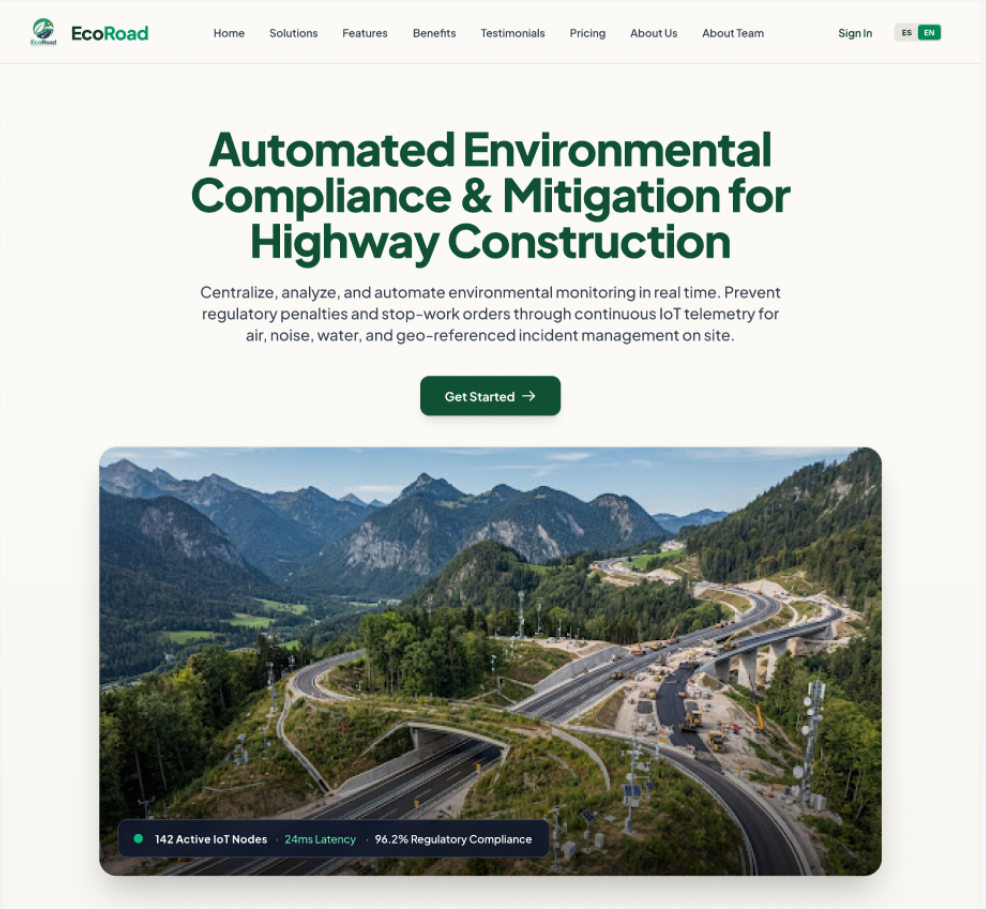

**Solutions**

La sección "Solutions" presenta la oferta de valor mediante un encabezado claro ("Specialized Solutions for the Highway Construction Sector") e introduce una retícula de cuatro tarjetas interactivas que detallan las áreas clave de monitoreo: calidad del aire y polvo, nivel sonoro y ruido, supervisión de recursos hídricos y protección de fauna/hábitats sensibles. Cada tarjeta utiliza un ícono representativo, una breve descripción técnica del proceso automatizado y etiquetas que destacan los estándares normativos o de calibración correspondientes, garantizando una lectura estructurada y fluida de las capacidades de la plataforma, mostrando lo que ofrece la plataforma.

  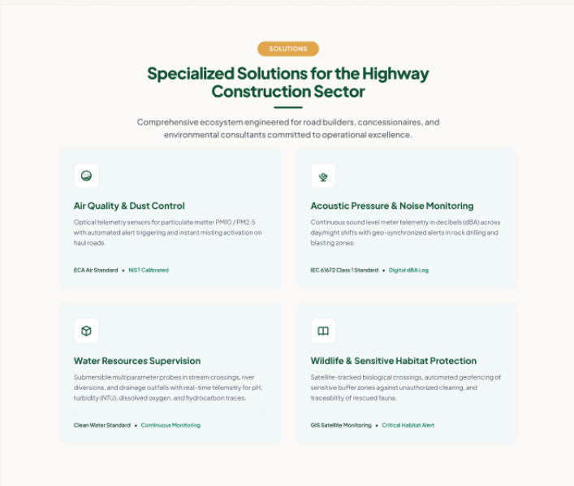

**Benefits**

La sección "Benefits" resalta las ventajas competitivas del sistema bajo el título "The EcoRoad Advantage: From Manual Logs to Real-Time Telemetry". Mediante una cuadrícula de cuatro tarjetas con apoyo visual e infográfico, detalla los beneficios clave de la plataforma: prevención de multas y paralizaciones mediante detección preventiva ("Zero Shutdowns & Fines"), consolidación automática de evidencias con encriptación SHA-256 para auditorías ("Automated Audits"), trazabilidad y flujo de trabajo de mitigación inmediata con georreferenciación GPS RTK desde la app offline ("Immediate Mitigation Workflow"), y respaldo legal/técnico continuo frente a inspecciones normativas ("Legal Peace of Mind & Expert Backing"). Cada bloque incluye métricas de impacto que refuerzan la eficiencia operativa y el cumplimiento normativo en obra.

  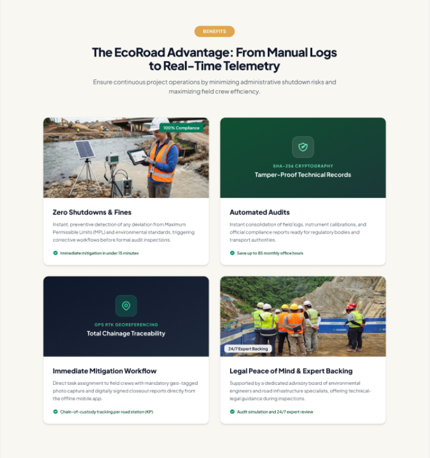

**About Us**

La sección "About Us" resalta la propuesta tecnológica bajo el título "Advanced Management & Compliance Technology". Incluye un video explicativo en función de la plataforma junto a un menú interactivo que detalla sus capacidades clave: dashboards GIS georreferenciados, alertas regulatorias automáticas por SMS/WhatsApp/email, cadena de custodia de evidencias con metadatos forenses y exportación en un clic de reportes oficiales en formato PDF/A y GeoJSON.

  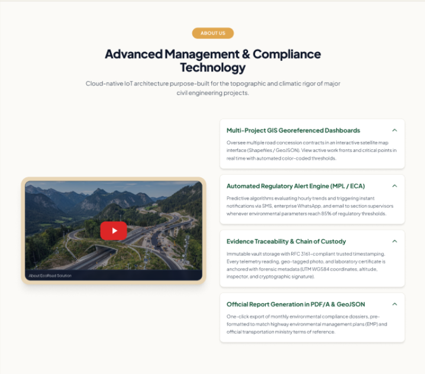

**Testimonials**

La sección presenta ejemplos de experiencias basados en casos de éxito de la plataforma. Muestra testimonios ficticios pero realistas atribuidos a roles clave del sector (directores ambientales, consultores senior y supervisores de obra) para validar el impacto técnico y operacional de EcoRoad ante potenciales clientes.

  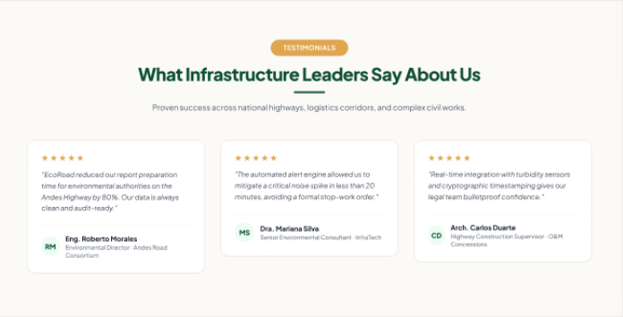

**Pricing**

La sección "Pricing" expone el modelo de monetización bajo el título "Flexible, Scalable Subscription Plans". Estructura la oferta en tres planes SaaS escalables (Base, Professional y Enterprise), permitiendo alternar entre facturación mensual y anual con descuento. Cada tarjeta detalla el precio, el perfil de cliente objetivo, un botón directo de acción y un listado de funcionalidades clave que van desde el monitoreo básico de proyectos hasta integraciones avanzadas y soporte 24/7.

  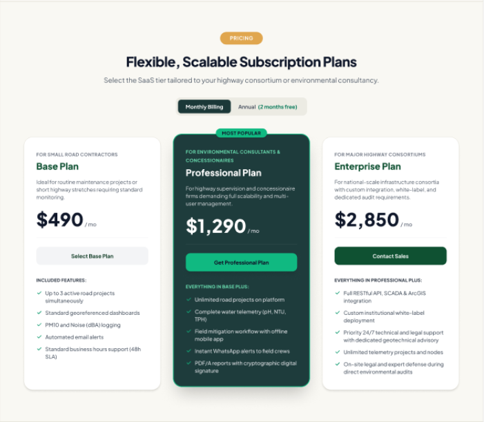

**About team**

La sección "About Team" presenta al equipo detrás de la plataforma bajo el título "Driving Innovation and Sustainability in Highway Infrastructure". Incluye un video institucional que muestra el proceso colaborativo del grupo, acompañado por un bloque explicativo que resalta su enfoque multidisciplinario, la combinación de ingeniería de software con sostenibilidad y su visión para transformar el monitoreo ambiental tradicional en una experiencia digital eficiente e intuitiva.

  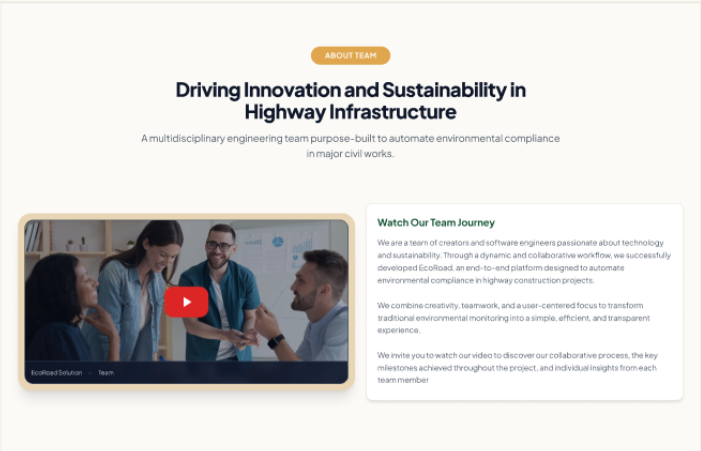

**Our team**

La sección "Our Team" presenta a los integrantes del proyecto bajo el título "Meet the multidisciplinary team behind EcoRoad's environmental telemetry platform". Organiza los perfiles en tarjetas individuales que incluyen fotografía, como Software Engineers y una breve descripción profesional centrada en sus habilidades de desarrollo y contribución a la plataforma. Justo debajo, la sección concluye con un banner final de conversión enfocado en la transformación de la sostenibilidad ambiental, ofreciendo botones directos para iniciar o agendar una sesión con un especialista.

  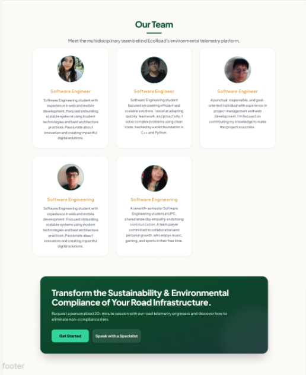

**Footer**

El Footer (pie de página) de la plataforma cierra el sitio con una estructura institucional sobre fondo oscuro. Se divide en cuatro columnas principales: la primera incluye el logotipo, una breve descripción de la propuesta de valor y el eslogan ("Infrastructure today, a better environment"); las dos siguientes organizan enlaces rápidos hacia los módulos de telemetría y el marco regulatorio/normativo; y la última muestra los canales de contacto, soporte técnico y sedes regionales. En la franja inferior incluye los derechos de autor reservados e información de políticas de privacidad y seguridad de datos.

  

4.4. Web Applications UX/UI Design.

4.4.1. Web Applications Wireframes.

**Home**

Muestra el resumen global de la red telemática (proyectos, sensores, alertas e incidentes activos) y el estado general de los proyectos junto con un feed de lecturas recientes fuera de parámetro

  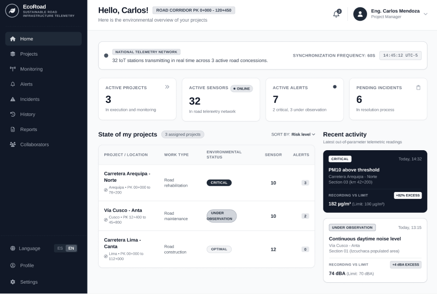

**Projects**

Ofrece el listado general de obras viales indicando su estado ambiental (óptimo, bajo observación o crítico), cantidad de sensores IoT asociados y métricas de alertas e incidentes

  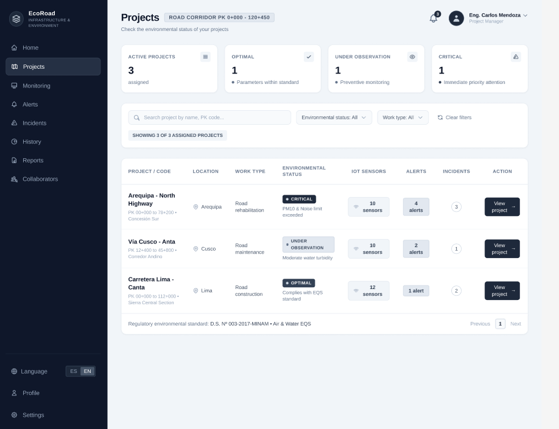

**Project Dashboard**

Presenta la vista detallada de un proyecto vial específico con el porcentaje de cumplimiento normativo (ECA), estado de la red de sensores LoRaWAN, lista de incidentes pendientes y los responsables técnicos asignados.

  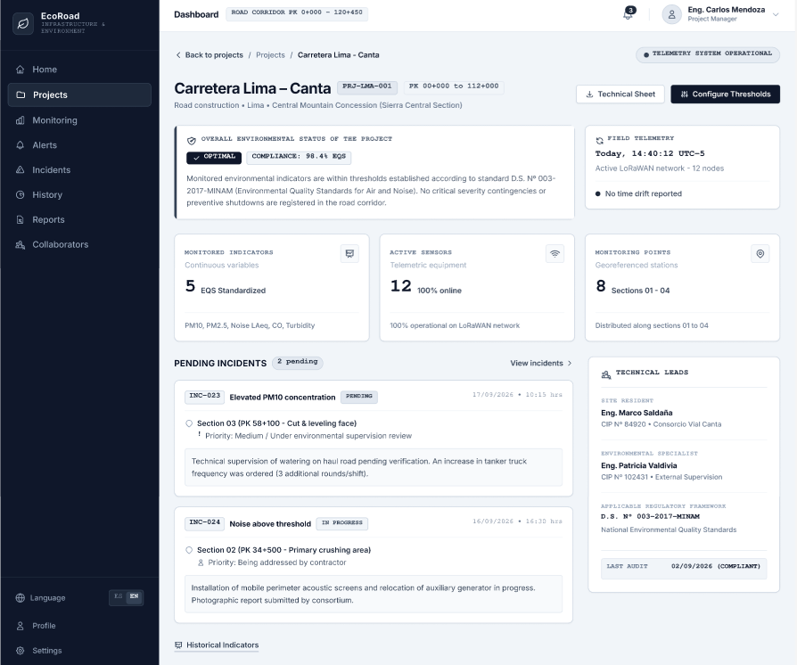

**Alerts**

Gestiona las alertas telemáticas preventivas por exceso de parámetros (material particulado, ruido, calidad de agua) y detalla la ubicación, sensor y acción preventiva recomendada en un panel técnico.

  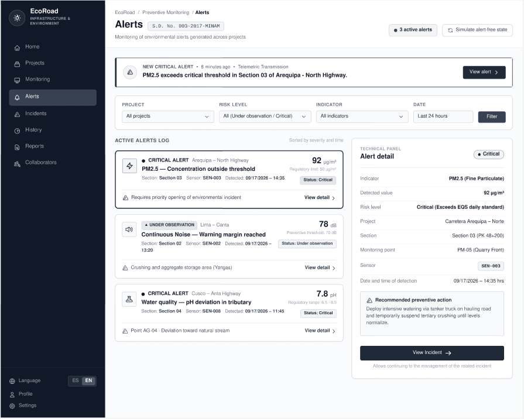

**Incidents**

Proporciona un tablero Kanban organizado según el estado del flujo de trabajo (Pendiente, En Progreso, Resuelto, Cerrado) para la asignación y gestión operativa de contingencias ambientales.

  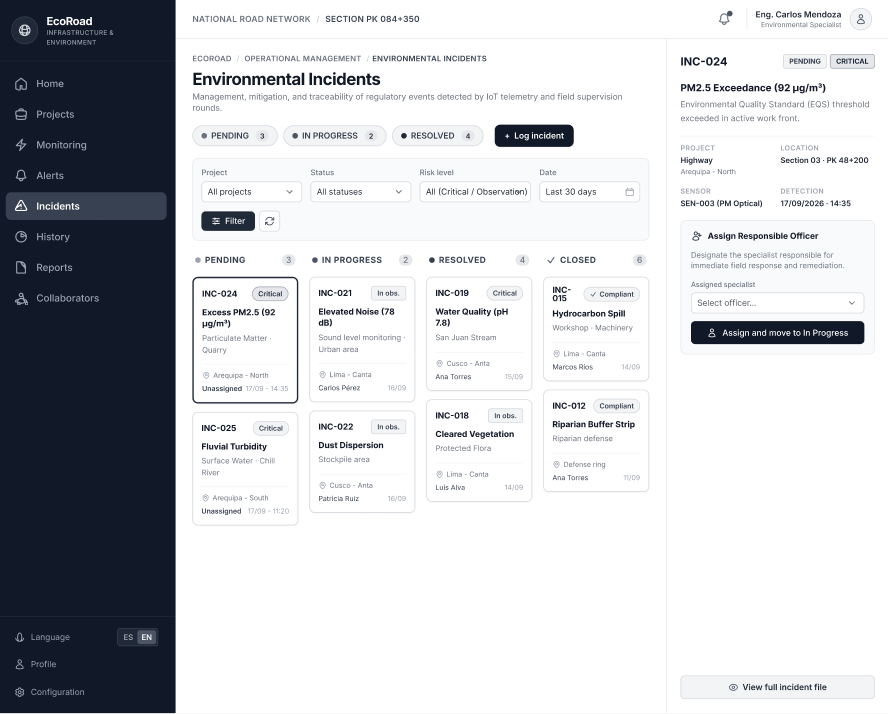

**History**

Grafica la evolución temporal de los indicadores ambientales (como PM10) comparándolos contra los límites normativos del estándar ECA, incluyendo promedios del periodo y simulador de estado sin datos

  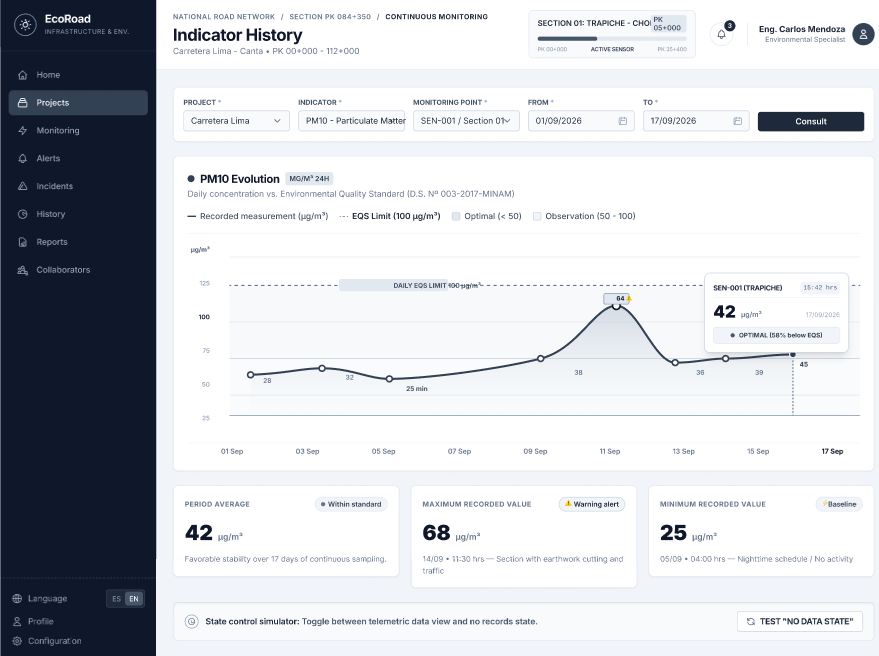

**Reports**

Facilita la configuración y generación de informes oficiales de cumplimiento ambiental exportables en PDF, integrando validación por firma digital y código de seguridad encriptado SHA-256.

  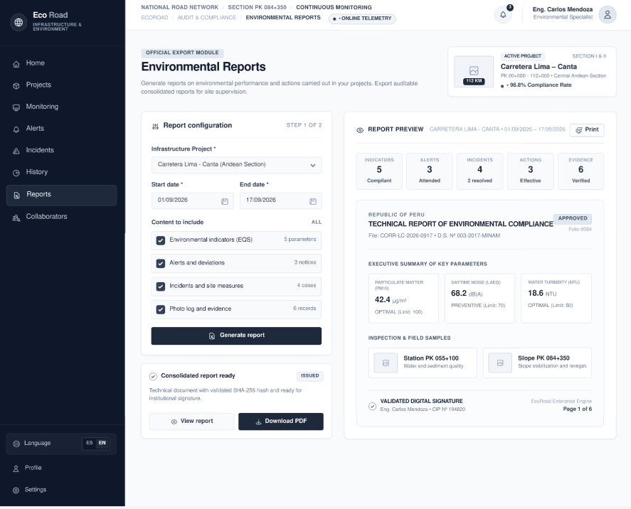

**Traceability history**

Muestra la secuencia cronológica y la trazabilidad completa de un evento ambiental desde la detección de la alerta hasta el registro de evidencia e implementación de la acción correctiva.

  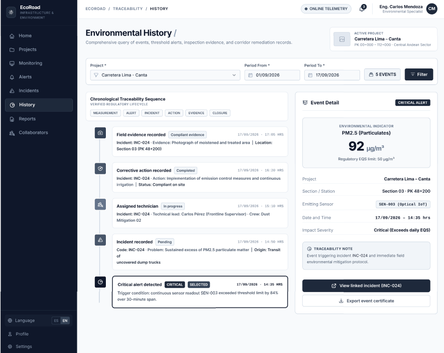

**Collaborators**

Permite administrar usuarios y asignar permisos granulares basados en roles (RBAC), incluyendo un área para simular la experiencia de restricciones de acceso según el perfil seleccionado

  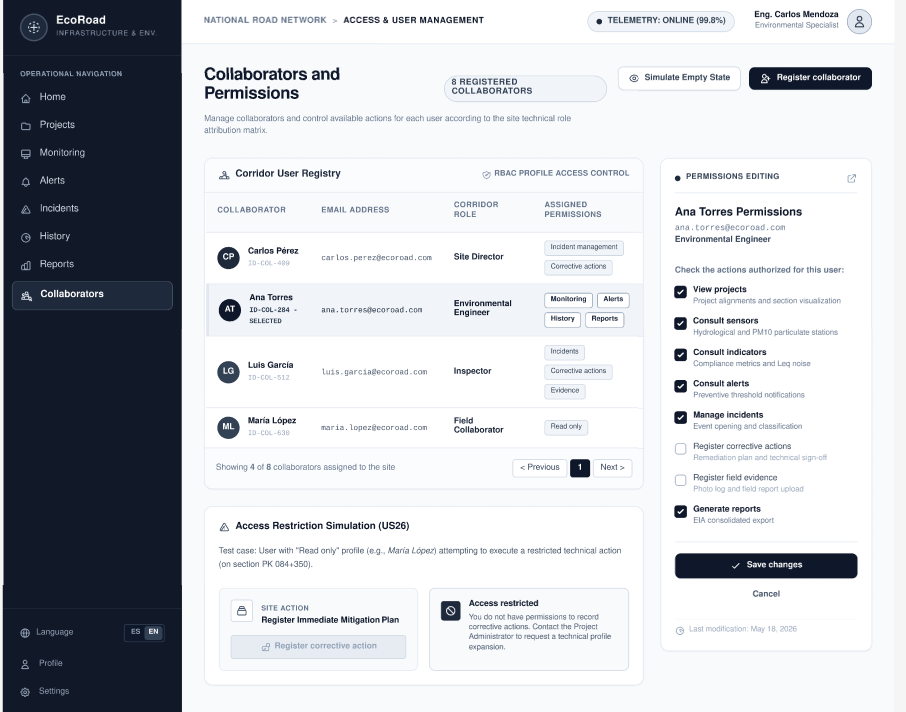

4.4.2. Web Applications Wireflow Diagrams.

4.4.2. Web Applications Mock-ups.

En esta sección se presentan los mock-ups diseñados para la aplicación web de EcoRoad. Cada pantalla responde a las funcionalidades principales del sistema.

**Home**

Panel principal con resumen de red de telemetría, métricas globales (proyectos, sensores, alertas, incidentes) y lista de proyectos activos con tarjetas de alertas recientes en tiempo real.

  

**Projects**

Listado general de obras viales con filtro por estado ambiental (óptimo, observación, crítico), conteo de sensores activos y accesos directos al detalle de cada proyecto

  

**Project Dashboard**

Vista detallada de un proyecto específico (Carretera Lima-Canta) con porcentaje de cumplimiento normativo, datos de telemetría LoRaWAN, lista de incidentes pendientes y responsables técnicos.

  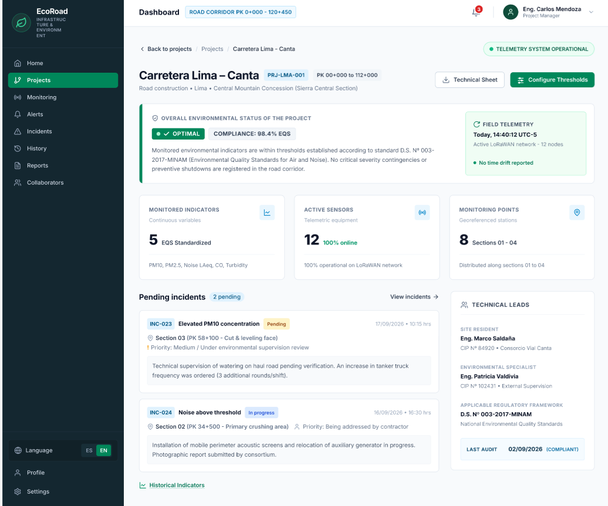

**Alerts**

Gestor de alertas preventivas que notifica excesos de parámetros (material particulado, ruido, agua) e incluye un panel técnico con detalles y acciones de mitigación recomendadas.

  

**Incidents**

Tablero tipo Kanban organizado por estado (Pendiente, En Progreso, Resuelto, Cerrado) para la trazabilidad y asignación de responsables en la atención de eventos ambientales.

  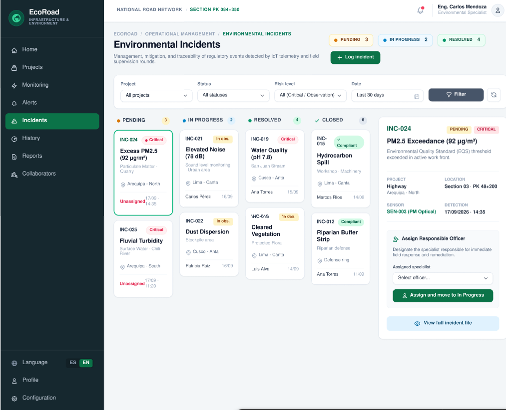

**History**

Gráfico de evolución temporal de indicadores (como PM10) comparados contra los límites normativos del estándar (ECA), con promedios y simulador de estados sin datos

  

**Reports**

Módulo de generación de informes ambientales oficiales exportables en PDF con validación de firma digital y código de seguridad encriptado SHA-256.

  

**Collaborators**

Panel de administración de usuarios y permisos (RBAC), con simulación de restricciones de acceso según el perfil técnico asignado.

  

4.4.3. Web Applications User Flow Diagrams.

4.5. Web Applications Prototyping.

4.6. Domain-Driven Software Architecture.

La arquitectura de software de EcoRoad se construye a partir de los resultados obtenidos en el Big Picture EventStorming, que permitió comprender en profundidad los flujos clave del dominio de gestión y cumplimiento ambiental en infraestructura vial, así como las interacciones entre las empresas constructoras, supervisoras y los dispositivos IoT de campo. A partir de este análisis inicial, se desarrolló una visión más estructurada del dominio utilizando los principios de Domain-Driven Design (DDD).

En las siguientes secciones se presenta cada nivel del modelo, explicando la estructura, responsabilidades y comunicación entre los elementos que conforman la arquitectura de EcoRoad.

4.6.1. Design-Level Event Storming.

Para identificar los eventos de dominio y profundizar en el modelado táctico, se realizó una sesión de EventStorming. Esta técnica permite visualizar y comprender el flujo de eventos dentro del dominio, facilitando la identificación de los Bounded Contexts, los aggregates (agregados) como fronteras transaccionales, los comandos, eventos, políticas y vistas de lectura.

1. Commercial and Subscription Management

Este contexto gestiona todo el ciclo comercial y el modelo de negocio de doble ingreso (dual revenue) de EcoRoad. Administra el registro de las cuentas corporativas y los contratos de suscripción independientes tanto para las empresas constructoras como para las supervisoras/consultoras ambientales. Su propósito es validar el acceso financiero a la plataforma mediante planes segmentados (Base, Profesional y Enterprise), asegurando que las operaciones viales de los clientes estén debidamente respaldadas por una suscripción activa.

  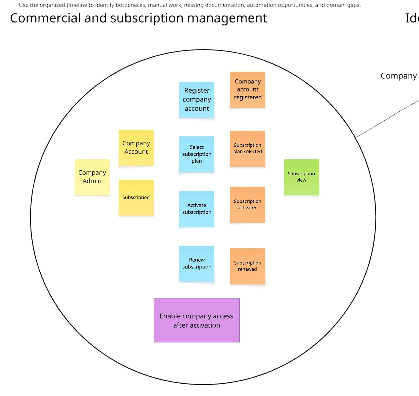

2. Identity and Access Management (IAM)

El Bounded Context IAM se encarga de la autenticación, autorización y gobernanza de credenciales dentro del ecosistema EcoRoad. Administra procesos críticos como el registro de usuarios corporativos, inicio de sesión y la asignación granular de permisos y roles (tales como administradores, residentes de obra o personal de fiscalización). Su objetivo es garantizar accesos seguros, confiables y alineados con las políticas de control de seguridad de la información.

  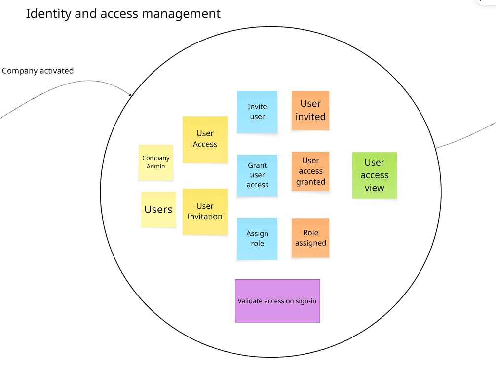

3. Project and Road Site Management

Este contexto es el núcleo operativo para la planificación de la infraestructura vial. Permite registrar formalmente los proyectos de construcción y mantenimiento, configurar los tramos viales y establecer los frentes de trabajo donde se desarrollarán las operaciones. Su diseño valida de forma estricta que exista una cuenta y suscripción comercial activa antes de autorizar la creación y el despliegue lógico de cualquier nuevo proyecto de carretera.

  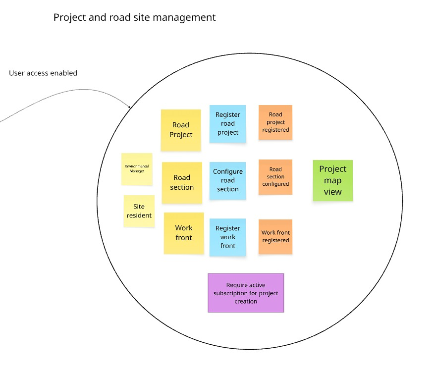

4. Monitoring Asset and Deployment

Se encarga de la gestión del hardware de sensores IoT propios que provee el modelo HaaS (Hardware as a Service) de EcoRoad. Este contexto administra la geolocalización de los puntos de monitoreo, la habilitación de los dispositivos de campo, su asignación específica a los frentes de obra, así como su calibración y activación. Su propósito es asegurar que solo los sensores autorizados y debidamente vinculados puedan reportar datos al sistema.

  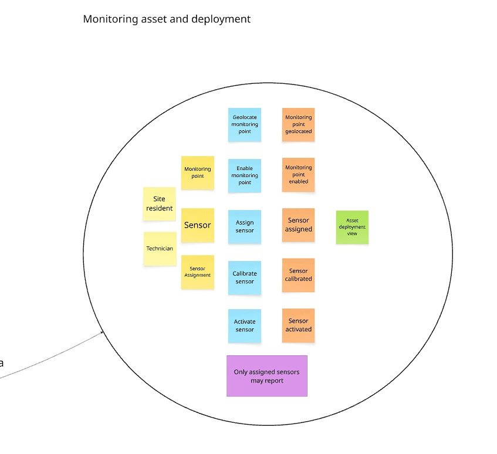

5. Environmental Monitoring

Este contexto gestiona la captura y el procesamiento de la telemetría ambiental (indicadores de aire, ruido, agua y vibración) recopilada por la red de sensores IoT. Se encarga de configurar los parámetros ambientales y perfiles de umbrales normativos, permitiendo procesar tanto las mediciones automatizadas en tiempo real como los registros manuales efectuados en campo, reduciendo la dependencia de reportes que puedan ser alterados.

  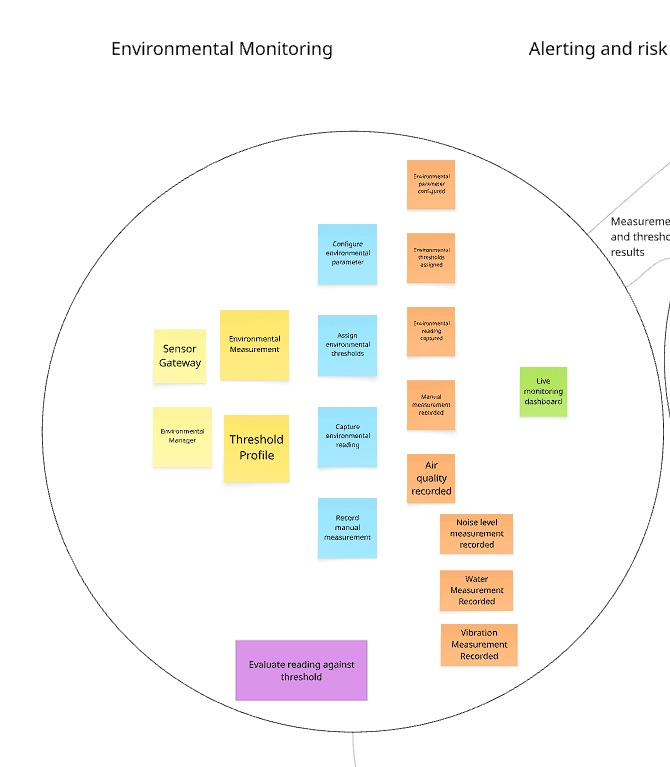

6. Alerting and Risk Evaluation

Funciona como el motor preventivo de la plataforma. Evalúa de manera continua las mediciones e indicadores ambientales frente a los límites y umbrales normativos establecidos. Su propósito es detectar desviaciones de manera temprana, confirmar riesgos ambientales críticos y emitir las alertas preventivas necesarias para que las empresas constructoras actúen antes de incurrir en incumplimientos legales o sanciones.

  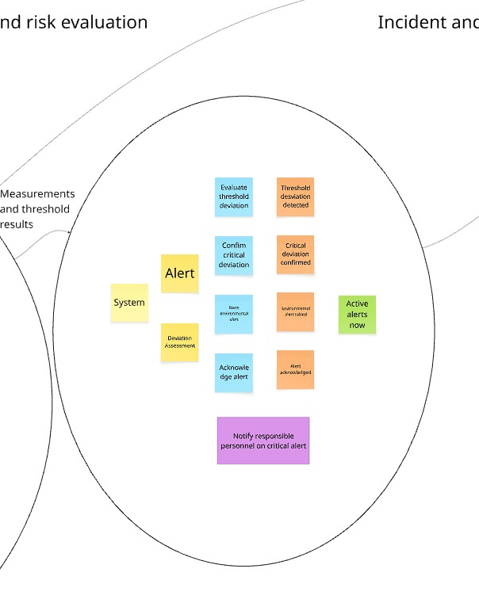

7. Incident and Remediation Management

Este contexto coordina la respuesta operativa ante incidentes ambientales detectados en las obras viales. Controla el ciclo de vida de los tickets de incidencia, la asignación de responsables y cuadrillas de campo, la ejecución de acciones correctivas (como riego de vías o instalación de barreras acústicas), la subida de evidencias verificables y el cierre formal de las incidencias.

  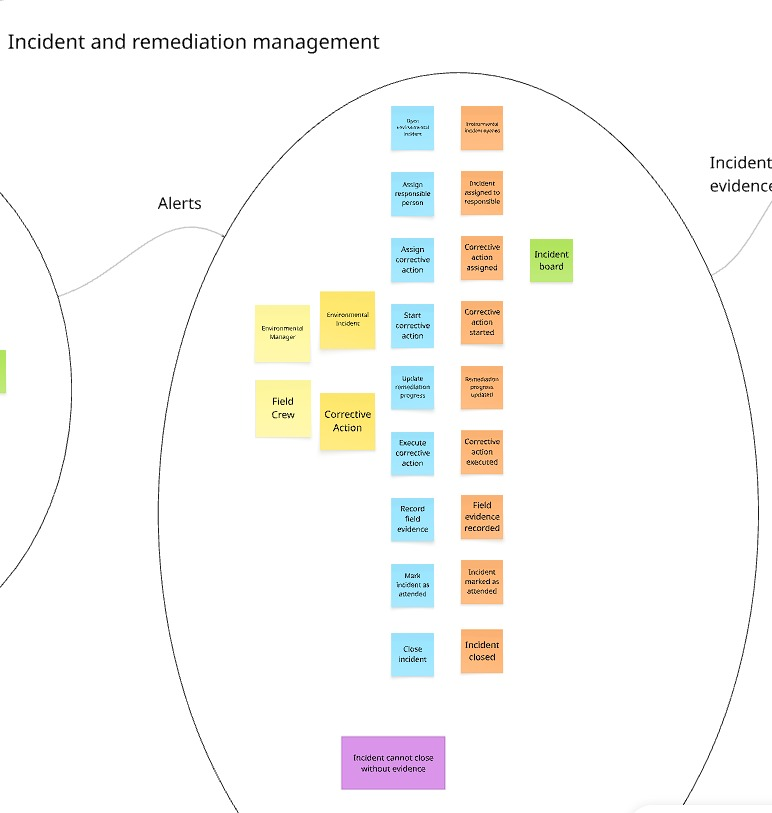

8. Compliance and Reporting

Agrupa la consolidación de los datos históricos de monitoreo, alertas e incidentes para la generación de reportes regulatorios de cumplimiento. Su propósito es proveer a las empresas supervisoras y consultoras ambientales una herramienta neutral y basada en datos inalterables, facilitando los procesos de auditoría, reduciendo los costos de fiscalización y generando confianza mutua entre los ejecutores de la obra y los entes fiscalizadores.

  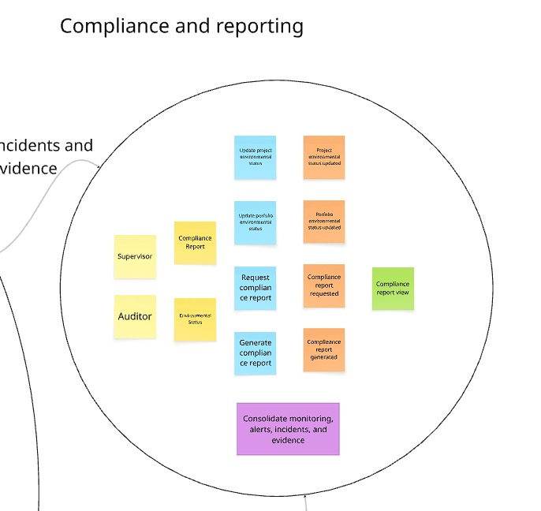

4.6.2. Software Architecture Context Diagram.

En este nivel se presenta una vista de alto nivel de la arquitectura, donde el foco está en el sistema de software **EcoRoad** como una “caja negra” y en las interacciones que mantiene con sus usuarios, sus dispositivos de campo y con otros sistemas externos.

El *Context Diagram* muestra al **EcoRoad Software System** como un recuadro en el centro, rodeado por los principales actores y sistemas con los que se comunica:

* **Site Resident**: usuario interno principal (ingeniero residente o supervisor de obra) responsable de registrar proyectos viales, monitorear alertas ambientales en tiempo real, asignar acciones de remediación a las cuadrillas y autorizar el cierre de incidencias socioambientales.
* **Regulatory Auditor**: usuario externo o entidad fiscalizadora (MTC / OEFA) que accede a la plataforma para revisar expedientes de cumplimiento y validar el acatamiento normativo del Plan de Manejo Ambiental.
* **IoT Sensor Node**: dispositivo físico de campo distribuido en los frentes de obra que captura continuamente datos de telemetría (material particulado PM10/PM2.5, ruido, calidad de agua y vibraciones) y los transmite en tiempo real al sistema central.
* **Payment System (Stripe / Niubiz)**: sistema externo encargado de procesar las suscripciones B2B y los pagos asociados al uso de la plataforma SaaS y al arrendamiento del hardware IoT (modelo HaaS).
* **Google Maps API / GIS**: servicio de mapas utilizado para obtener la geolocalización, el trazado de tramos carreteros y la ubicación espacial de los nodos sensores en las obras.
* **Notification Service (SendGrid / Twilio)**: servicio de mensajería utilizado para enviar notificaciones e instructivos automáticos por correo electrónico y SMS ante desvíos de umbrales normativos ECA.

En el diagrama se representan las relaciones entre estos elementos, destacando que tanto los usuarios humanos (**Site Resident** y **Regulatory Auditor**) como los instrumentos de campo (**IoT Sensor Node**) interactúan directamente con **EcoRoad**, mientras que el sistema central se encarga de orquestar las integraciones con los servicios externos (pagos, mapas y notificaciones). Esta vista permite entender el alcance del sistema, los límites de responsabilidad y el ecosistema en el que se inserta **EcoRoad** antes de entrar a detalles de implementación.

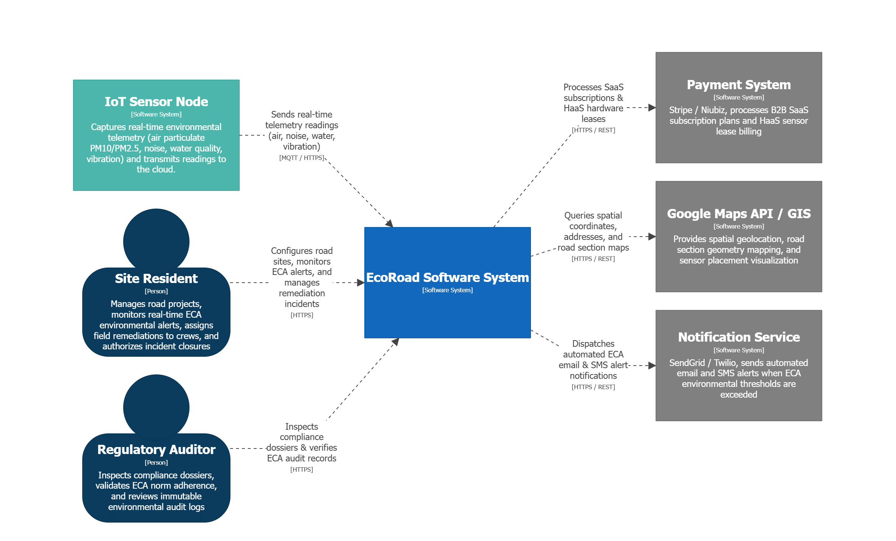

 

4.6.3. Software Architecture Container Diagrams.

En el nivel de contenedores, la atención se desplaza desde “quién usa el sistema” hacia “cómo se organiza internamente el sistema en aplicaciones y fuentes de datos”. El *Container Diagram* muestra los elementos de alto nivel de la arquitectura de **EcoRoad**, sus responsabilidades principales y la forma en que se comunican entre sí y con los sistemas externos.

La arquitectura lógica de **EcoRoad** se estructura en los siguientes contenedores:

* **Landing Page**: aplicación web estática que presenta la propuesta de valor de **EcoRoad** (modelo híbrido HaaS/SaaS) para empresas constructoras y de conservación vial, guía a nuevos usuarios y redirige a la aplicación principal. Está desarrollada con tecnologías web estándar (HTML5, CSS3 y JavaScript) y se despliega en un entorno orientado a contenido estático.
* **Single Page Application (SPA)**: aplicación web principal, implementada en Angular, donde interactúan el **Site Resident** y el **Regulatory Auditor**. Este contenedor concentra la experiencia de usuario, las vistas y la lógica de presentación para los 8 contextos del dominio (*Commercial &amp; Subscription Management*, *Identity &amp; Access Management - IAM*, *Project &amp; Road Site Management*, *Monitoring Asset &amp; Deployment*, *Environmental Telemetry &amp; Monitoring*, *Alerting &amp; Risk Evaluation*, *Incident &amp; Remediation Management*, y *Compliance &amp; Audit Reporting*).
* **API Application**: backend implementado con Spring Boot, que expone una API REST, gestiona la ingesta continua de telemetría IoT y encapsula la lógica de negocio, reglas de evaluación de umbrales normativos ECA y orquestación de procesos. Este contenedor agrupa los módulos backend por contexto (*Subscription Backend*, *IAM Backend*, *Project Backend*, *Asset Management Backend*, *Telemetry Backend*, *Alert Engine Backend*, *Incident Backend* y *Compliance Reporting Backend*).
* **Database**: base de datos relacional (PostgreSQL / MySQL), donde se persiste la información estructurada del sistema: proyectos viales, tramos carreteros, nodos sensores, mediciones telemétricas (material particulado PM10/PM2.5, ruido, agua y vibraciones), reglas de alerta ECA, tickets de incidencias, evidencias fotográficas, expedientes de cumplimiento, cuentas de usuario y suscripciones.

En el diagrama se observa que:

* Los usuarios humanos (**Site Resident** y **Regulatory Auditor**) acceden primero a la **Landing Page**, la cual redirige a la **SPA** tras el proceso de autenticación.
* Los dispositivos físicos **IoT Sensor Node** transmiten lecturas telemétricas en tiempo real directamente hacia la **API Application** mediante protocolos de comunicación como MQTT o HTTPS.
* La **SPA** se comunica exclusivamente con la **API Application** mediante peticiones HTTP/HTTPS con mensajes JSON, siguiendo un estilo REST.
* La **API Application** persiste y consulta datos en la **Database** mediante JDBC y mapeo objeto–relacional (JPA/Hibernate).
* Tanto la **SPA** como la **API Application** interactúan con los sistemas externos: el **Payment System (Stripe / Niubiz)** para el cobro de suscripciones y arrendamiento de hardware, la **Google Maps API** para la geolocalización y trazado espacial de tramos viales, y el **Notification Service (SendGrid / Twilio)** para el envío automático de notificaciones de alerta por correo electrónico y SMS.

Esta vista resume la distribución de responsabilidades entre las capas de presentación (Landing Page y SPA), lógica e ingesta (API Application) y persistencia (Database), detallando sus tecnologías clave. A través de flujos unidireccionales y bidireccionales, el diagrama delimita el alcance de EcoRoad, mostrando cómo interactúan los usuarios y sensores, y cómo el sistema central orquesta las integraciones externas de pagos, mapas, notificaciones y fiscalización.

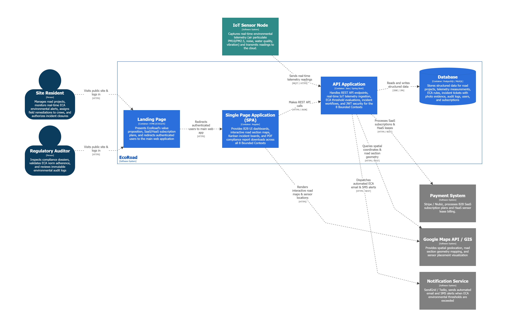

 

4.6.4. Software Architecture Components Diagrams.

En el nivel de componentes se detalla la descomposición interna de los contenedores, mostrando los bloques estructurales que conforman cada uno y las relaciones entre ellos. Dado que la **Single Page Application** y la **Database** son descritas mediante diagramas de clases frontend y de base de datos, en esta sección se pone especial énfasis en el contenedor **API Application**, donde reside la mayor parte de la lógica de negocio y la ingesta de telemetría ambiental.

El *Component Diagram* de la **API Application** agrupa la arquitectura interna siguiendo los Bounded Contexts definidos en el dominio de **EcoRoad**. Cada módulo backend representa un componente principal dentro del contenedor:

* **Subscription Backend**: administra el modelo comercial de doble ingreso (dual revenue), gestionando los contratos de suscripción SaaS (planes Starter, Professional y Enterprise) y los acuerdos HaaS de alquiler de sensores IoT. Se integra con el **Payment System (Stripe / Niubiz)** para el procesamiento de cobros y facturación.
* **IAM Backend**: se encarga de la autenticación de usuarios, emisión y validación de tokens JWT, gestión de cuentas corporativas, roles (RBAC) y control de permisos de acceso a la plataforma.
* **Project Backend**: gestiona el alta de proyectos de infraestructura vial, la sectorización de tramos carreteros y el establecimiento de frentes de obra.
* **Asset Management Backend**: administra el inventario de dispositivos **IoT Sensor Node**, su estado operativo, la calibración de hardware y su vinculación lógica a tramos viales específicos.
* **Telemetry Backend**: gestiona la ingesta de alto rendimiento y el procesamiento en tiempo real de las lecturas telemétricas (material particulado PM10/PM2.5, ruido, calidad de agua y vibraciones) enviadas por los sensores de campo.
* **Alert Engine Backend**: evalúa continuamente las mediciones ambientales frente a los Estándares de Calidad Ambiental (ECA) para detectar desvíos e interactúa con el **Notification Service (SendGrid / Twilio)** para despachar avisos automáticos por correo electrónico y SMS.
* **Incident Backend**: coordina el flujo de trabajo de tickets de incidencia socioambiental, la asignación de tareas a cuadrillas, la carga de evidencias fotográficas en campo y la autorización de cierre.
* **Compliance Reporting Backend**: consolida el historial inmutable de telemetría, alertas e incidencias para empaquetar expedientes digitales de cumplimiento en PDF presentables ante auditorías regulatorias (MTC / OEFA).
* **Shared Backend**: provee componentes compartidos, utilidades, clases base auditables, eventos y mecanismos de infraestructura transversales reutilizados por los demás módulos backend.

En el diagrama se refleja cómo:

* La **SPA** consume los servicios expuestos por cada módulo backend a través de la **API Application**, utilizando endpoints REST específicos por contexto.
* Los dispositivos físicos **IoT Sensor Node** transmiten lecturas en tiempo real directamente hacia el **Telemetry Backend** mediante protocolos de comunicación como MQTT o HTTPS.
* Cada módulo backend accede a la **Database** para leer y escribir la información correspondiente a su contexto (por ejemplo, Telemetry Backend a tablas de mediciones, Incident Backend a tablas de tickets y evidencias, etc.).
* Algunos módulos se integran con sistemas externos: **Subscription Backend** con el sistema de pagos (Stripe / Niubiz), **Project Backend** y **Asset Management Backend** con la API de mapas (Google Maps API), e **IAM Backend** y **Alert Engine Backend** con el servicio de notificaciones (SendGrid / Twilio).
* Todos los módulos backend reutilizan capacidades comunes provistas por el **Shared Backend**, lo que favorsce la consistencia, la reutilización y la reducción de duplicación de código.

En conclusión, esta vista de componentes permite transparentar la organización interna del backend de **EcoRoad**, evidenciando la separación modular de responsabilidades según cada *Bounded Context*. Al estructurar de forma desacoplada la ingesta telemétrica, la evaluación de umbrales ECA y la gestión de incidencias, este diagrama sirve como puente entre la visión de contenedores de alto nivel y el diseño detallado de clases y persistencia del sistema.

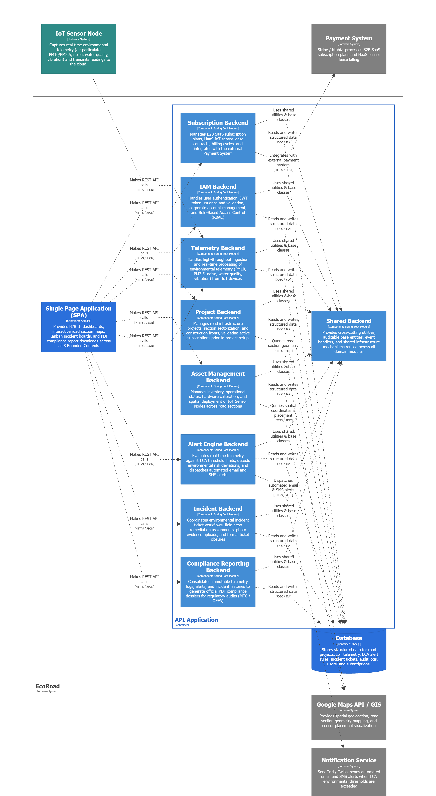

 

## 4.7. Software Object-Oriented Design.

### 4.7.1. Class Diagrams.

Se centra en la definición de diagramas de clases, la interacción entre objetos y la aplicación de principios.

### Bounded Context 1 - Suscriptions and Payment:
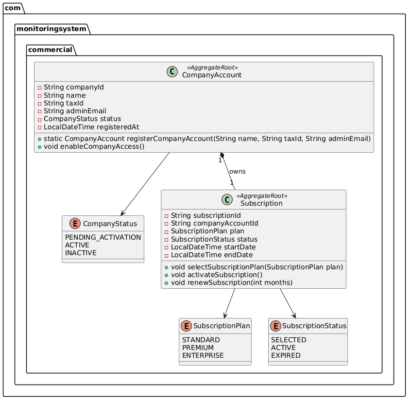

### Bounded Context 2 - Identity and Access Management:
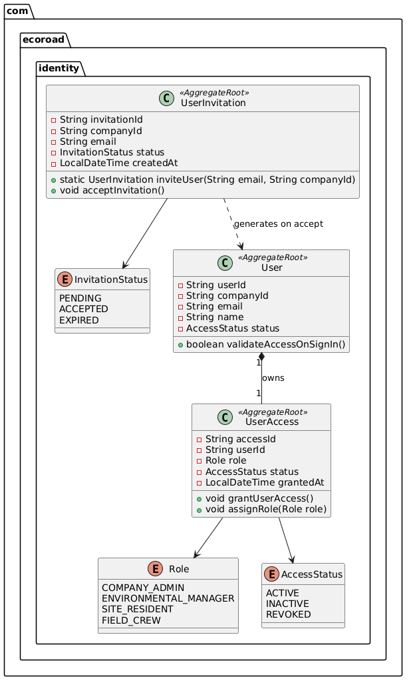

### Bounded Context 3 - Project and Road Site Management:
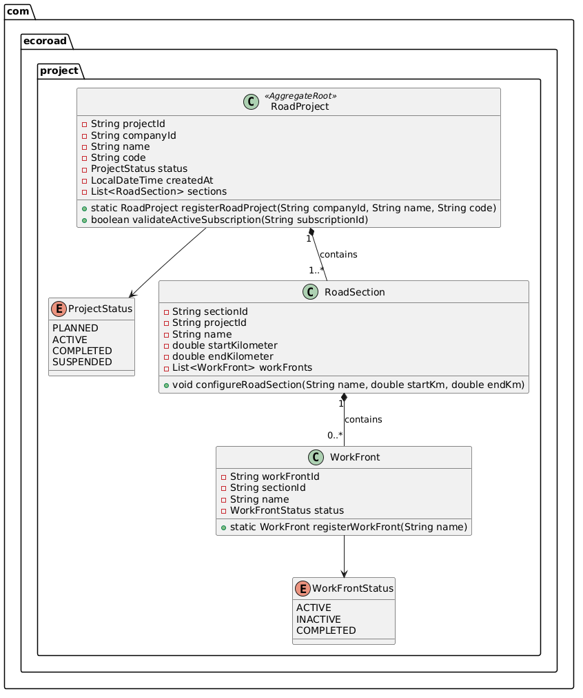

### Bounded Context 4 - Monitoring Asset and Deployment:
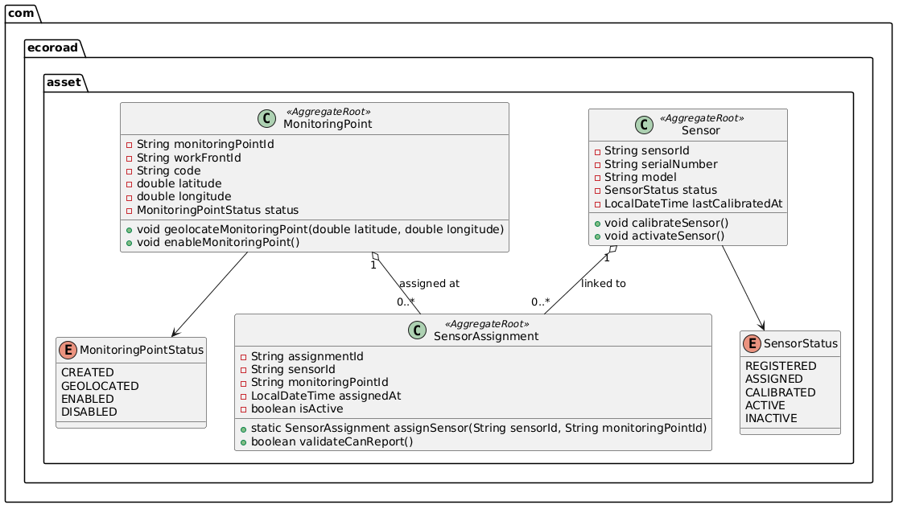

### Bounded Context 5 - Environmental Monitoring:
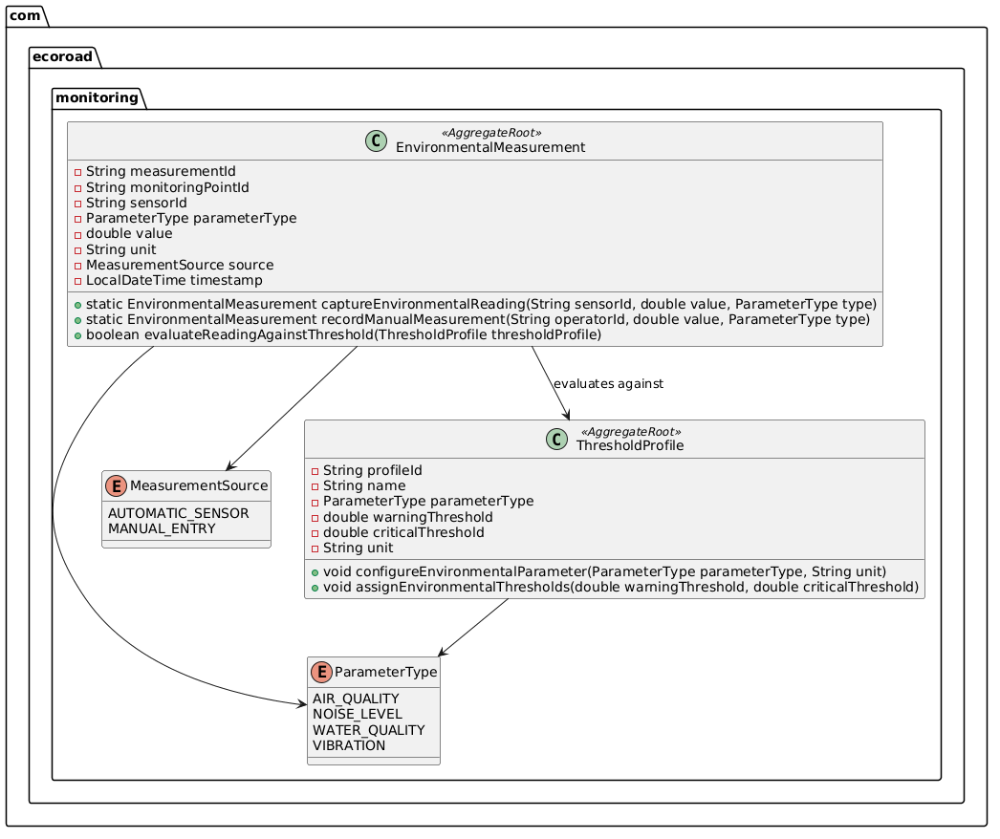

### Bounded Context 6 - Alerting and Risk Evaluation:
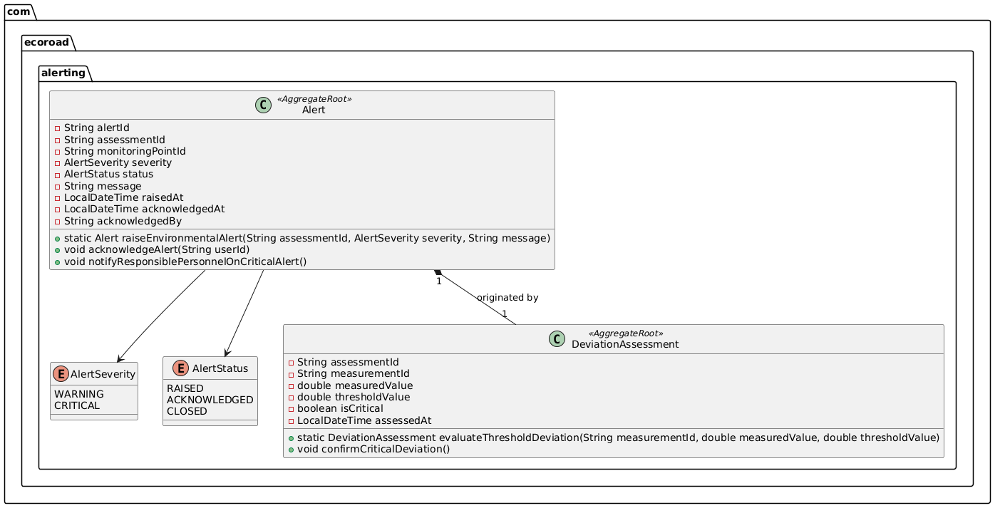

### Bounded Context 7 - Incident and Remediation Management:
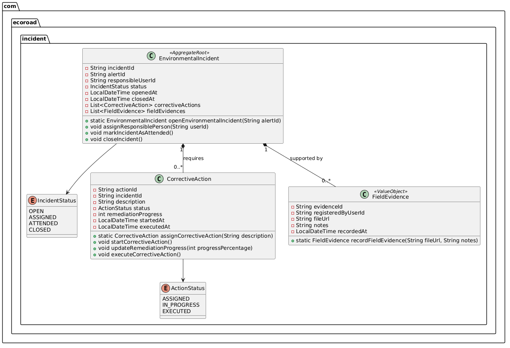

### Bounded Context 8 - Compliance and Reporting:
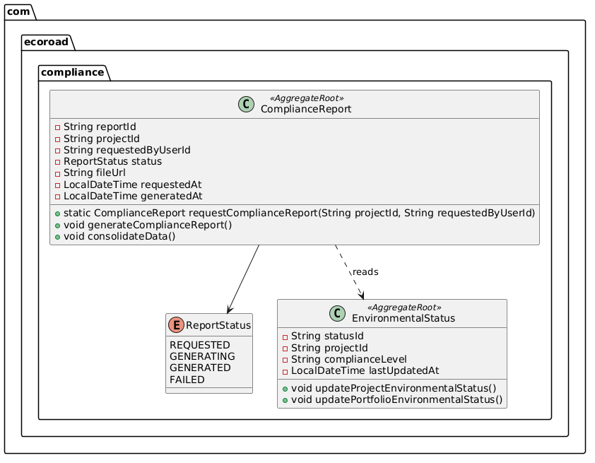

## 4.8. Database Design.

### 4.8.1. Database Diagrams.

### Bounded Context 1 - Suscriptions and Payment:
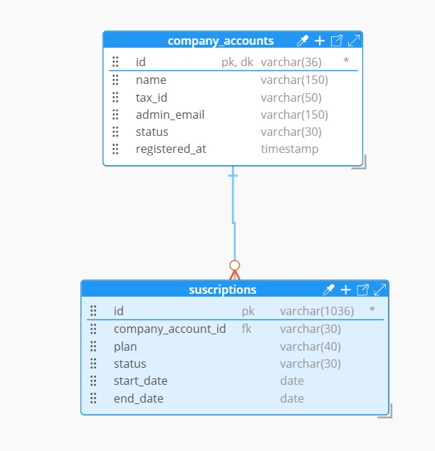

### Bounded Context 2 - Identity and Access Management:
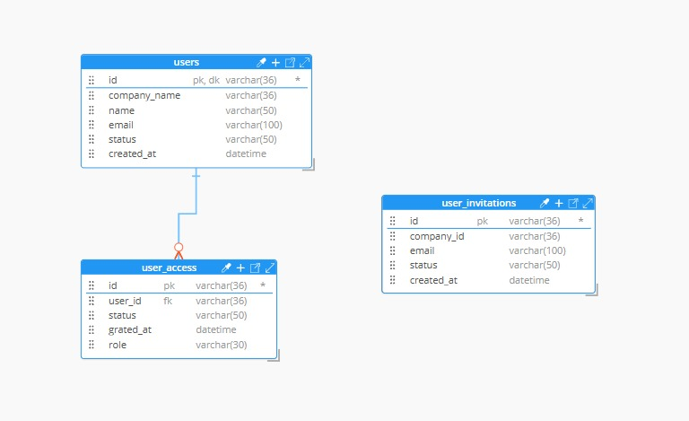

### Bounded Context 3 - Project and Road Site Management:
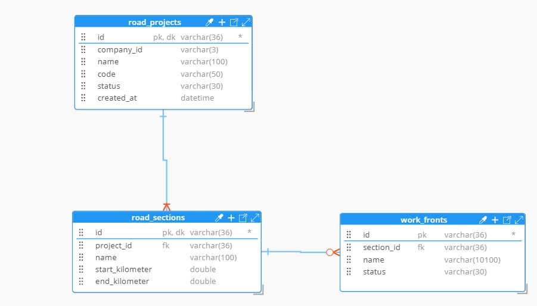

### Bounded Context 4 - Monitoring Asset and Deployment:
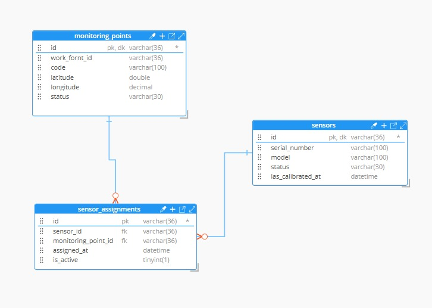

### Bounded Context 5 - Environmental Monitoring:
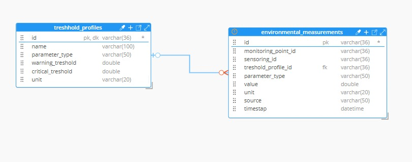

### Bounded Context 6 - Alerting and Risk Evaluation:
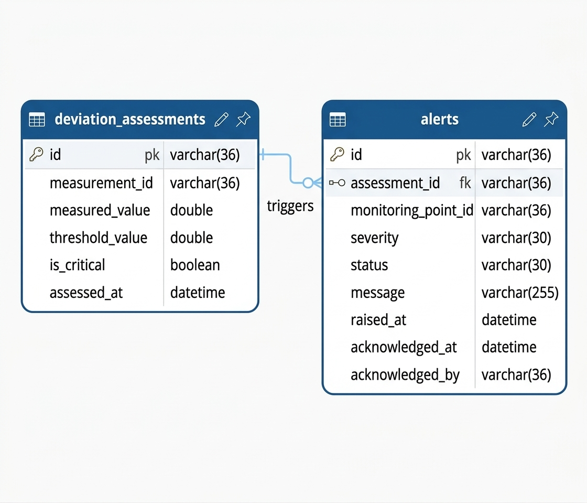

### Bounded Context 7 - Incident and Remediation Management:
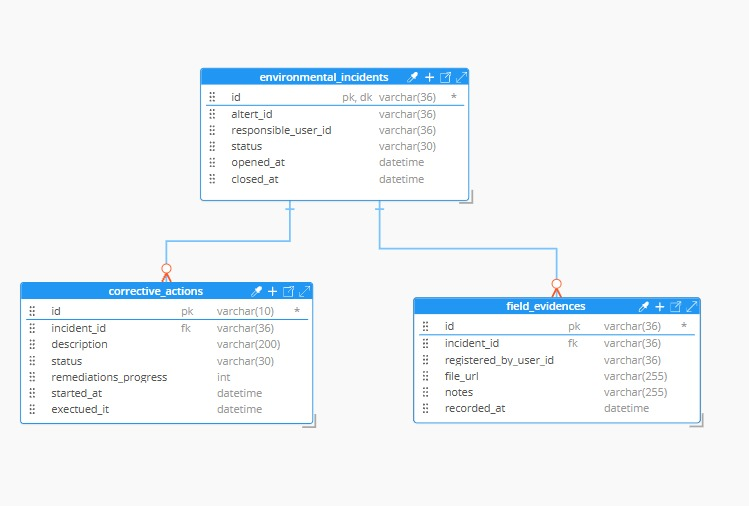

### Bounded Context 8 - Compliance and Reporting:
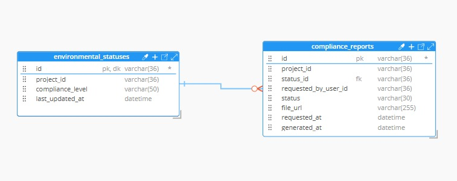